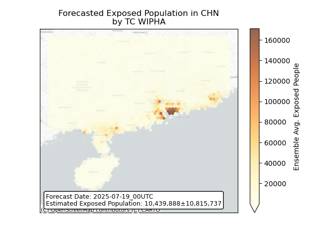
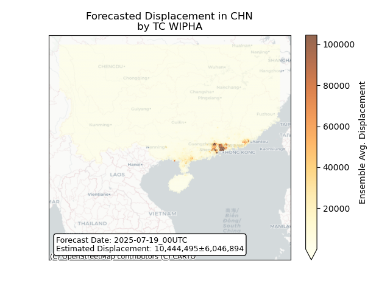
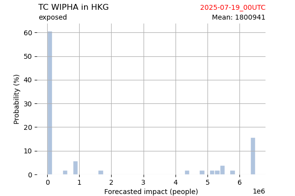
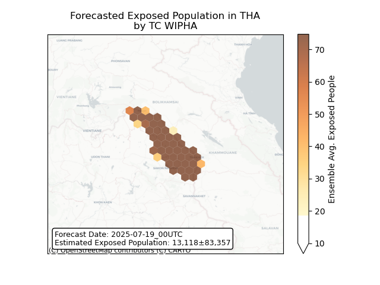
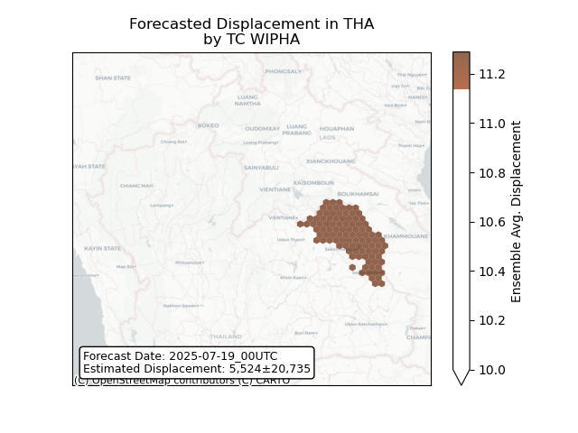
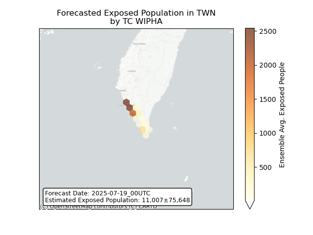
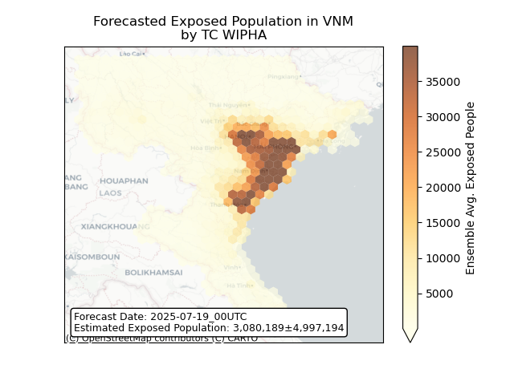

# Displacement forecast

This is a WIP. All this is going to change, for now we're just dumping things here.

## Forecast for 2025-07-19 00:00 UTC

There are 1 active named storms.

## WIPHA China: areas affected

## WIPHA China: people exposed

## WIPHA China: people displaced

## WIPHA Hong Kong: areas affected

## WIPHA Hong Kong: people exposed

## WIPHA Hong Kong: people displaced

## WIPHA Lao People's Democratic Republic: areas affected

## WIPHA Lao People's Democratic Republic: people exposed

## WIPHA Lao People's Democratic Republic: people displaced

## WIPHA Macao: areas affected

## WIPHA Philippines: areas affected

## WIPHA Philippines: people exposed

## WIPHA Philippines: people displaced

## WIPHA Thailand: areas affected

## WIPHA Thailand: people exposed

## WIPHA Thailand: people displaced

## WIPHA Taiwan, Province of China: areas affected

## WIPHA Taiwan, Province of China: people exposed

## WIPHA Taiwan, Province of China: people displaced

## WIPHA Viet Nam: areas affected

## WIPHA Viet Nam: people exposed

## WIPHA Viet Nam: people displaced

