# Displacement forecast

This is a WIP. All this is going to change, for now we're just dumping things here.
## Forecast for 2025-07-23 00:00 UTC

There are 2 active named storms.

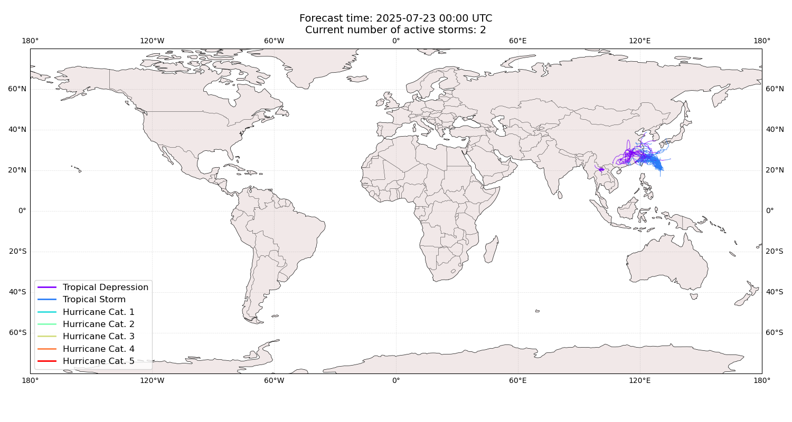

## WIPHA All countries: No forecast people exposed

Storm WIPHA is not forecast to affect people in All countries.

## WIPHA All countries: no forecast people displaced

Storm WIPHA is not forecast to displace people in All countries.

## FRANCISCO China: areas affected

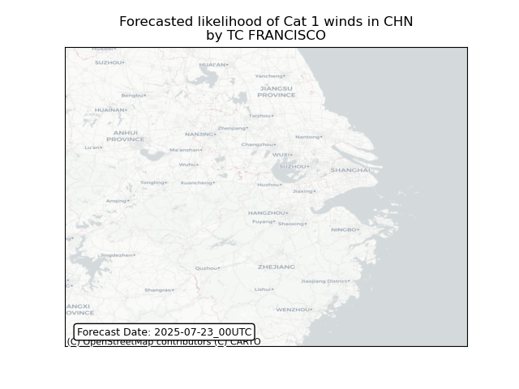
## FRANCISCO China: people exposed

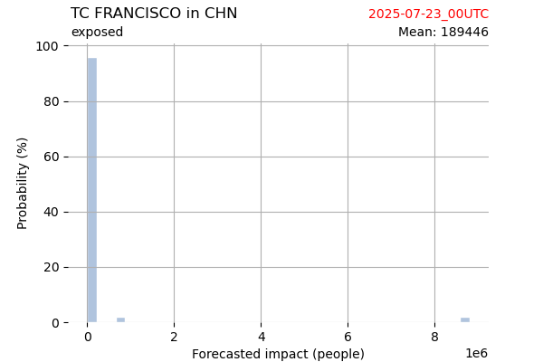

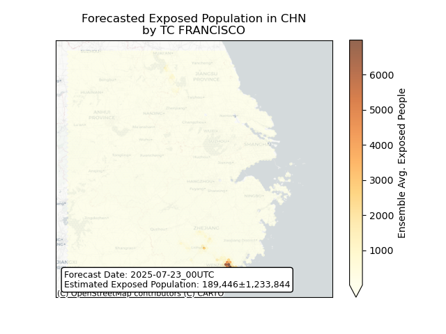

## FRANCISCO China: people displaced

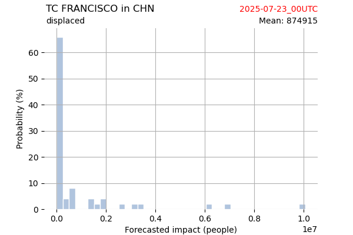

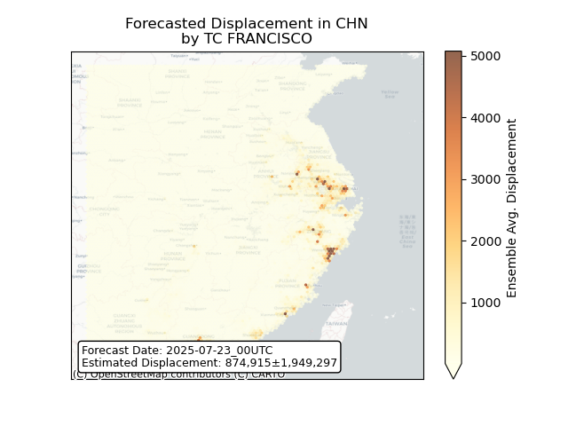

## FRANCISCO Japan: areas affected

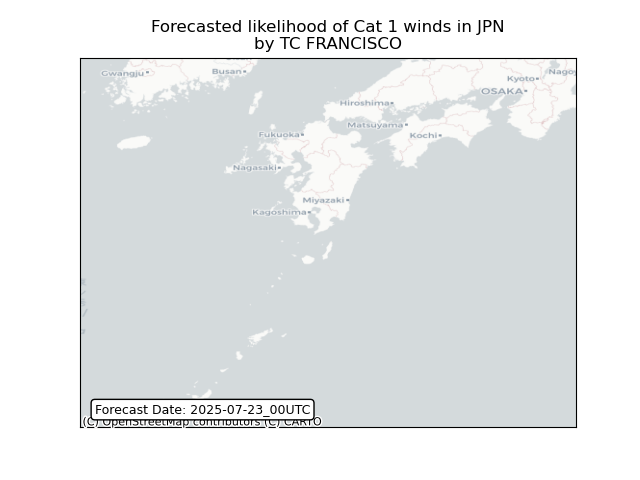
## FRANCISCO Japan: people exposed

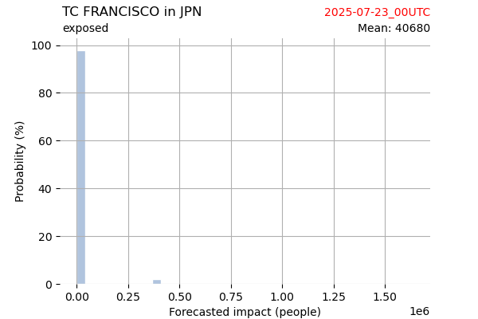

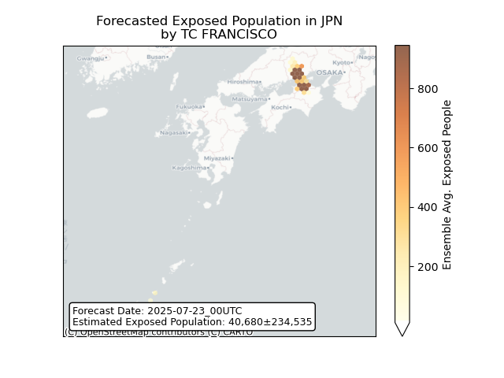

## FRANCISCO Japan: people displaced

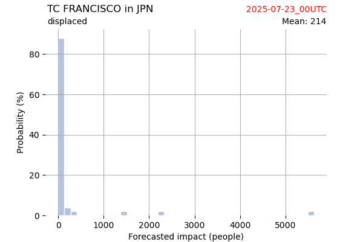

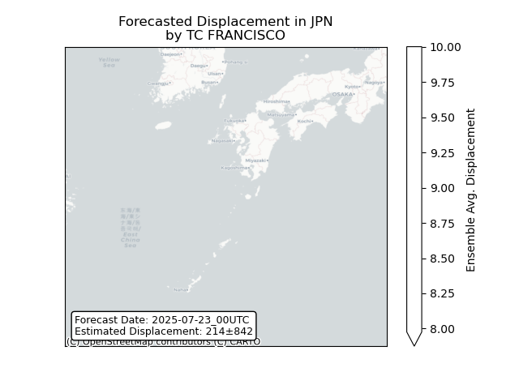

