# Displacement forecast

This is a WIP. All this is going to change, for now we're just dumping things here.

## Forecast for 2025-07-24 12:00 UTC

There are 3 active named storms.

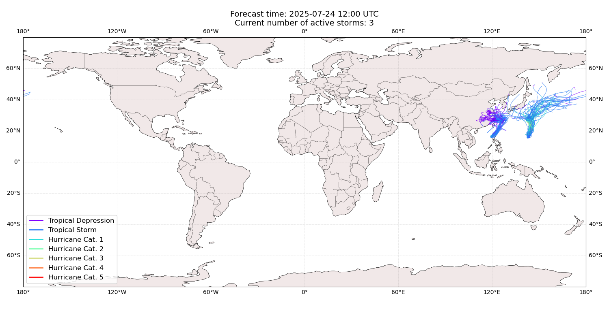

## FRANCISCO China: areas affected

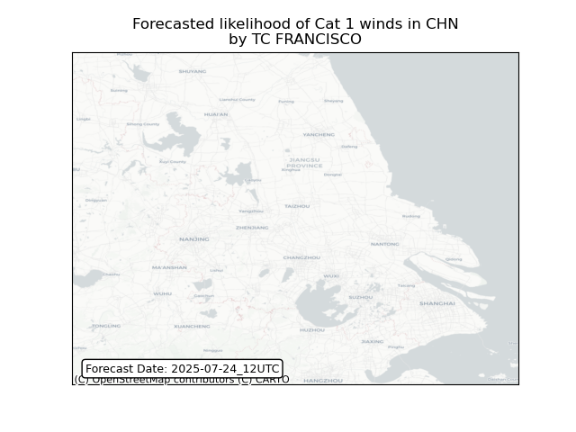

## FRANCISCO China: people exposed

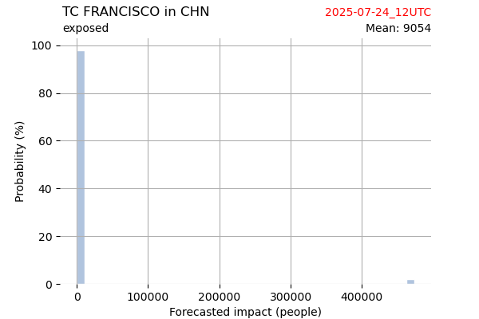

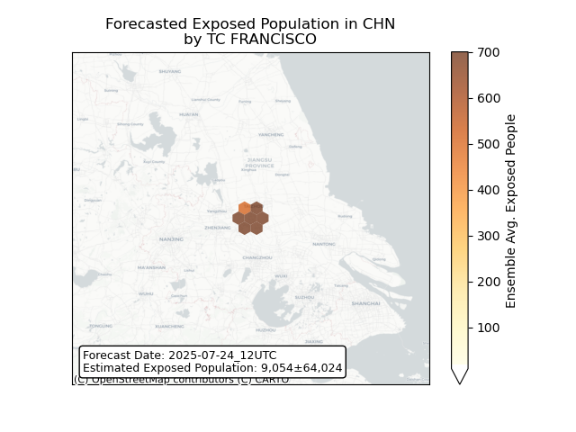

## FRANCISCO China: people displaced

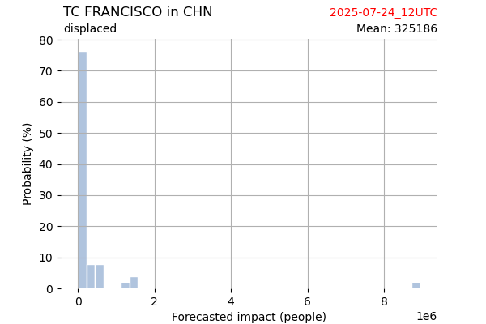

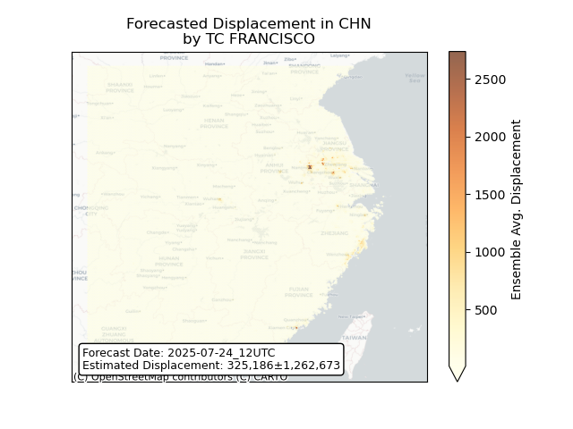

## FRANCISCO Japan: areas affected

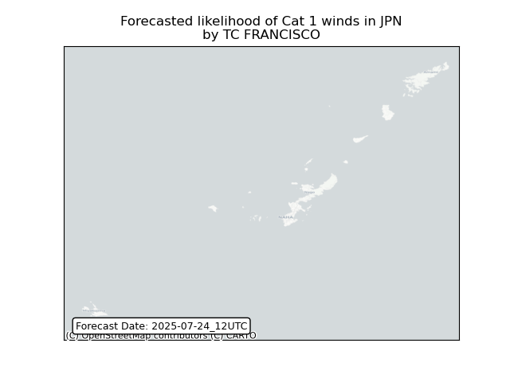

## FRANCISCO Japan: people exposed

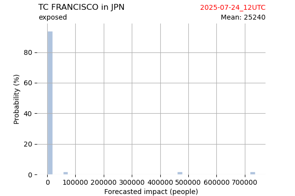

## FRANCISCO Japan: people displaced

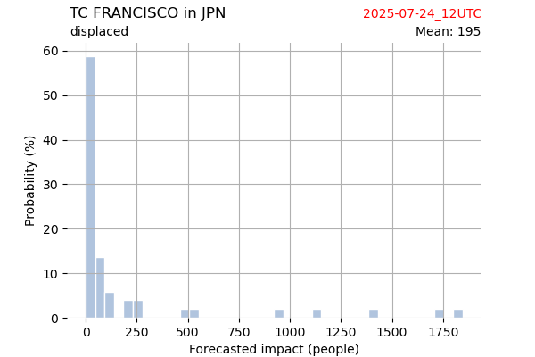

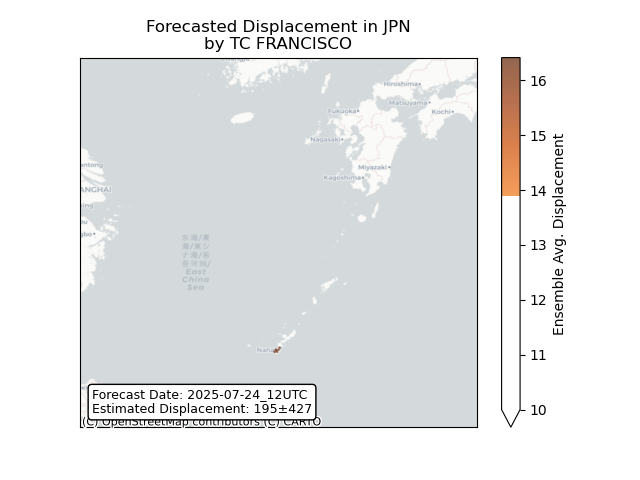

## CO-MAY Japan: areas affected

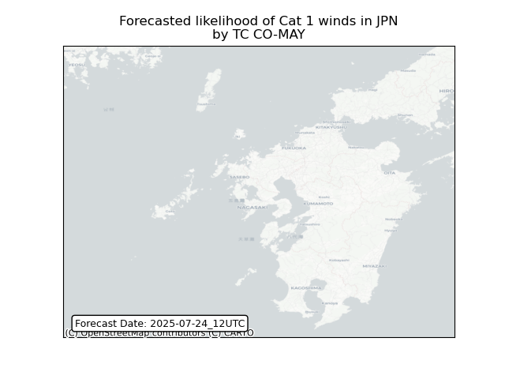

## CO-MAY Japan: people exposed

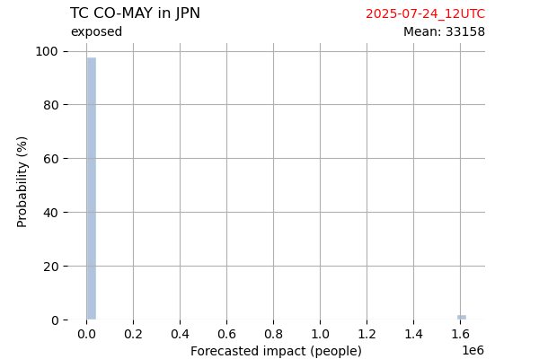

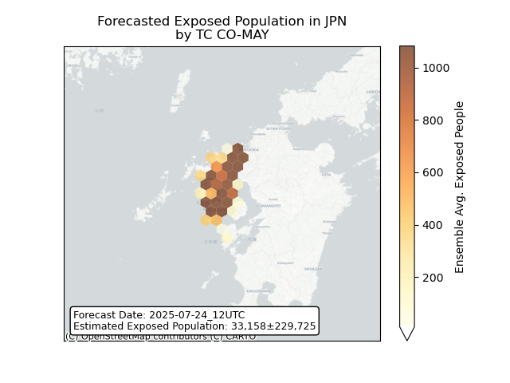

## CO-MAY Japan: people displaced

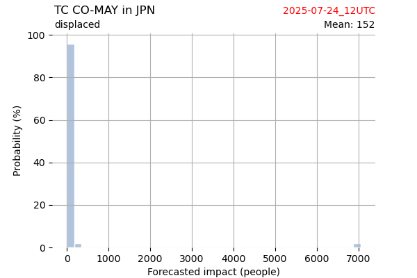

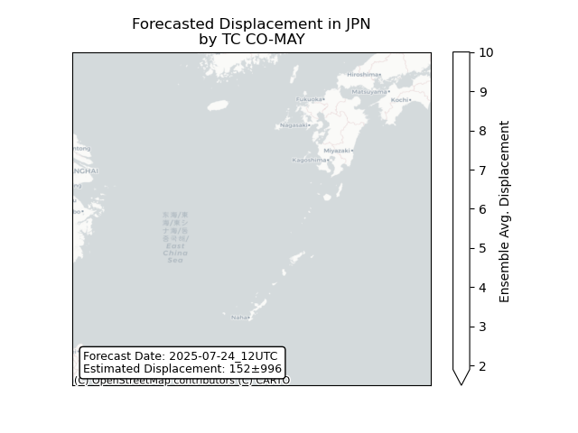

## CO-MAY Philippines: areas affected

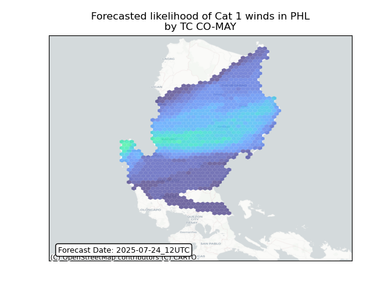

## CO-MAY Philippines: people exposed

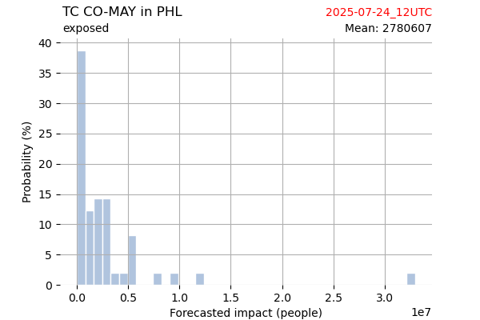

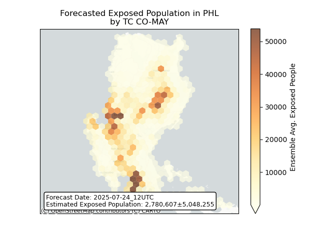

## CO-MAY Philippines: people displaced

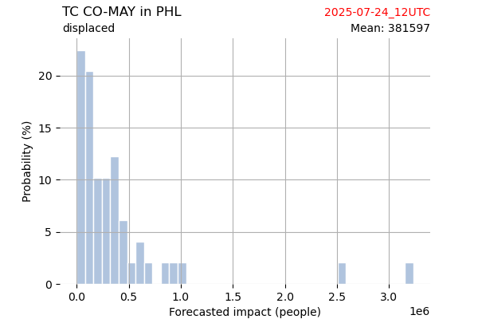

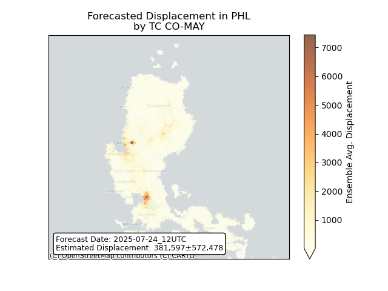

## KROSA Japan: areas affected

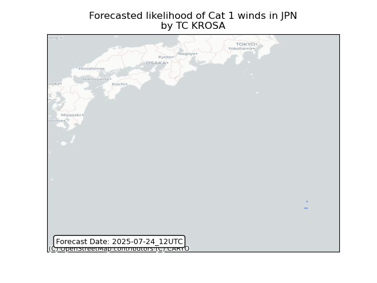

## KROSA Japan: people exposed

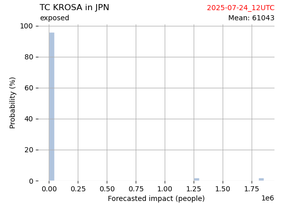

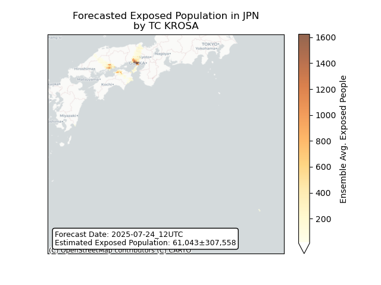

## KROSA Japan: people displaced

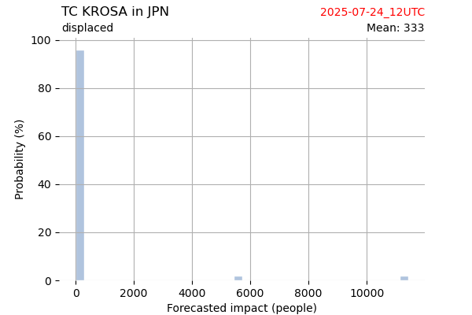

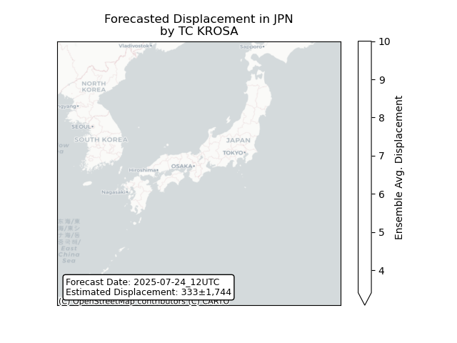

