# Displacement forecast

This is a WIP. All this is going to change, for now we're just dumping things here.

## Forecast for 2025-07-25 00:00 UTC

There are 3 active named storms.

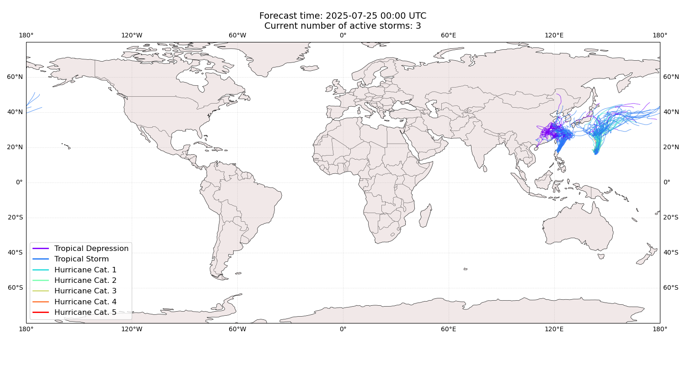

## CO-MAY China: areas affected

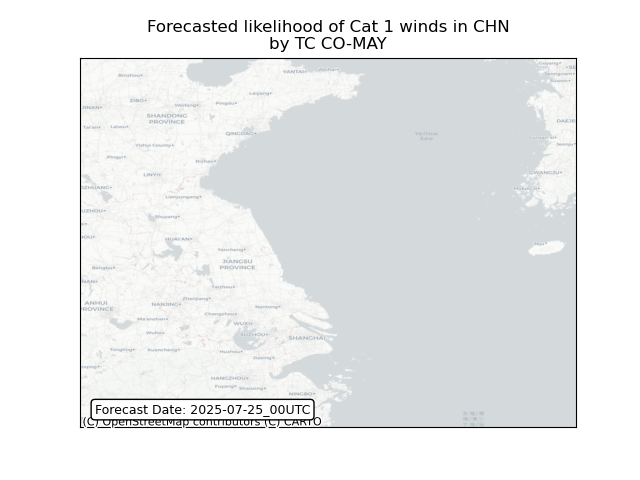

## CO-MAY China: people exposed

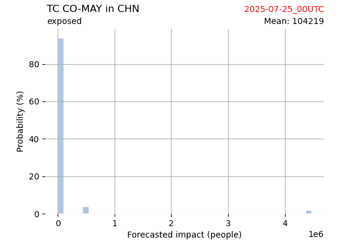

## CO-MAY China: people displaced

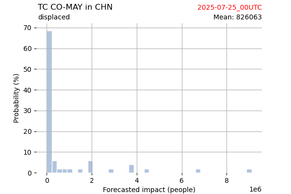

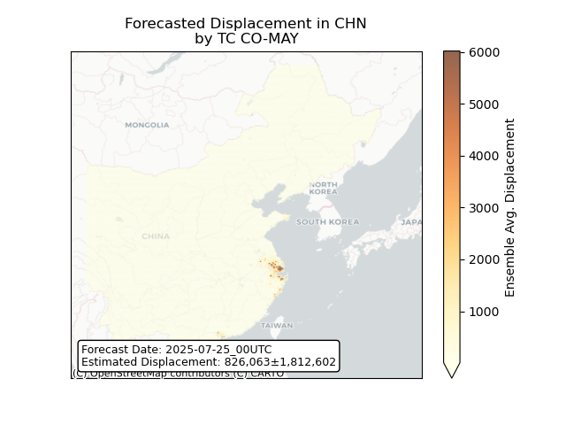

## CO-MAY Japan: areas affected

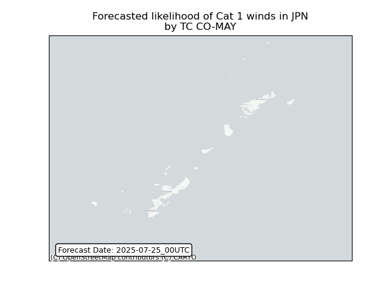

## CO-MAY Japan: people exposed

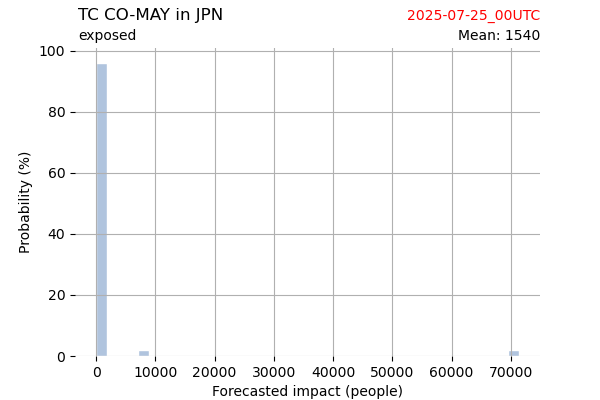

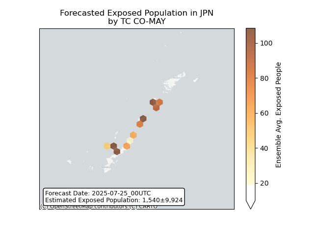

## CO-MAY Japan: people displaced

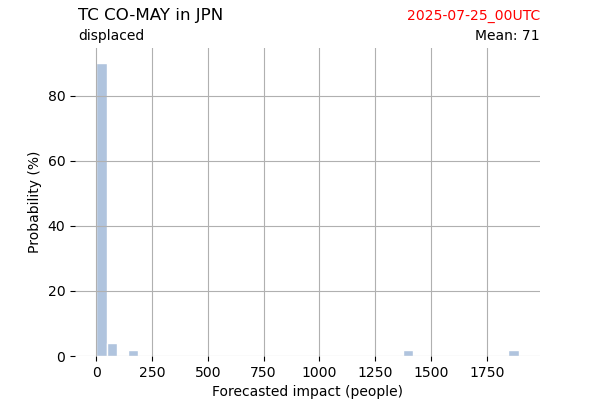

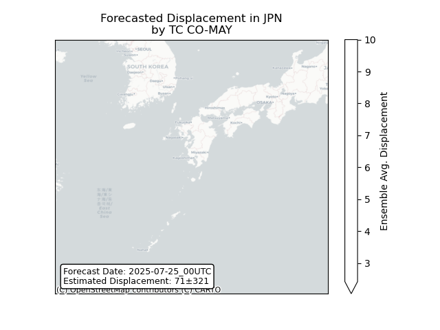

## CO-MAY Philippines: areas affected

## CO-MAY Philippines: people exposed

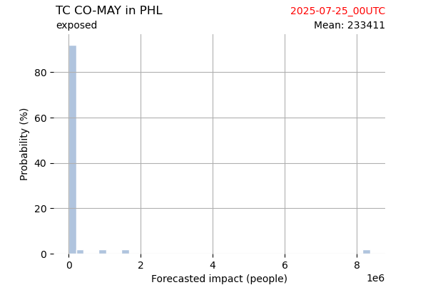

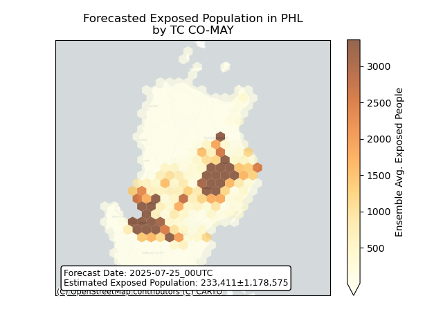

## CO-MAY Philippines: people displaced

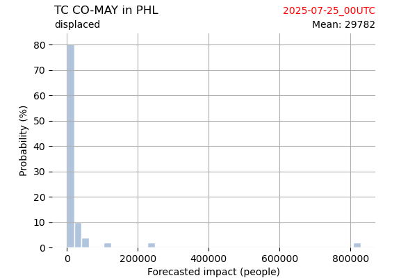

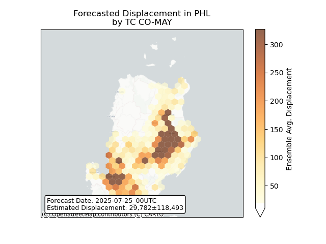

## FRANCISCO All countries: No forecast people exposed

Storm FRANCISCO is not forecast to affect people in All countries.

## FRANCISCO All countries: no forecast people displaced

Storm FRANCISCO is not forecast to displace people in All countries.

## KROSA Japan: areas affected

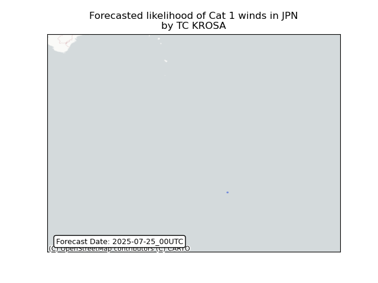

## KROSA Japan: people exposed

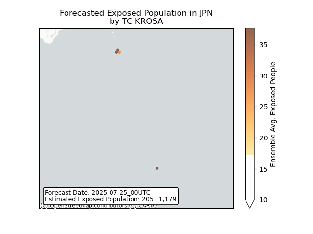

## KROSA Japan: people displaced

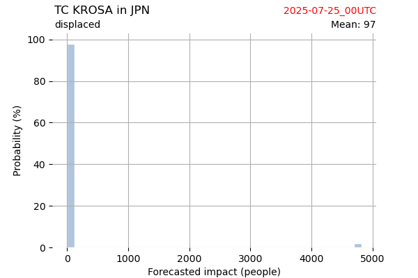

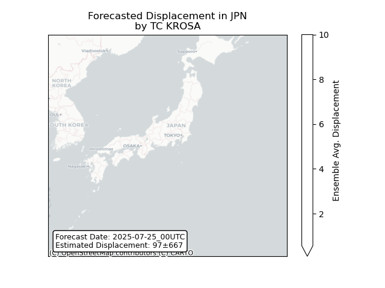

