# Displacement forecast

This is a WIP. All this is going to change, for now we're just dumping things here.
## Forecast for 2025-07-25 12:00 UTC

There are 3 active named storms.

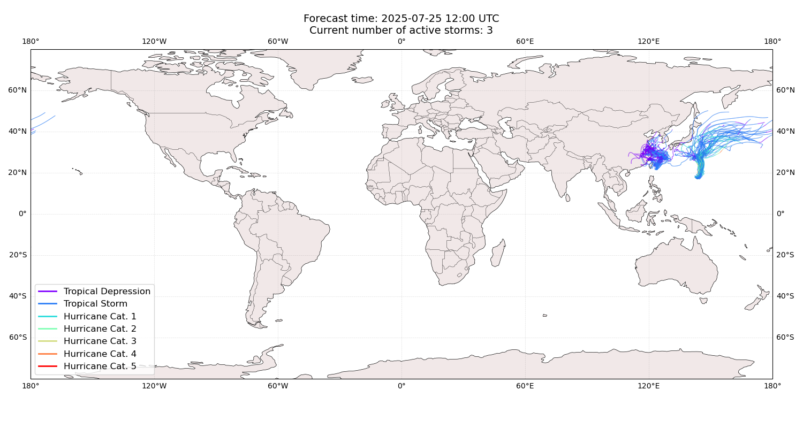

## KROSA Japan: areas affected

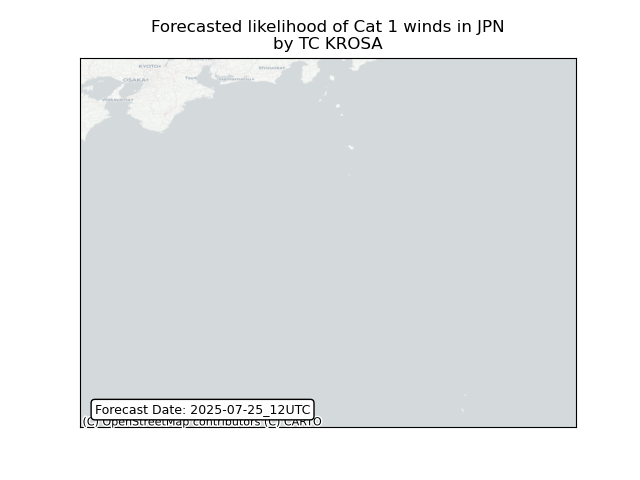
## KROSA Japan: people exposed

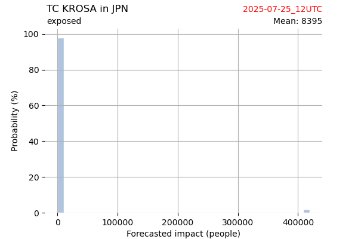

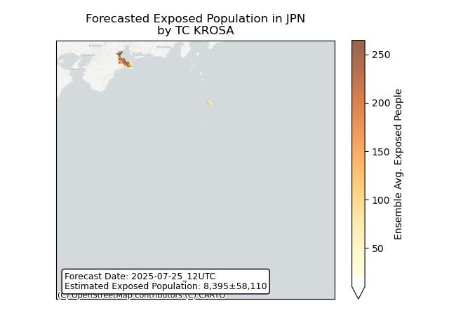

## KROSA Japan: people displaced

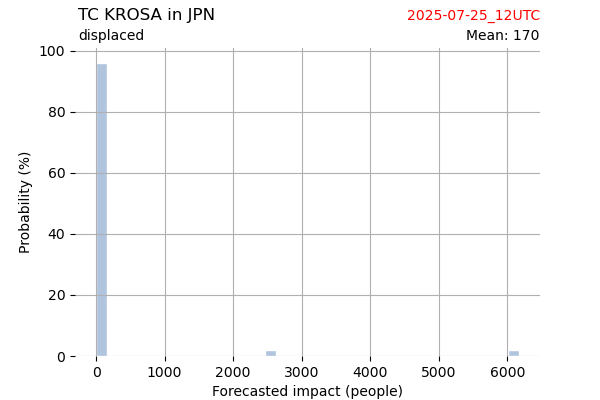

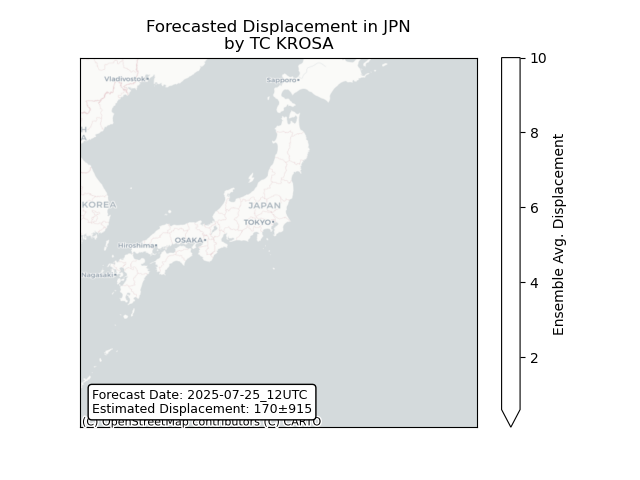

## KROSA Northern Mariana Islands: areas affected

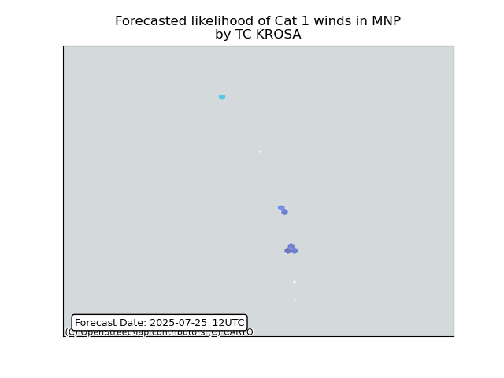
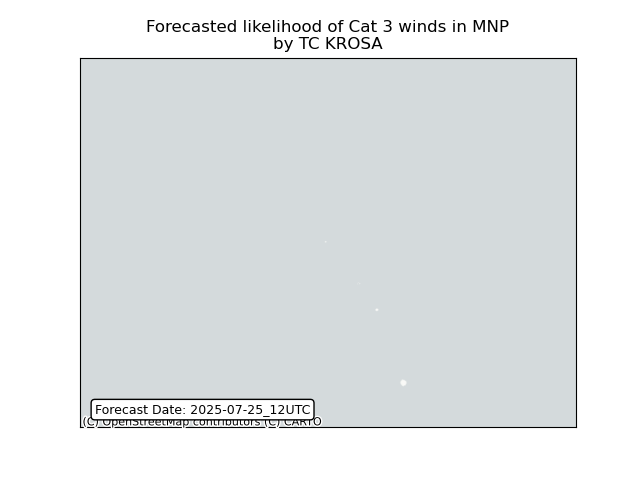

## KROSA Russian Federation: areas affected

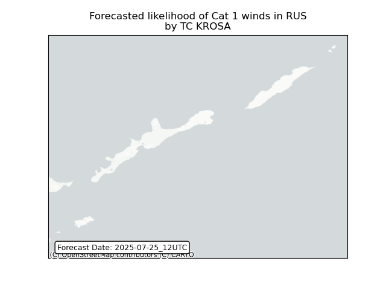
## KROSA Russian Federation: people exposed

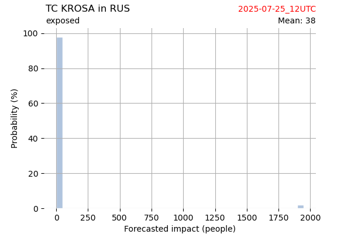

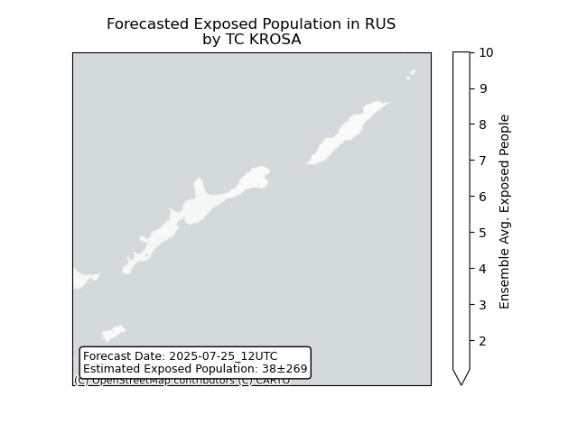

## KROSA Russian Federation: people displaced

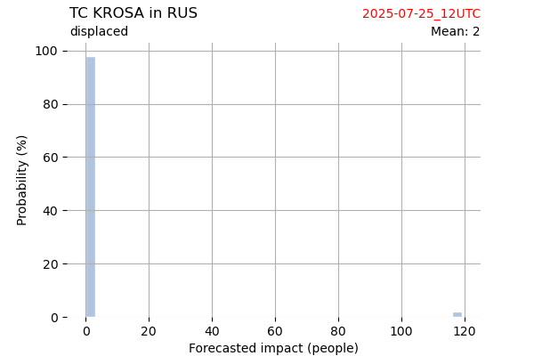

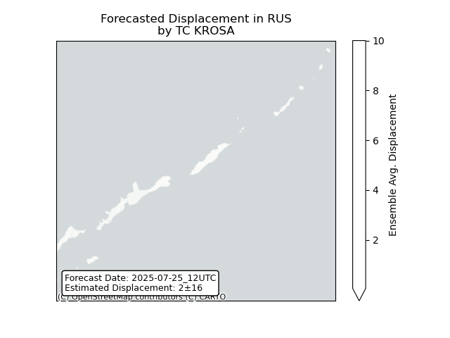

## FRANCISCO China: areas affected

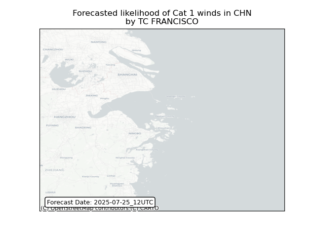
## FRANCISCO China: people exposed

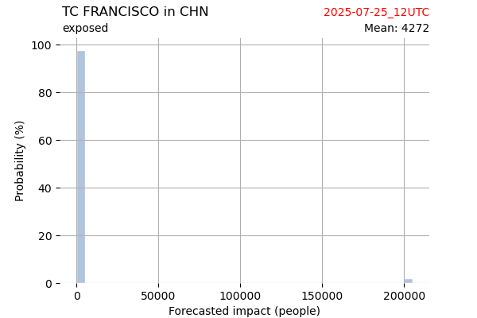

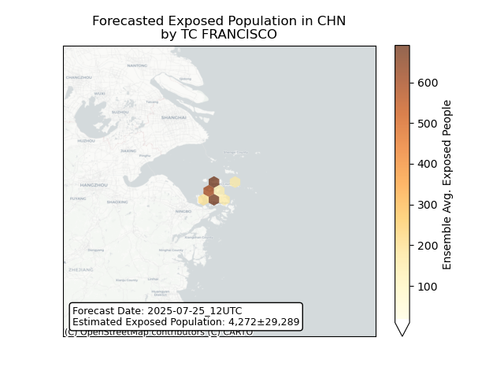

## FRANCISCO China: people displaced

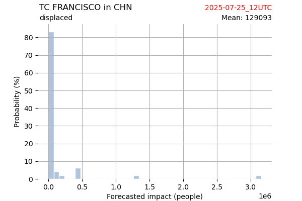

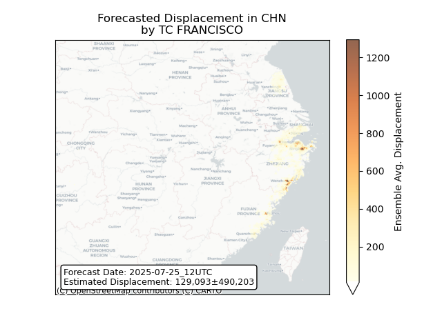

## FRANCISCO Japan: areas affected

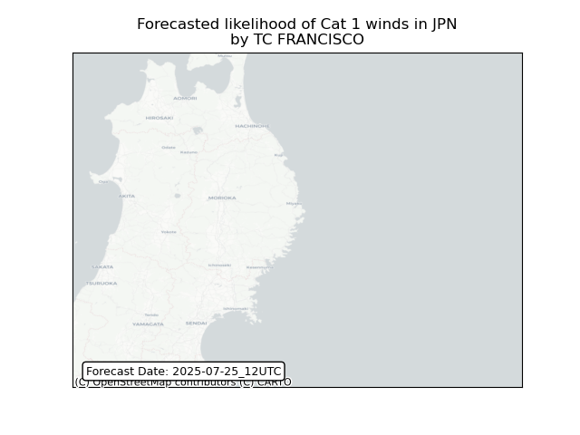
## FRANCISCO Japan: people exposed

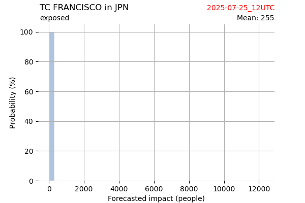

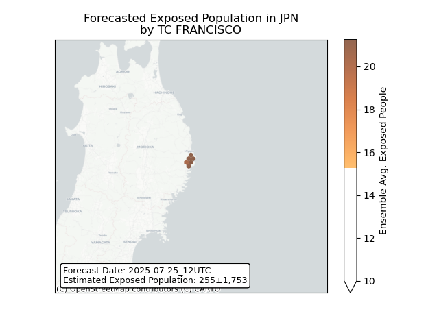

## FRANCISCO Japan: people displaced

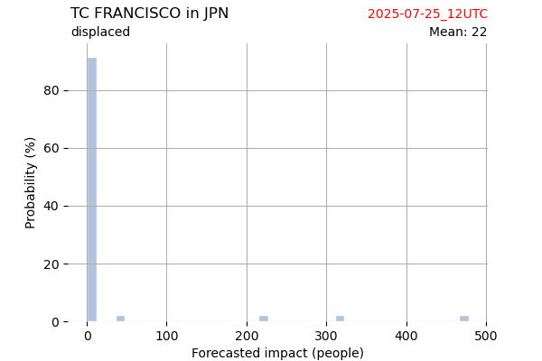

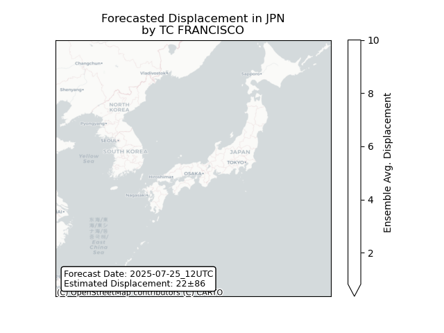

## CO-MAY Japan: areas affected

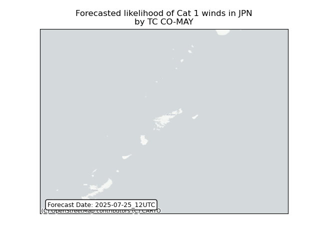
## CO-MAY Japan: people exposed

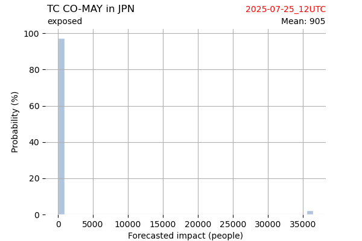

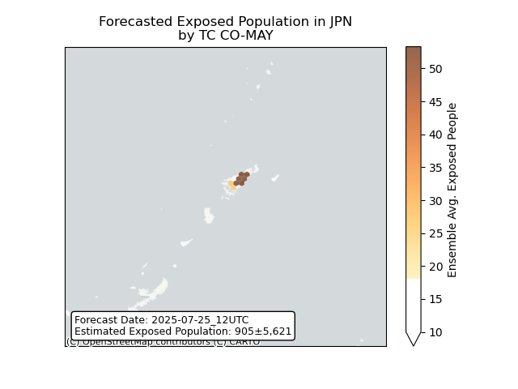

## CO-MAY Japan: people displaced

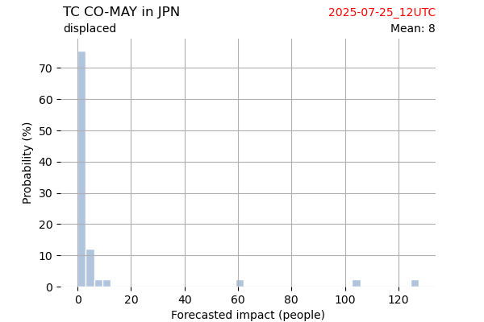

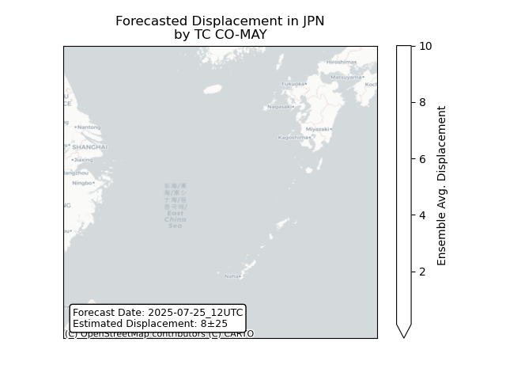

## CO-MAY Korea, Republic of: areas affected

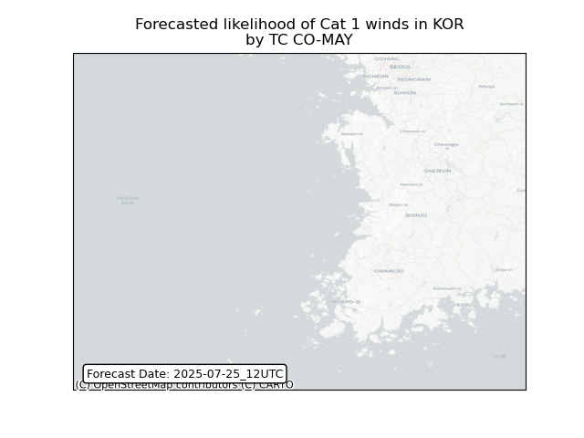
## CO-MAY Korea, Republic of: people exposed

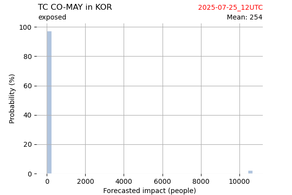

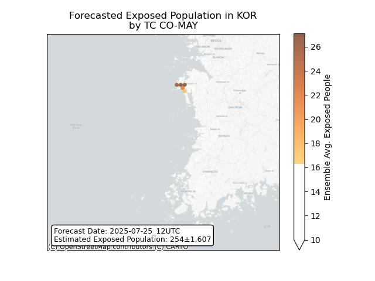

## CO-MAY Korea, Republic of: people displaced

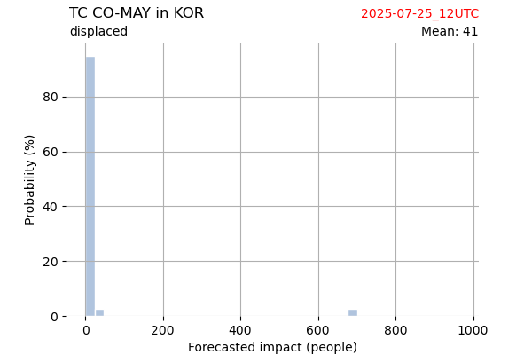

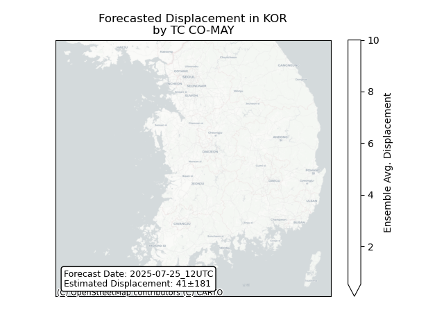

