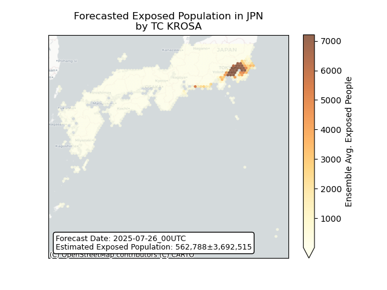
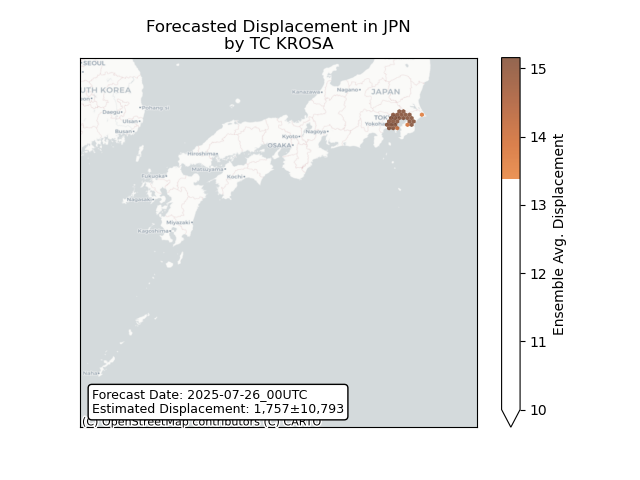
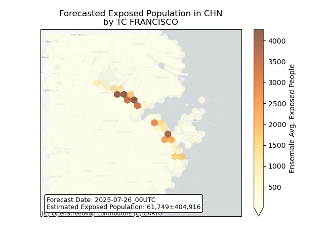
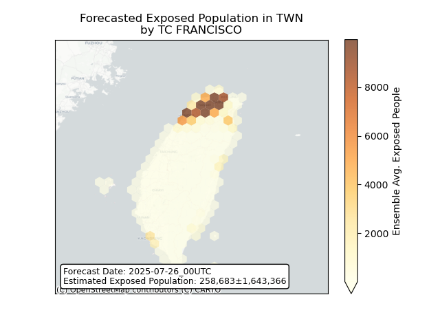

# Displacement forecast

This is a WIP. All this is going to change, for now we're just dumping things here.

## Forecast for 2025-07-26 00:00 UTC

There are 2 active named storms.

## KROSA Japan: areas affected

## KROSA Japan: people exposed

## KROSA Japan: people displaced

## KROSA Northern Mariana Islands: areas affected

## KROSA Russian Federation: areas affected

## KROSA Russian Federation: people exposed

## KROSA Russian Federation: people displaced

## FRANCISCO China: areas affected

## FRANCISCO China: people exposed

## FRANCISCO China: people displaced

## FRANCISCO Taiwan, Province of China: areas affected

## FRANCISCO Taiwan, Province of China: people exposed

## FRANCISCO Taiwan, Province of China: people displaced

