# Displacement forecast

This is a WIP. All this is going to change, for now we're just dumping things here.

## Forecast for 2025-07-26 12:00 UTC

There are 3 active named storms.

## FRANCISCO Japan: areas affected

## FRANCISCO Japan: people exposed

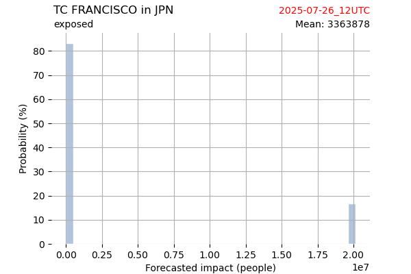

## FRANCISCO Japan: people displaced

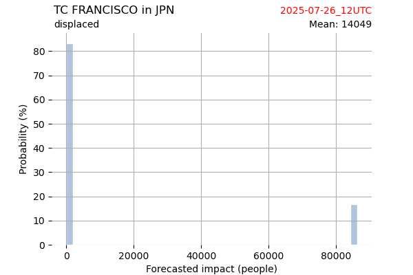

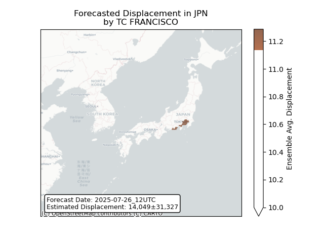

## FRANCISCO Russian Federation: areas affected

## FRANCISCO Russian Federation: people exposed

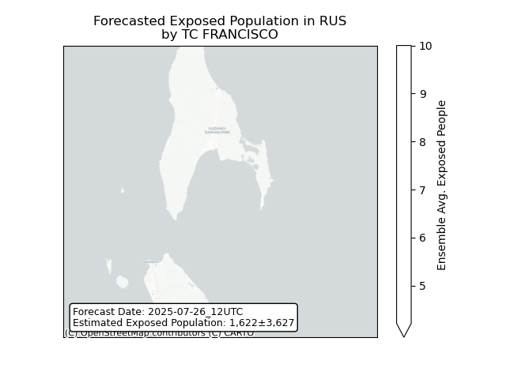

## FRANCISCO Russian Federation: people displaced

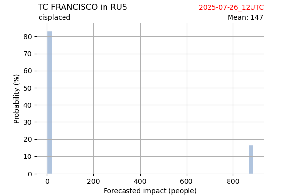

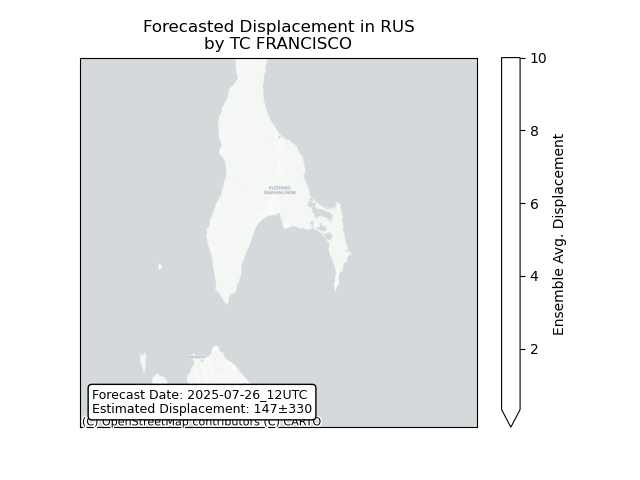

## KROSA Japan: areas affected

## KROSA Japan: people exposed

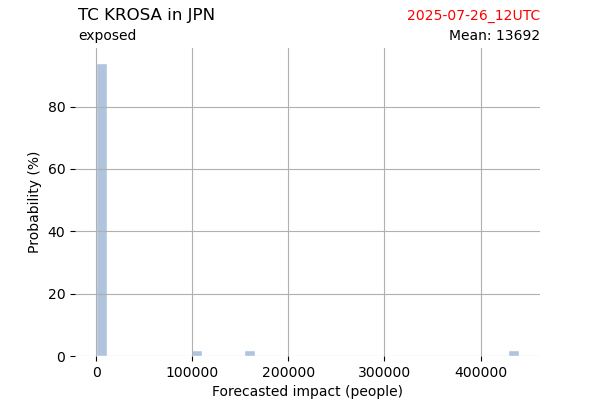

## KROSA Japan: people displaced

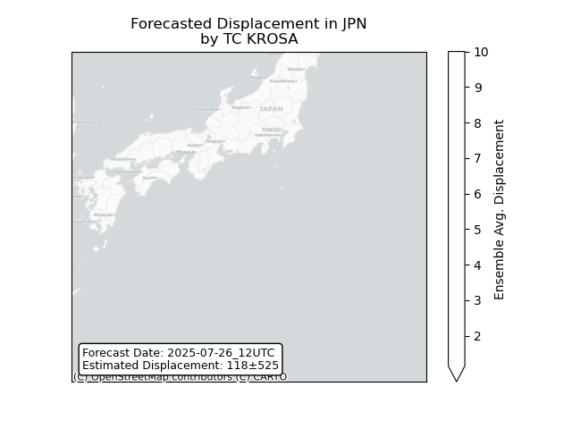

## KROSA Northern Mariana Islands: areas affected

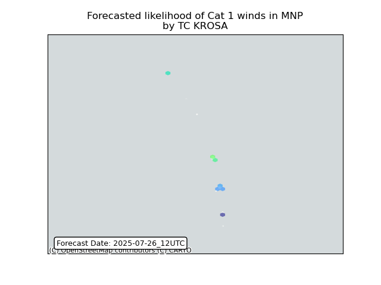

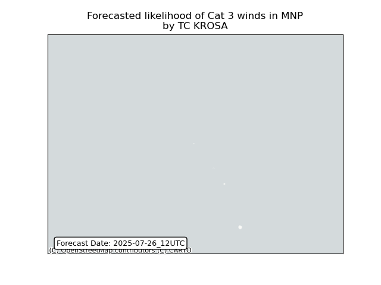

## MAY China: areas affected

## MAY China: people exposed

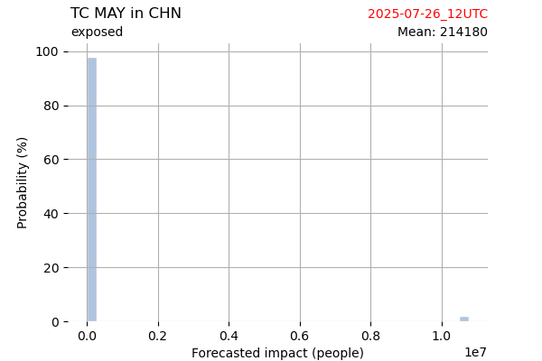

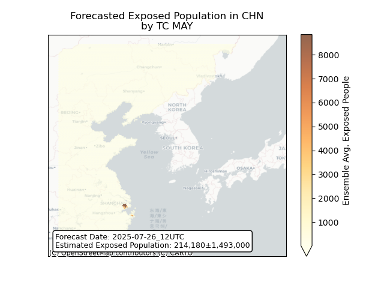

## MAY China: people displaced

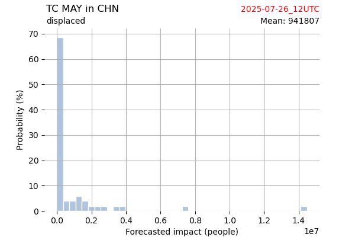

## MAY Japan: areas affected

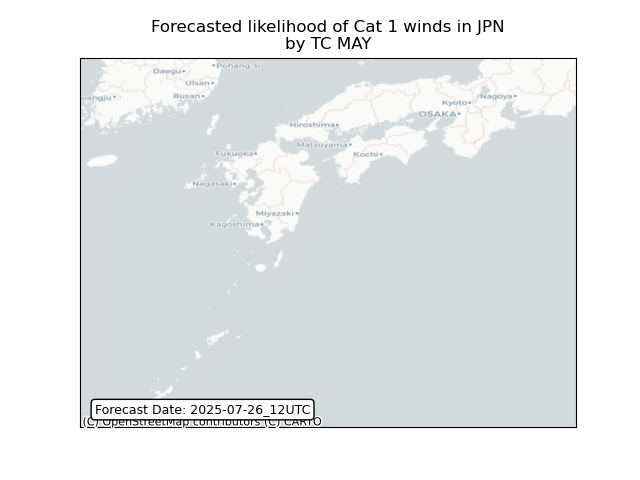

## MAY Japan: people exposed

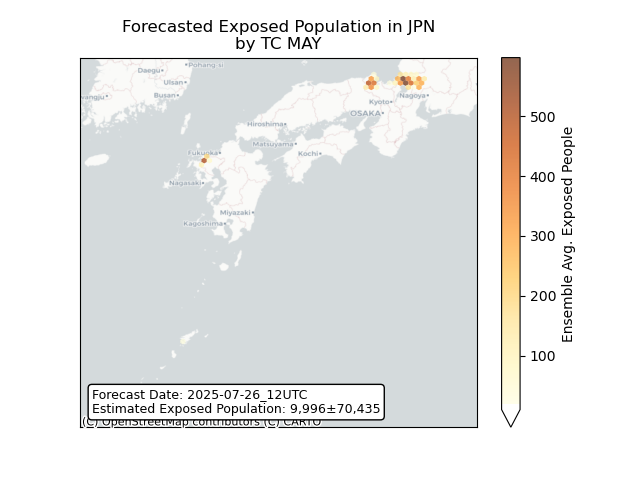

## MAY Japan: people displaced

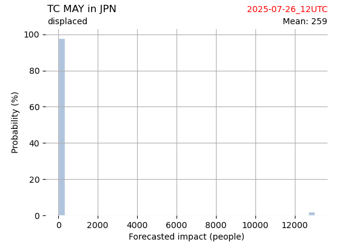

## MAY Korea, Republic of: areas affected

## MAY Korea, Republic of: people exposed

## MAY Korea, Republic of: people displaced

## MAY Korea, Democratic People's Republic of: areas affected

## MAY Korea, Democratic People's Republic of: people exposed

## MAY Korea, Democratic People's Republic of: people displaced

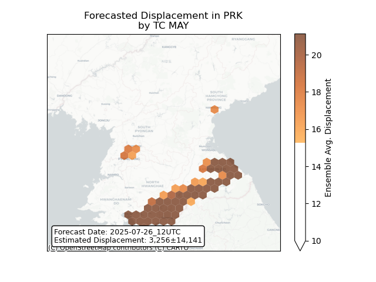

## MAY Russian Federation: areas affected

## MAY Russian Federation: people exposed

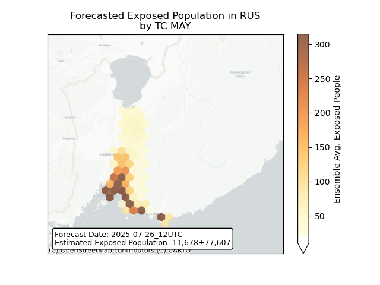

## MAY Russian Federation: people displaced

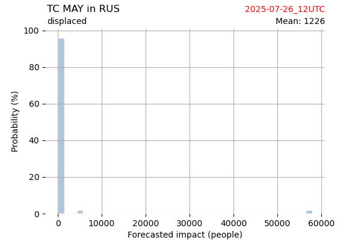

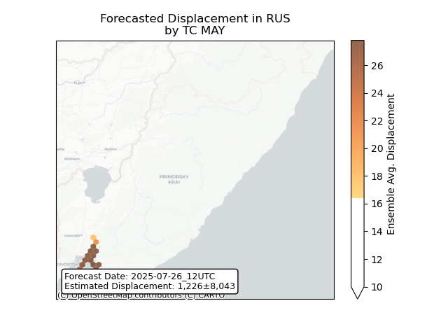

