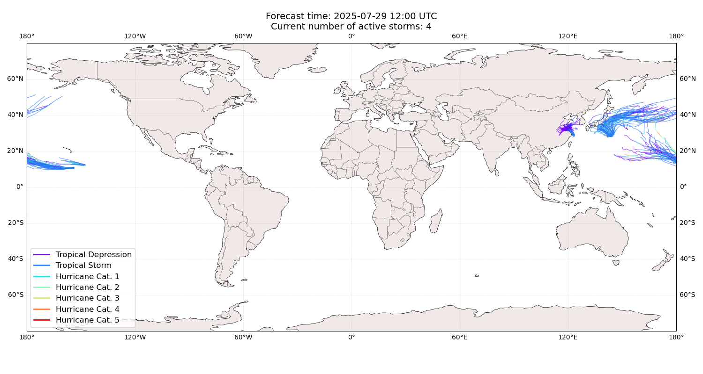
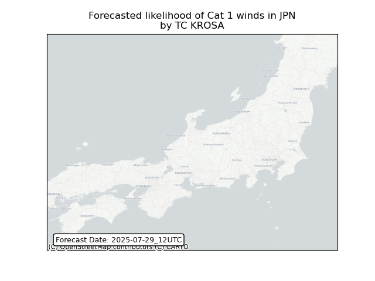
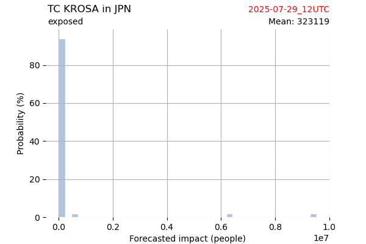
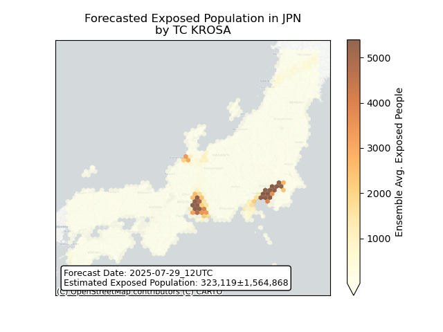
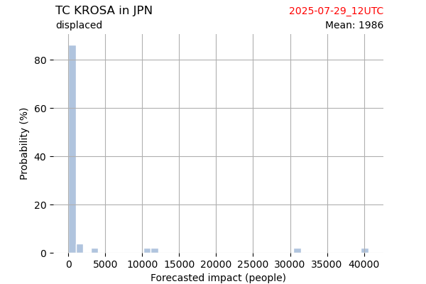
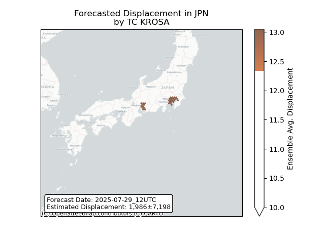
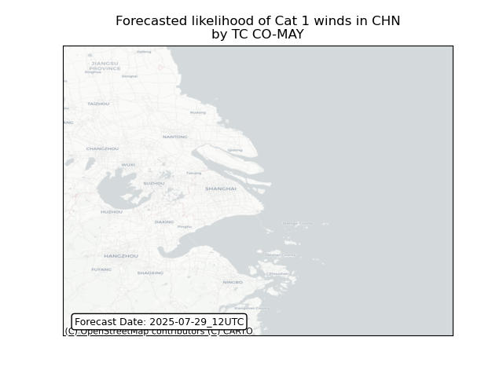
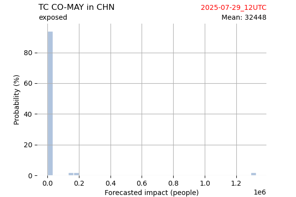
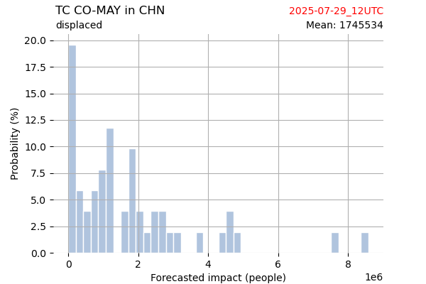
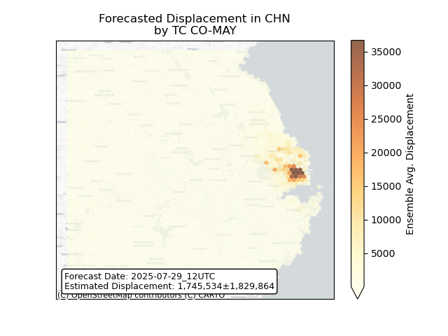

# Displacement forecast

This is a WIP. All this is going to change, for now we're just dumping things here.

## Forecast for 2025-07-29 12:00 UTC

There are 4 active named storms.

## KELI All countries: No forecast people exposed

Storm KELI is not forecast to affect people in All countries.

## KELI All countries: no forecast people displaced

Storm KELI is not forecast to displace people in All countries.

## KROSA Japan: areas affected

## KROSA Japan: people exposed

## KROSA Japan: people displaced

## CO-MAY China: areas affected

## CO-MAY China: people exposed

## CO-MAY China: people displaced

## IONA All countries: No forecast people exposed

Storm IONA is not forecast to affect people in All countries.

## IONA All countries: no forecast people displaced

Storm IONA is not forecast to displace people in All countries.

