# Displacement forecast

This is a WIP. All this is going to change, for now we're just dumping things here.

## Forecast for 2025-07-30 12:00 UTC

There are 4 active named storms.

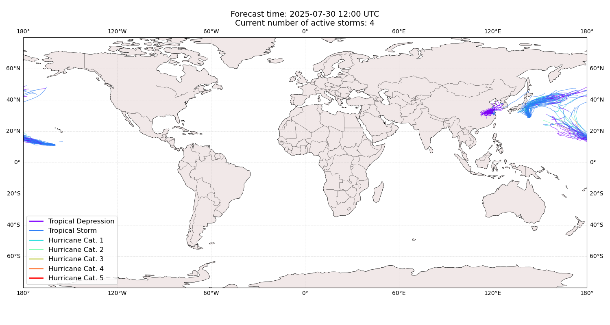

## CO-MAY China: areas affected

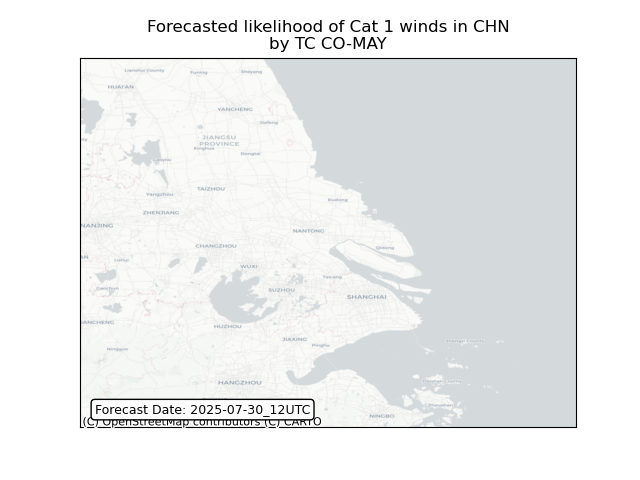

## CO-MAY China: people exposed

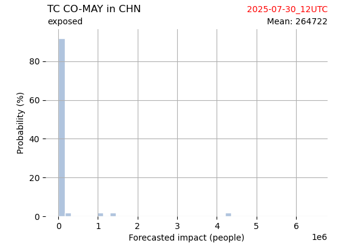

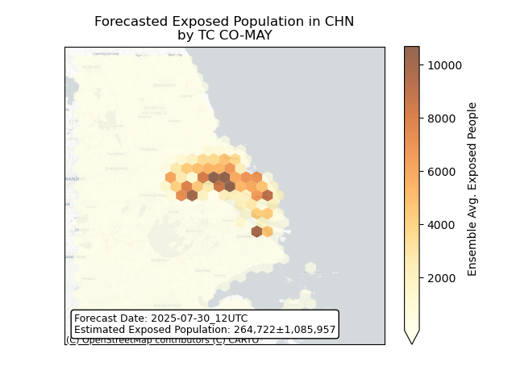

## CO-MAY China: people displaced

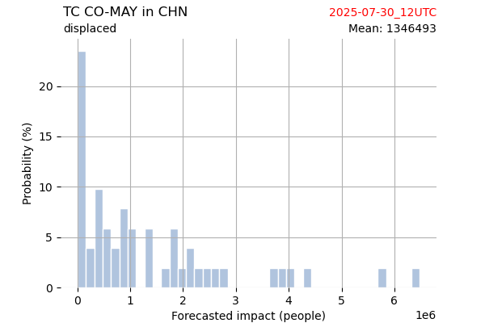

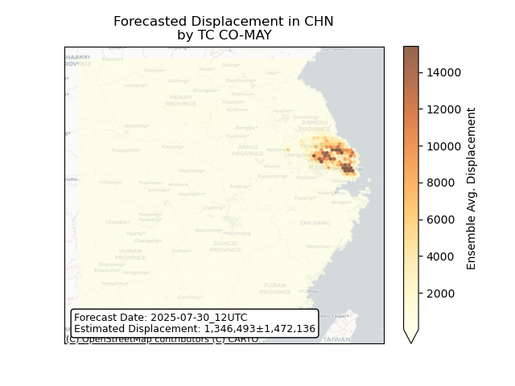

## CO-MAY Japan: areas affected

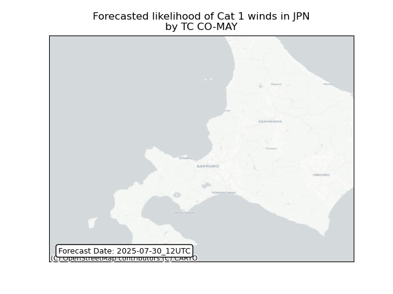

## CO-MAY Japan: people exposed

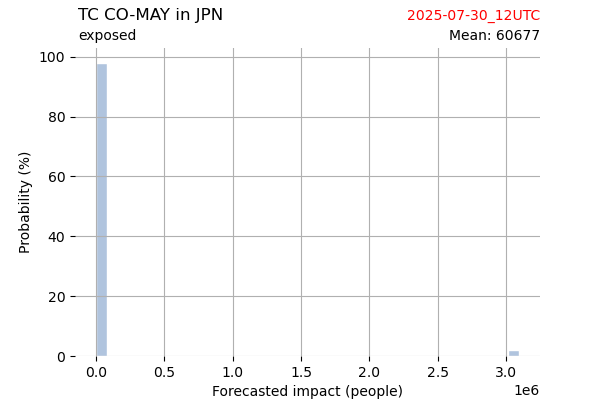

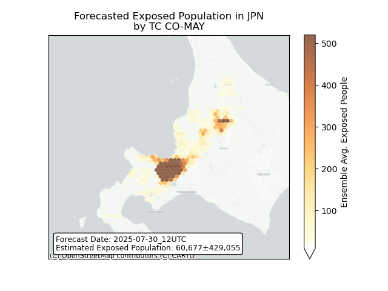

## CO-MAY Japan: people displaced

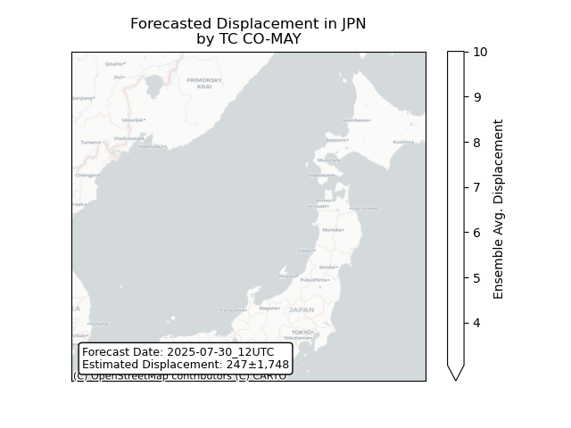

## CO-MAY Korea, Republic of: areas affected

## CO-MAY Korea, Republic of: people exposed

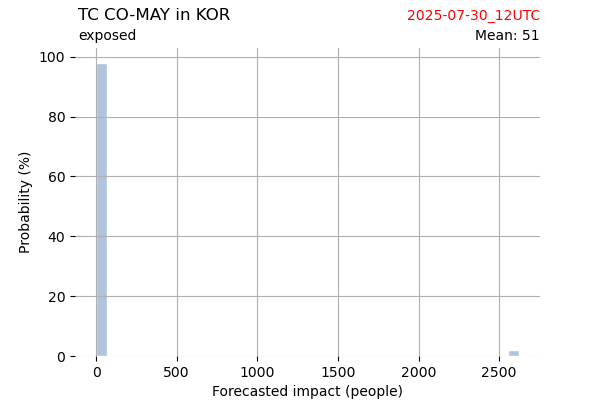

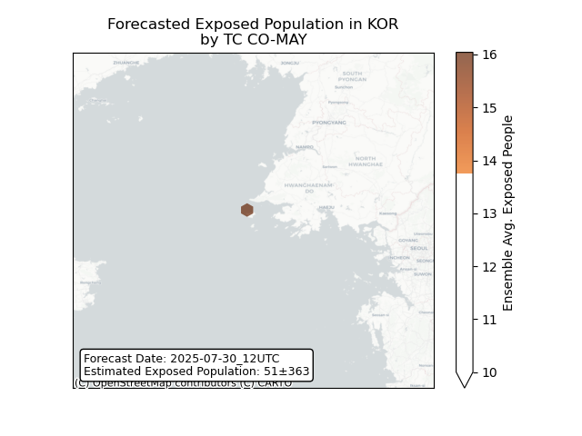

## CO-MAY Korea, Republic of: people displaced

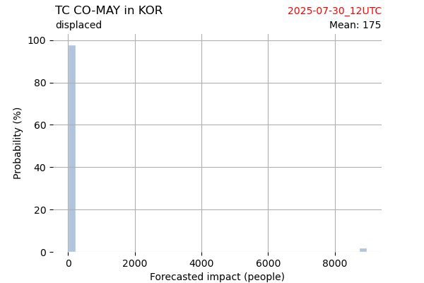

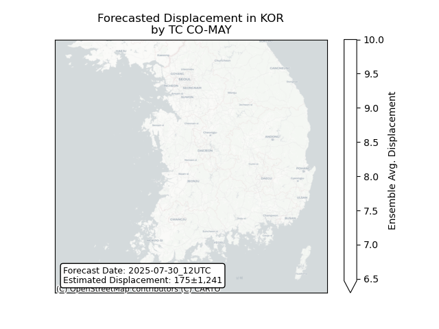

## CO-MAY Korea, Democratic People's Republic of: areas affected

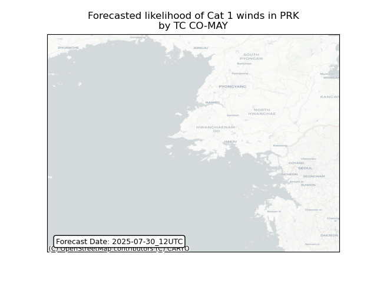

## CO-MAY Korea, Democratic People's Republic of: people exposed

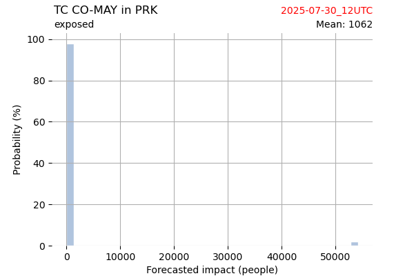

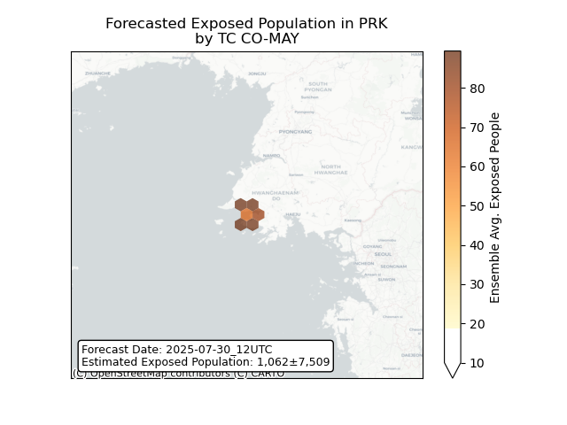

## CO-MAY Korea, Democratic People's Republic of: people displaced

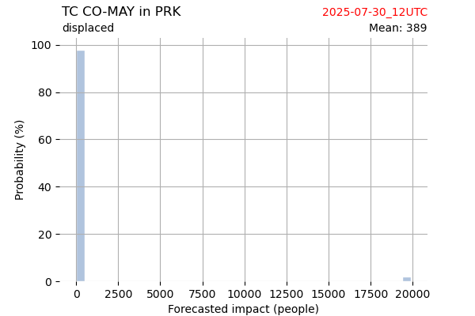

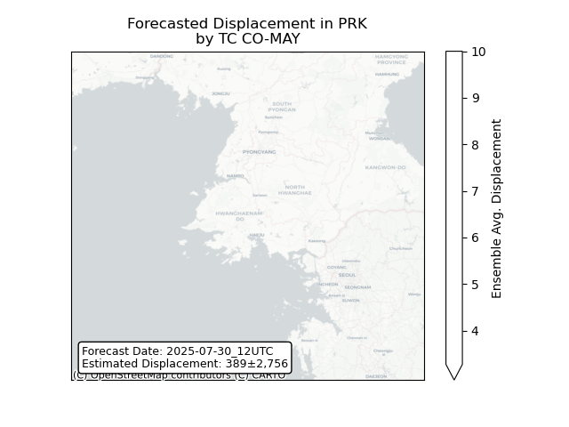

## KELI All countries: No forecast people exposed

Storm KELI is not forecast to affect people in All countries.

## KELI All countries: no forecast people displaced

Storm KELI is not forecast to displace people in All countries.

## IONA All countries: No forecast people exposed

Storm IONA is not forecast to affect people in All countries.

## IONA All countries: no forecast people displaced

Storm IONA is not forecast to displace people in All countries.

## KROSA All countries: No forecast people exposed

Storm KROSA is not forecast to affect people in All countries.

## KROSA All countries: no forecast people displaced

Storm KROSA is not forecast to displace people in All countries.

