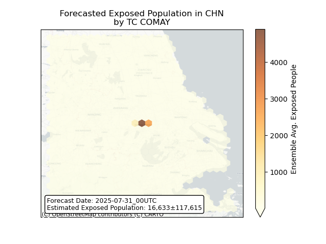

# Displacement forecast

This is a WIP. All this is going to change, for now we're just dumping things here.

## Forecast for 2025-07-31 00:00 UTC

There are 3 active named storms.

## KROSA All countries: No forecast people exposed

Storm KROSA is not forecast to affect people in All countries.

## KROSA All countries: no forecast people displaced

Storm KROSA is not forecast to displace people in All countries.

## IONA All countries: No forecast people exposed

Storm IONA is not forecast to affect people in All countries.

## IONA All countries: no forecast people displaced

Storm IONA is not forecast to displace people in All countries.

## COMAY China: areas affected

## COMAY China: people exposed

## COMAY China: people displaced

