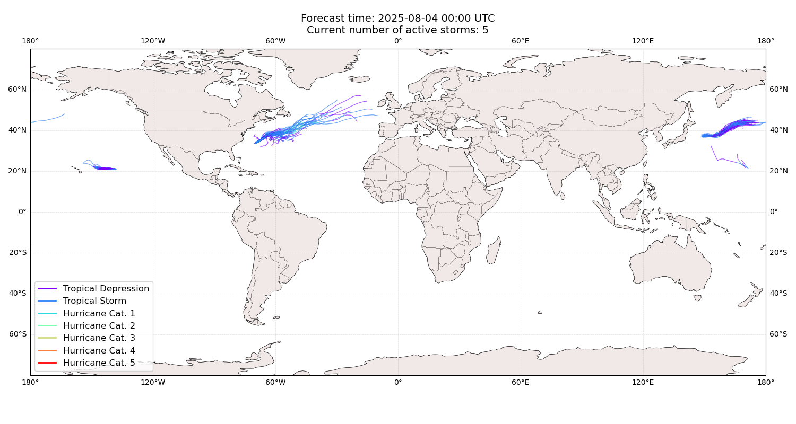

# Displacement forecast

This is a WIP. All this is going to change, for now we're just dumping things here.

## Forecast for 2025-08-04 00:00 UTC

There are 5 active named storms.

## DEXTER All countries: No forecast people exposed

Storm DEXTER is not forecast to affect people in All countries.

## DEXTER All countries: no forecast people displaced

Storm DEXTER is not forecast to displace people in All countries.

## GIL All countries: No forecast people exposed

Storm GIL is not forecast to affect people in All countries.

## GIL All countries: no forecast people displaced

Storm GIL is not forecast to displace people in All countries.

## KROSA All countries: No forecast people exposed

Storm KROSA is not forecast to affect people in All countries.

## KROSA All countries: no forecast people displaced

Storm KROSA is not forecast to displace people in All countries.

## IONA All countries: No forecast people exposed

Storm IONA is not forecast to affect people in All countries.

## IONA All countries: no forecast people displaced

Storm IONA is not forecast to displace people in All countries.

## BAILU All countries: No forecast people exposed

Storm BAILU is not forecast to affect people in All countries.

## BAILU All countries: no forecast people displaced

Storm BAILU is not forecast to displace people in All countries.

