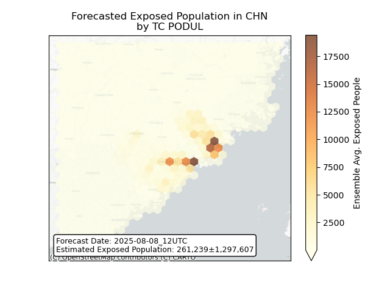
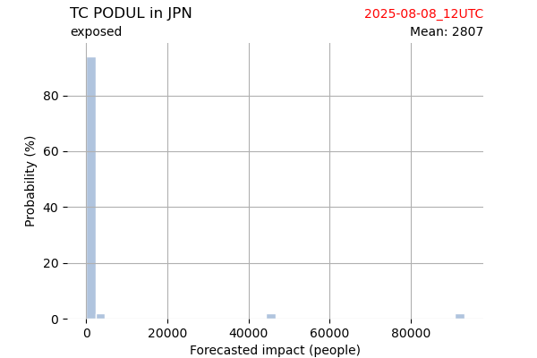
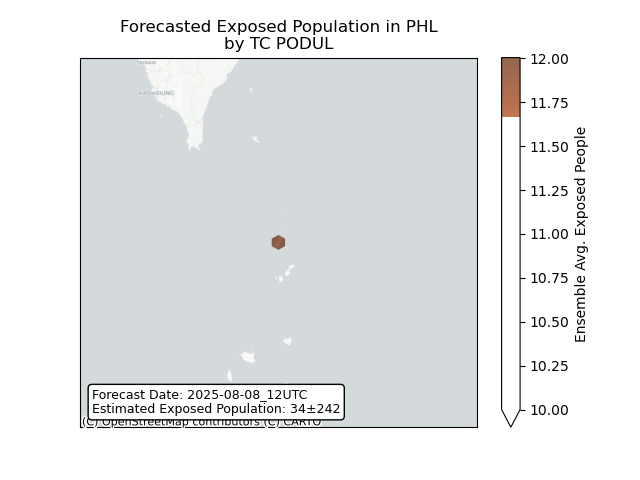
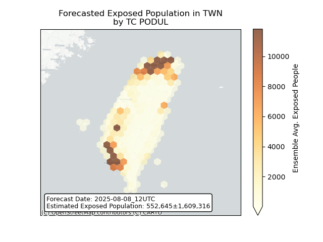

# Displacement forecast

This is a WIP. All this is going to change, for now we're just dumping things here.

## Forecast for 2025-08-08 12:00 UTC

There are 4 active named storms.

## IVO All countries: No forecast people exposed

Storm IVO is not forecast to affect people in All countries.

## IVO All countries: no forecast people displaced

Storm IVO is not forecast to displace people in All countries.

## PODUL China: areas affected

## PODUL China: people exposed

## PODUL China: people displaced

## PODUL Japan: areas affected

## PODUL Japan: people exposed

## PODUL Japan: people displaced

## PODUL Philippines: areas affected

## PODUL Philippines: people exposed

## PODUL Philippines: people displaced

## PODUL Taiwan, Province of China: areas affected

## PODUL Taiwan, Province of China: people exposed

## PODUL Taiwan, Province of China: people displaced

## AWO All countries: No forecast people exposed

Storm AWO is not forecast to affect people in All countries.

## AWO All countries: no forecast people displaced

Storm AWO is not forecast to displace people in All countries.

## HENRIETTE All countries: No forecast people exposed

Storm HENRIETTE is not forecast to affect people in All countries.

## HENRIETTE All countries: no forecast people displaced

Storm HENRIETTE is not forecast to displace people in All countries.

