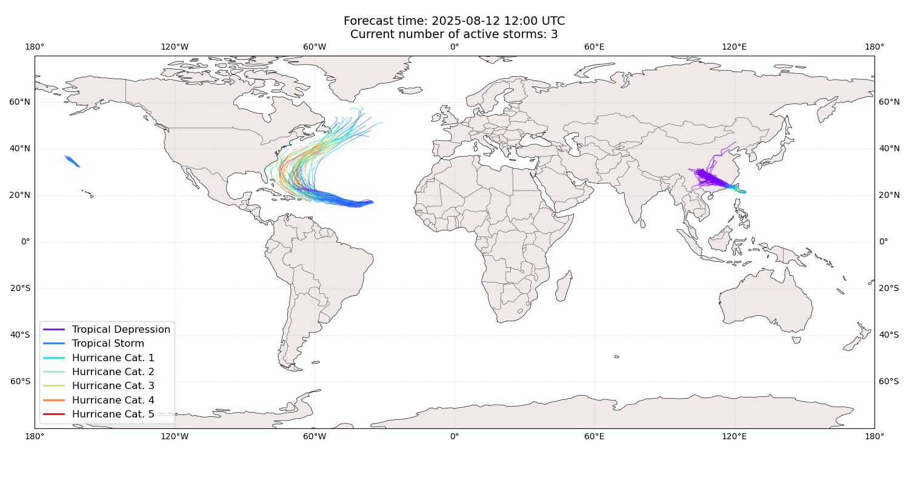

# Displacement forecast

This is a WIP. All this is going to change, for now we're just dumping things here.

## Forecast for 2025-08-12 12:00 UTC

There are 3 active named storms.

## HENRIETTE All countries: No forecast people exposed

Storm HENRIETTE is not forecast to affect people in All countries.

## HENRIETTE All countries: no forecast people displaced

Storm HENRIETTE is not forecast to displace people in All countries.

## ERIN All countries: No forecast people exposed

Storm ERIN is not forecast to affect people in All countries.

## ERIN All countries: no forecast people displaced

Storm ERIN is not forecast to displace people in All countries.

## PODUL All countries: No forecast people exposed

Storm PODUL is not forecast to affect people in All countries.

## PODUL All countries: no forecast people displaced

Storm PODUL is not forecast to displace people in All countries.

