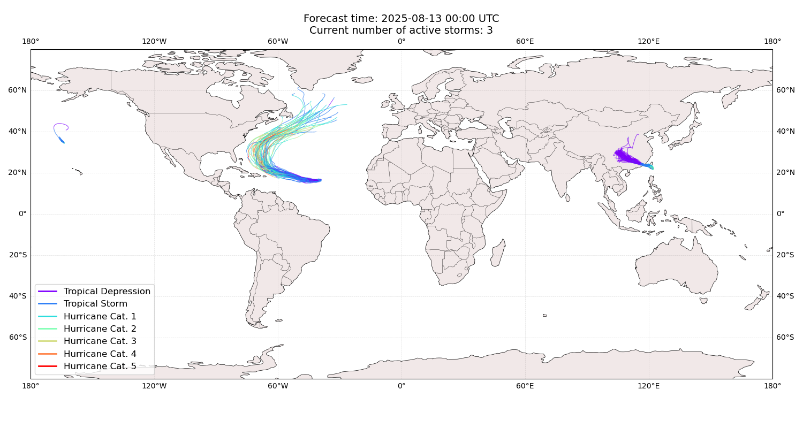
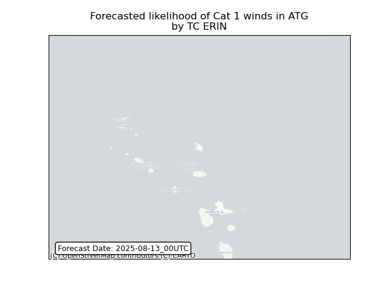
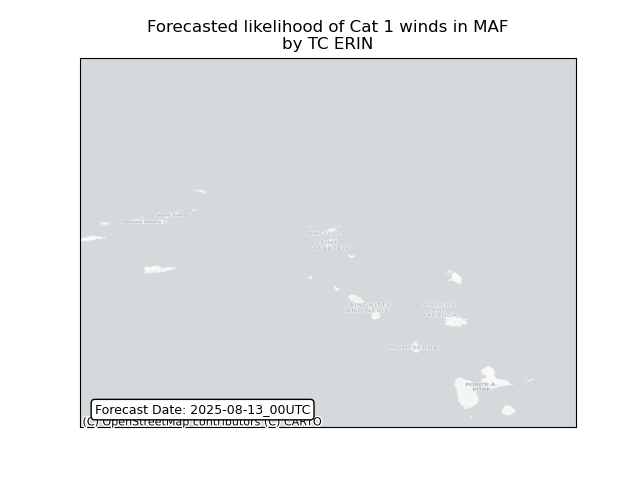
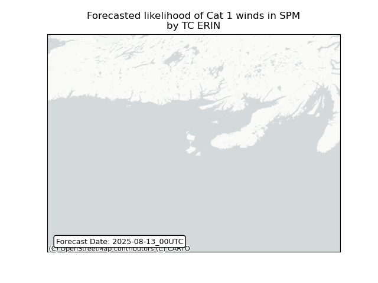

# Displacement forecast

This is a WIP. All this is going to change, for now we're just dumping things here.
## Forecast for 2025-08-13 00:00 UTC

There are 3 active named storms.

## ERIN Antigua and Barbuda: areas affected

## ERIN Saint Martin (French part): areas affected

## ERIN Saint Pierre and Miquelon: areas affected

## HENRIETTE All countries: No forecast people exposed

Storm HENRIETTE is not forecast to affect people in All countries.

## HENRIETTE All countries: no forecast people displaced

Storm HENRIETTE is not forecast to displace people in All countries.

