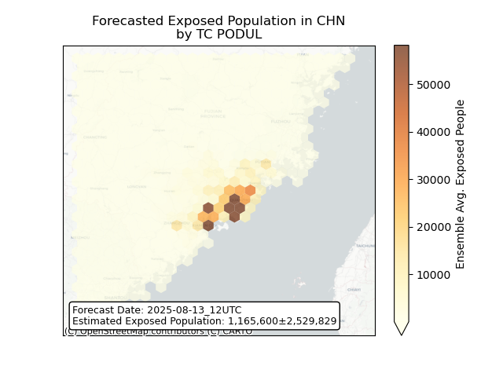
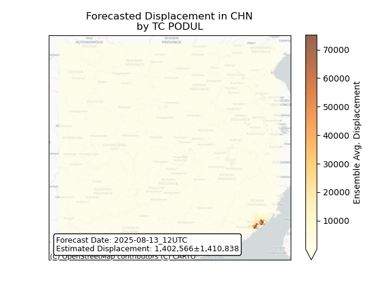
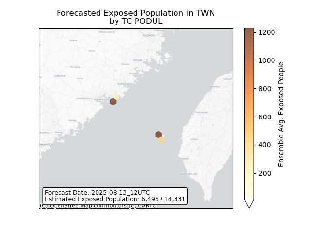
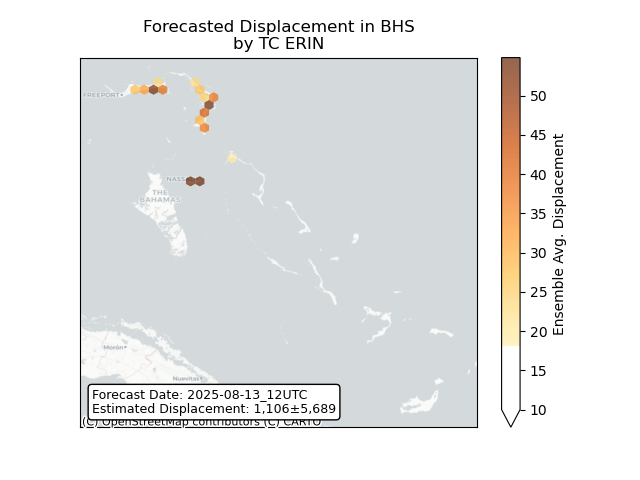
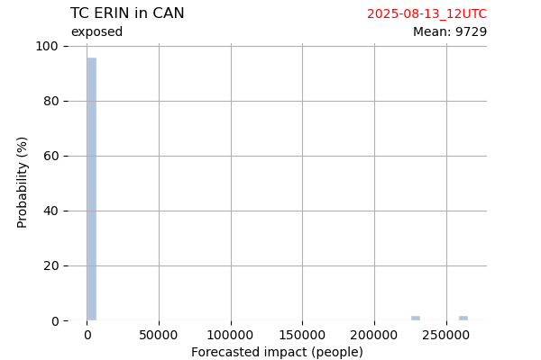
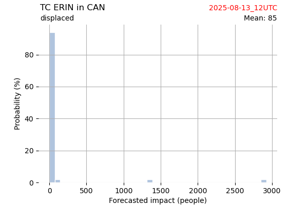

# Displacement forecast

This is a WIP. All this is going to change, for now we're just dumping things here.

## Forecast for 2025-08-13 12:00 UTC

There are 2 active named storms.

## PODUL China: areas affected

## PODUL China: people exposed

## PODUL China: people displaced

## PODUL Taiwan, Province of China: areas affected

## PODUL Taiwan, Province of China: people exposed

## PODUL Taiwan, Province of China: people displaced

## ERIN Antigua and Barbuda: areas affected

## ERIN Antigua and Barbuda: people exposed

## ERIN Antigua and Barbuda: people displaced

## ERIN Bahamas: areas affected

## ERIN Bahamas: people exposed

## ERIN Bahamas: people displaced

## ERIN Bermuda: areas affected

## ERIN Bermuda: people exposed

## ERIN Bermuda: people displaced

## ERIN Canada: areas affected

## ERIN Canada: people exposed

## ERIN Canada: people displaced

## ERIN Dominican Republic: areas affected

## ERIN Dominican Republic: people exposed

## ERIN Dominican Republic: people displaced

## ERIN Turks and Caicos Islands: areas affected

## ERIN Turks and Caicos Islands: people exposed

## ERIN Turks and Caicos Islands: people displaced

## ERIN United States: areas affected

## ERIN United States: people exposed

## ERIN United States: people displaced

## ERIN Virgin Islands, British: areas affected

## ERIN Virgin Islands, British: people exposed

## ERIN Virgin Islands, British: people displaced

