# Displacement forecast

This is a WIP. All this is going to change, for now we're just dumping things here.
## Forecast for 2025-08-14 12:00 UTC

There are 2 active named storms.

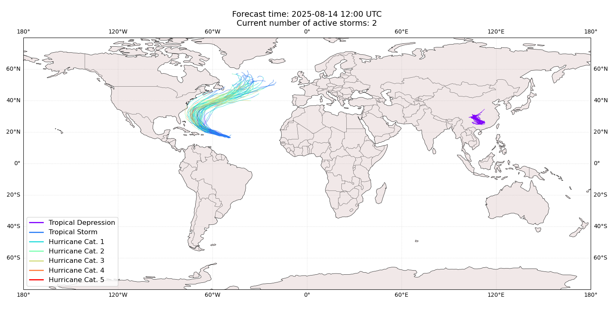

## PODUL All countries: No forecast people exposed

Storm PODUL is not forecast to affect people in All countries.

## PODUL All countries: no forecast people displaced

Storm PODUL is not forecast to displace people in All countries.

## ERIN Bermuda: areas affected

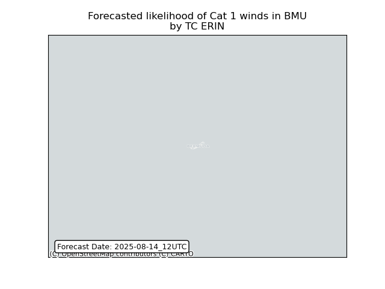
## ERIN Bermuda: people exposed

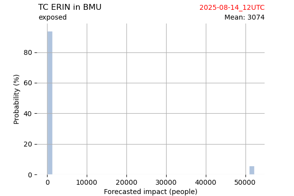

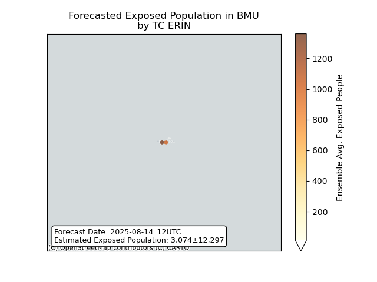

## ERIN Bermuda: people displaced

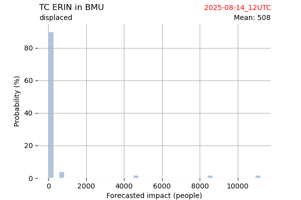

## ERIN Canada: areas affected

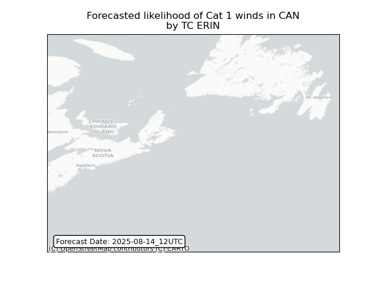
## ERIN Canada: people exposed

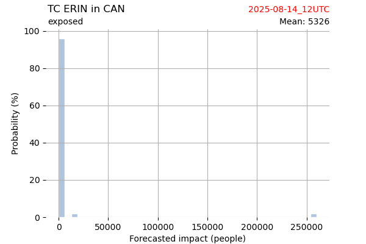

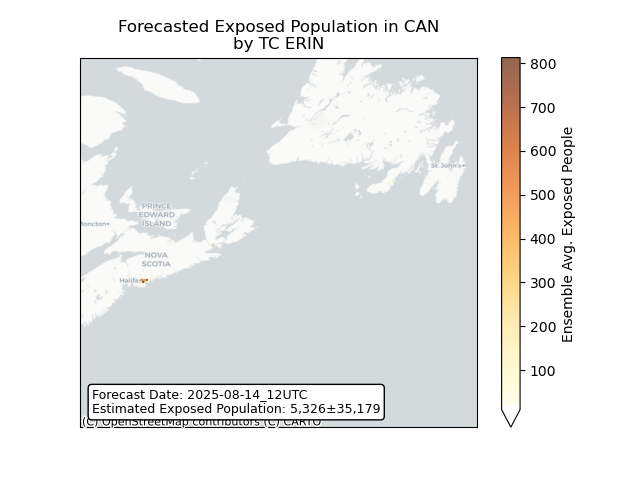

## ERIN Canada: people displaced

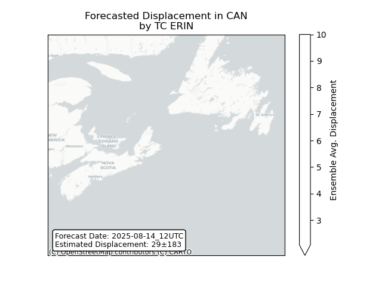

## ERIN United States: areas affected

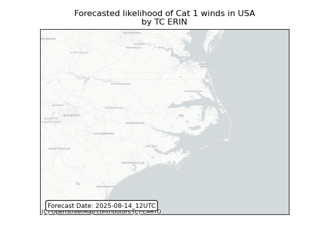
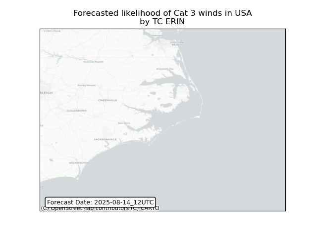

## ERIN United States: people exposed

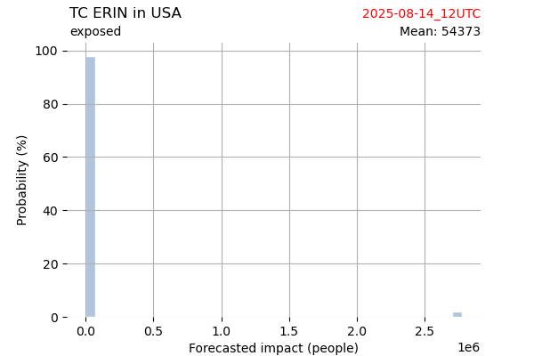

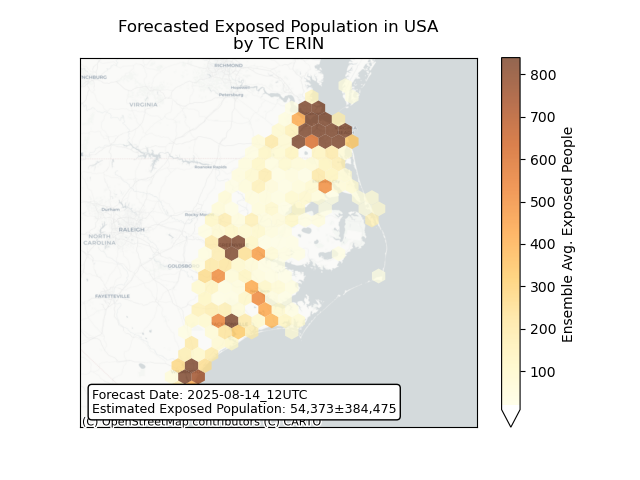

## ERIN United States: people displaced

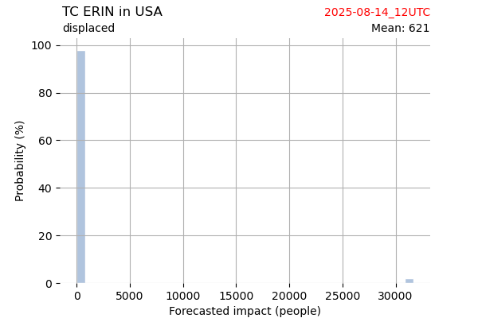

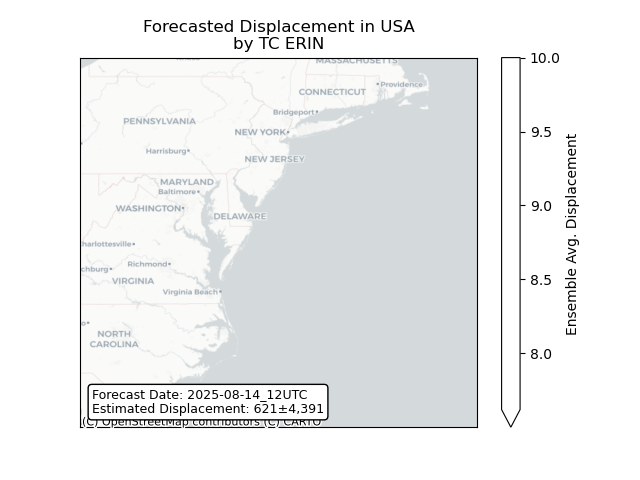

