# Displacement forecast

This is a WIP. All this is going to change, for now we're just dumping things here.

## Forecast for 2025-08-16 00:00 UTC

There are 1 active named storms.

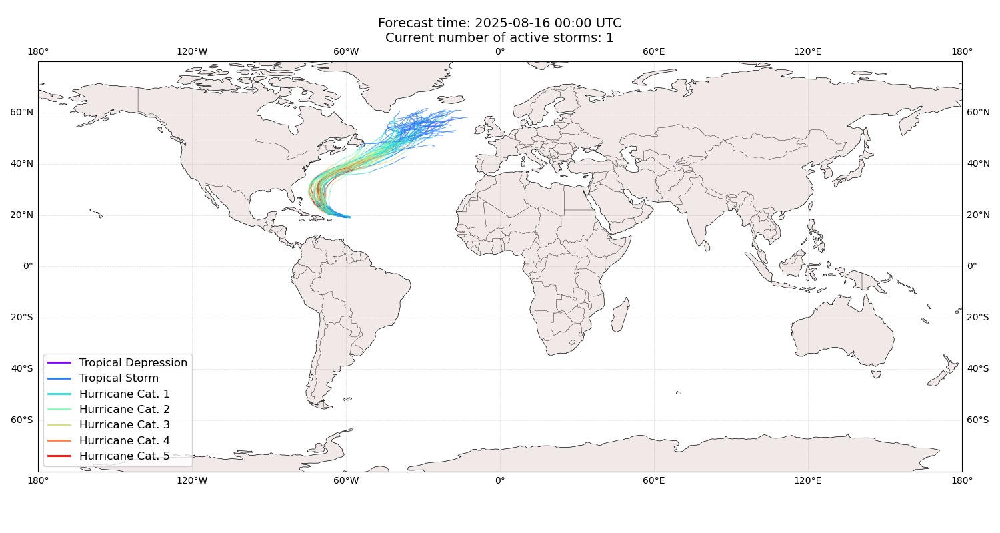

## ERIN Bermuda: areas affected

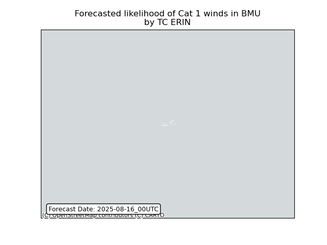

## ERIN Bermuda: people exposed

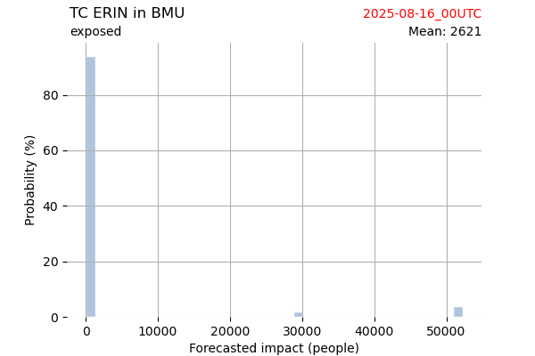

## ERIN Bermuda: people displaced

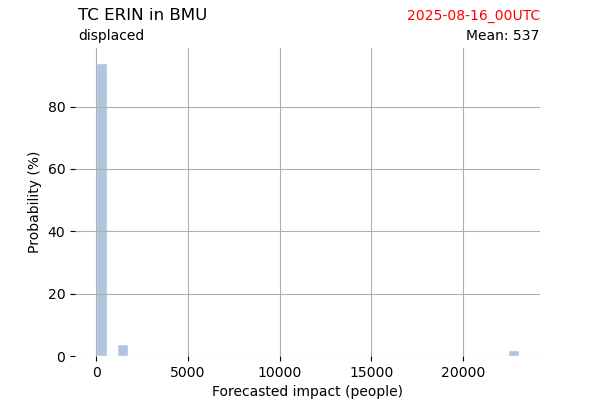

## ERIN Canada: areas affected

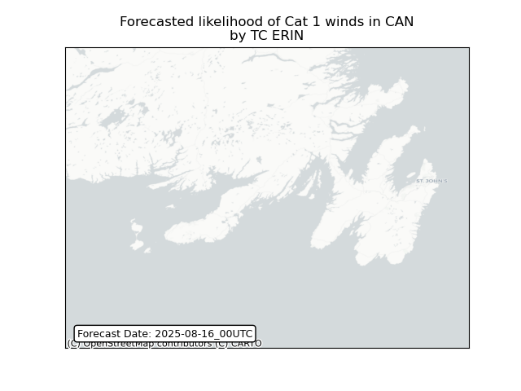

## ERIN Canada: people exposed

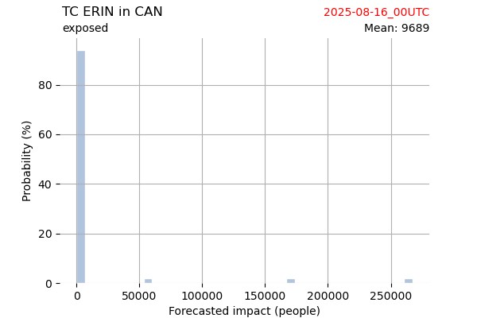

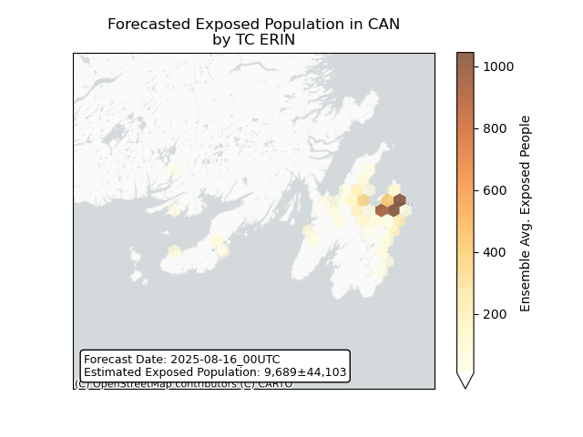

## ERIN Canada: people displaced

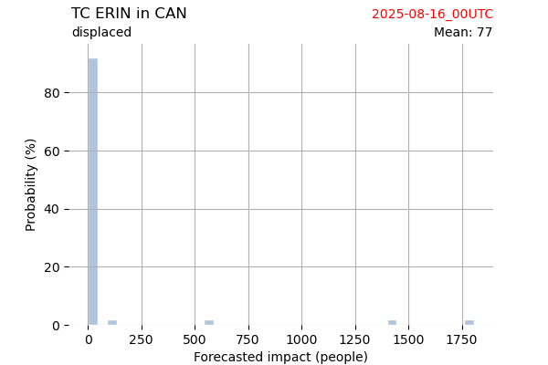

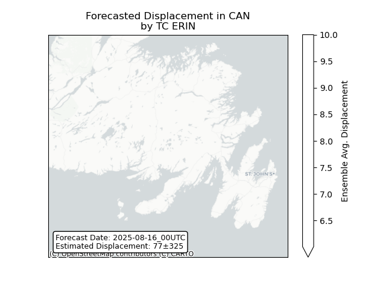

## ERIN Saint Pierre and Miquelon: areas affected

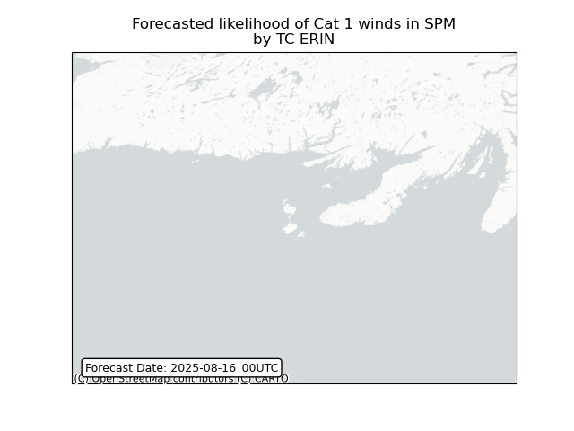

## ERIN Saint Pierre and Miquelon: people exposed

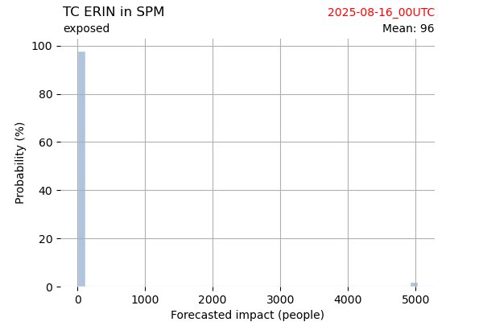

## ERIN Saint Pierre and Miquelon: people displaced

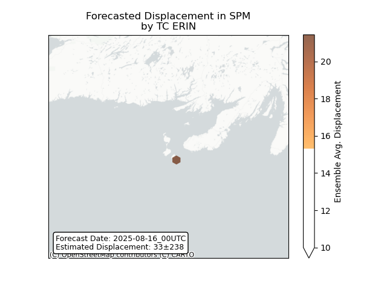

## ERIN Turks and Caicos Islands: areas affected

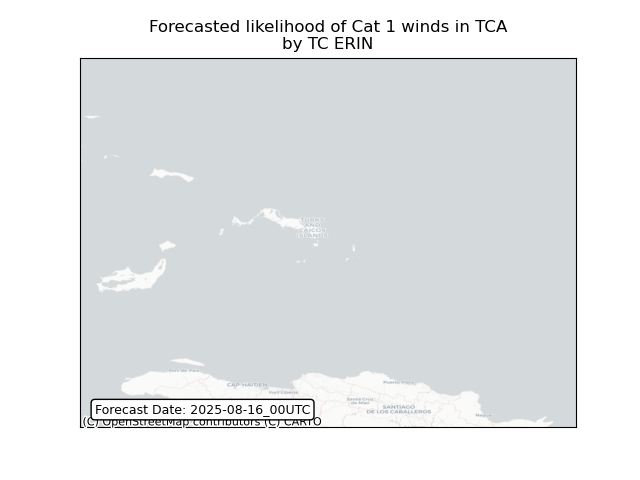

## ERIN Turks and Caicos Islands: people exposed

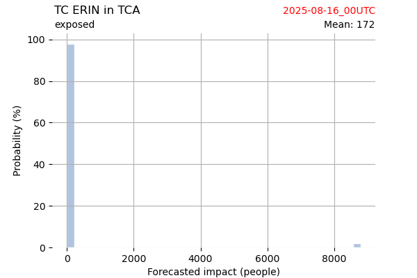

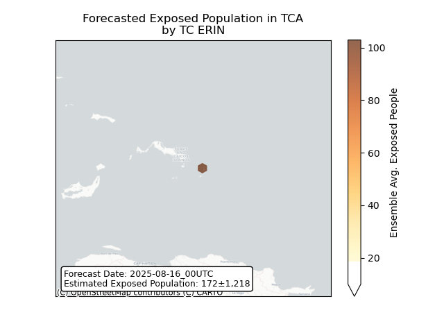

## ERIN Turks and Caicos Islands: people displaced

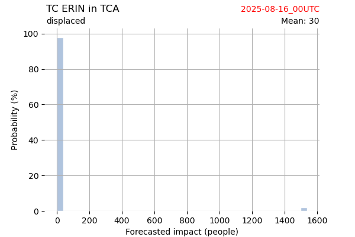

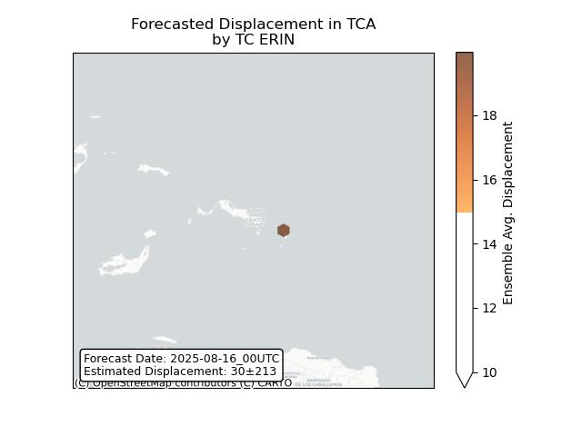

