# Displacement forecast

This is a WIP. All this is going to change, for now we're just dumping things here.

## Forecast for 2025-08-17 00:00 UTC

There are 1 active named storms.

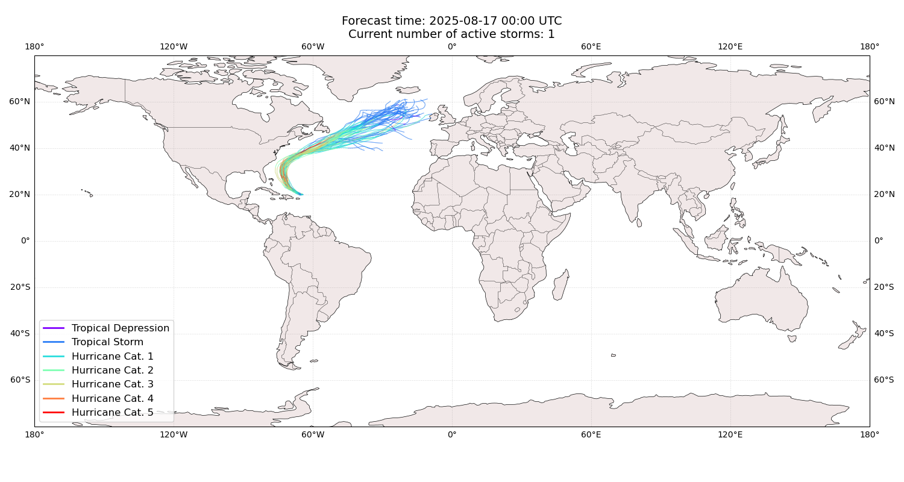

## ERIN Bahamas: areas affected

## ERIN Bahamas: people exposed

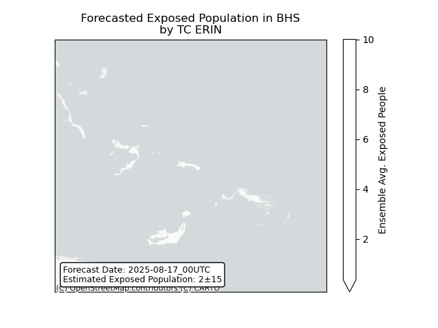

## ERIN Bahamas: people displaced

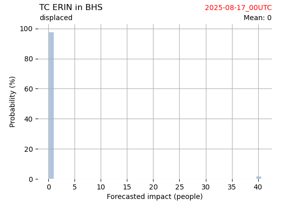

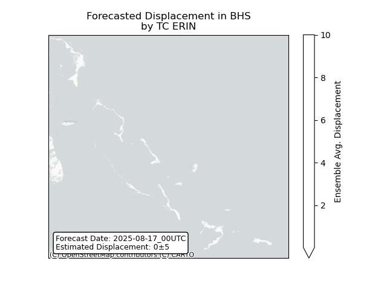

## ERIN United Kingdom: areas affected

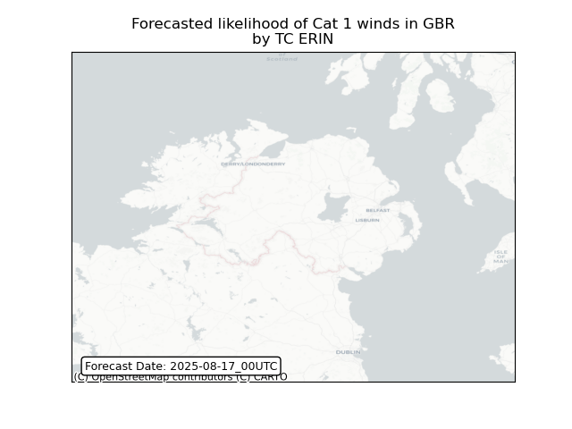

## ERIN United Kingdom: people exposed

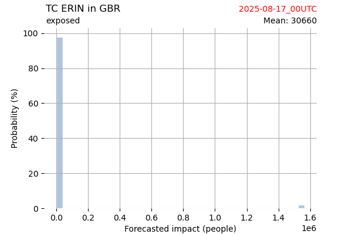

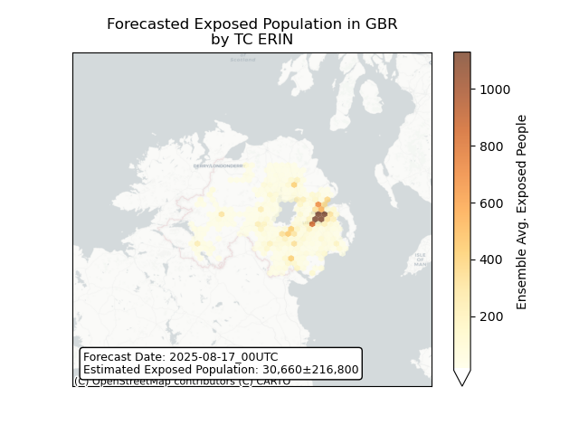

## ERIN United Kingdom: people displaced

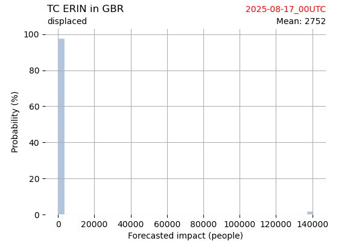

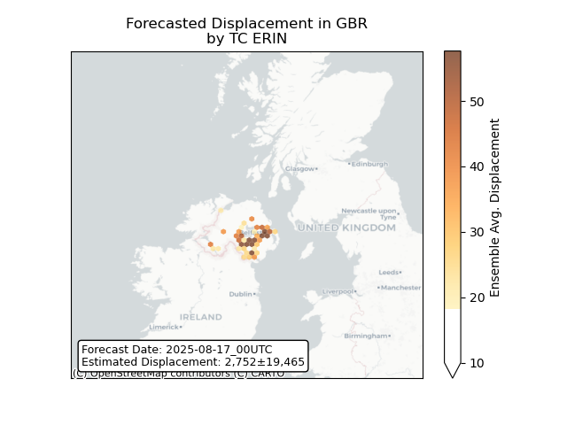

## ERIN Ireland: areas affected

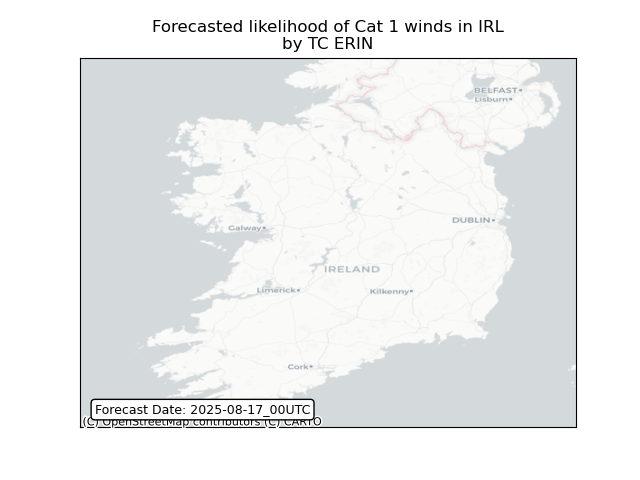

## ERIN Ireland: people exposed

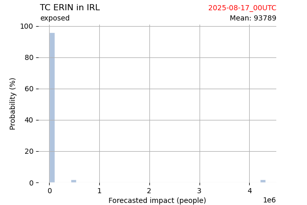

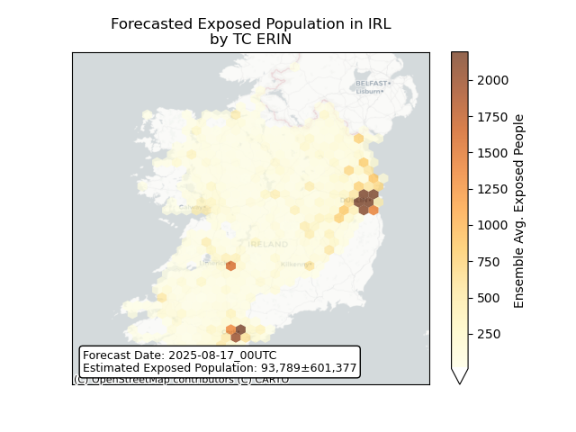

## ERIN Ireland: people displaced

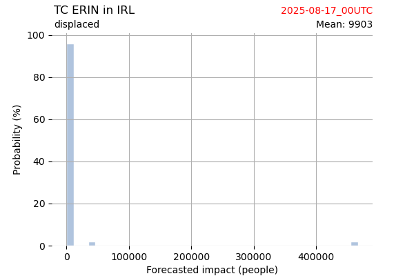

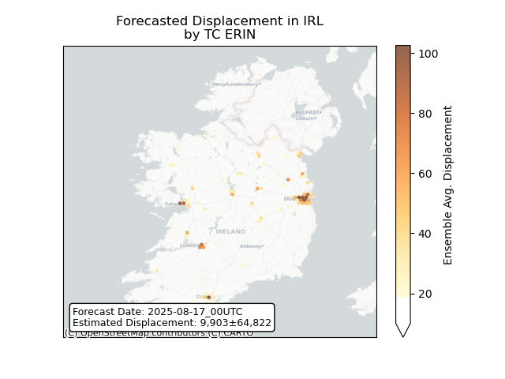

## ERIN Turks and Caicos Islands: areas affected

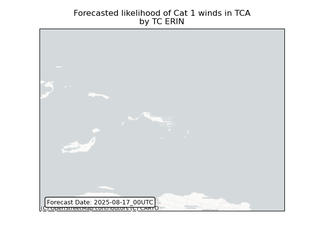

## ERIN Turks and Caicos Islands: people exposed

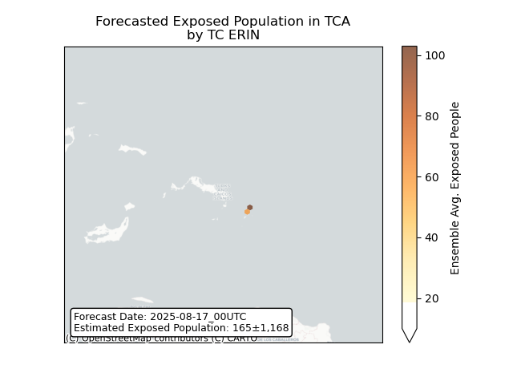

## ERIN Turks and Caicos Islands: people displaced

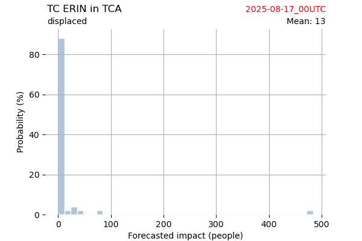

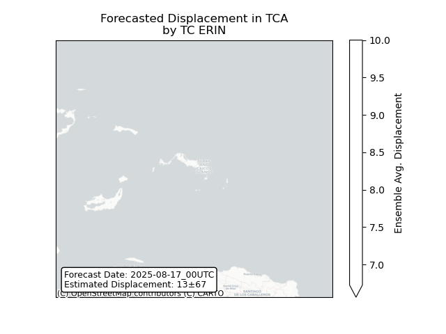

## ERIN United States: areas affected

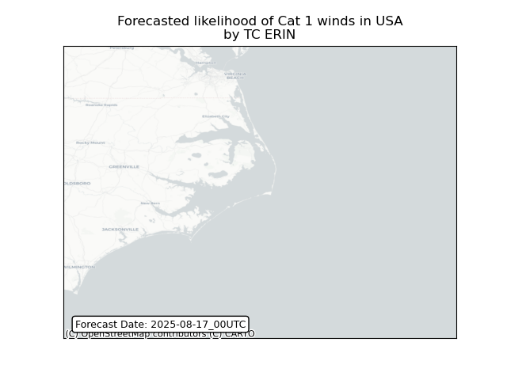

## ERIN United States: people exposed

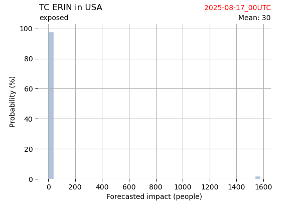

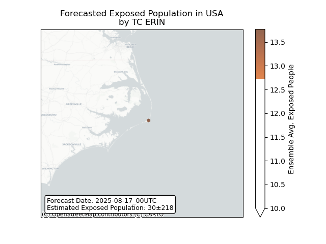

## ERIN United States: people displaced

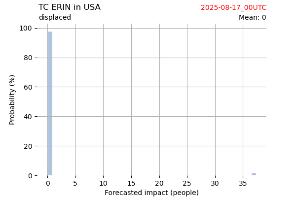

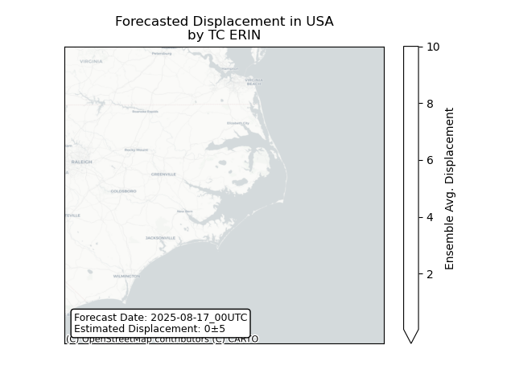

