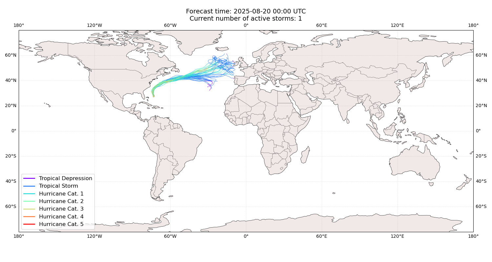
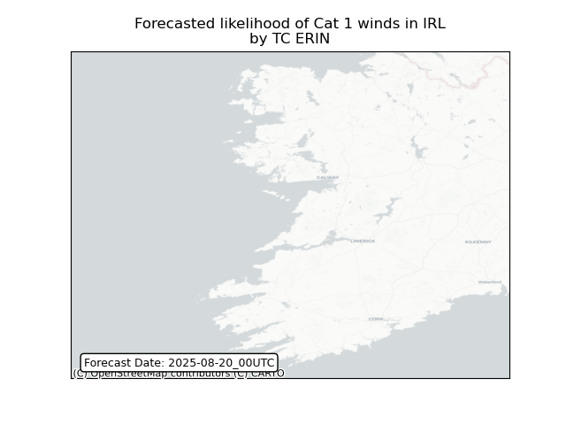
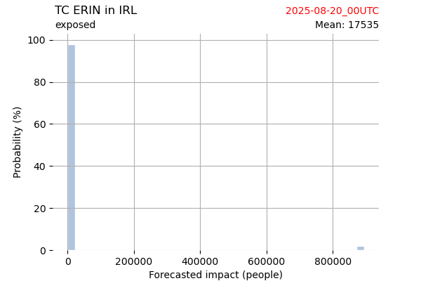
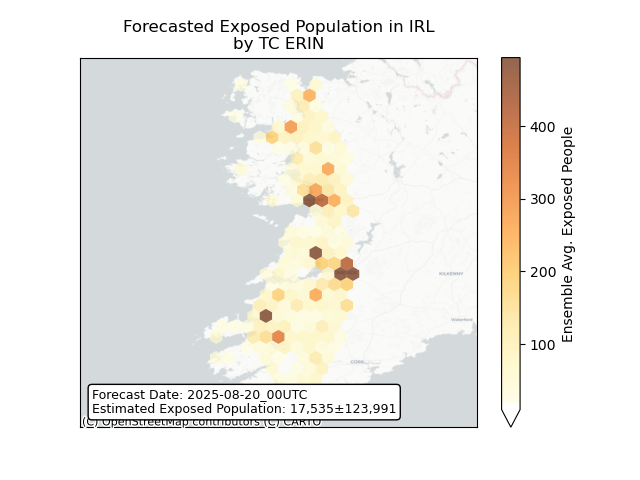
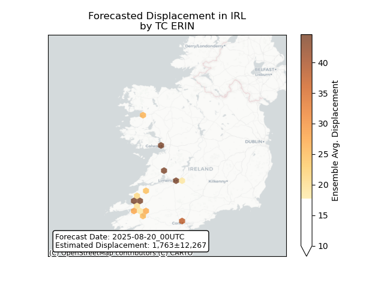

# Displacement forecast

This is a WIP. All this is going to change, for now we're just dumping things here.

## Forecast for 2025-08-20 00:00 UTC

There are 1 active named storms.

## ERIN Ireland: areas affected

## ERIN Ireland: people exposed

## ERIN Ireland: people displaced

