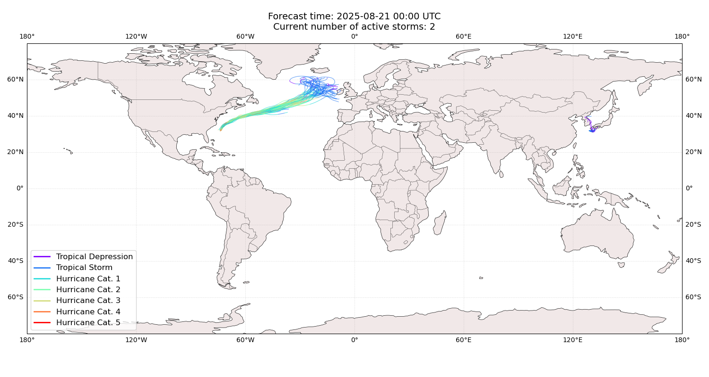
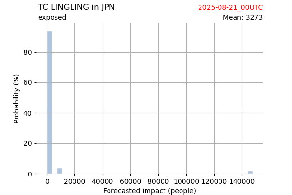
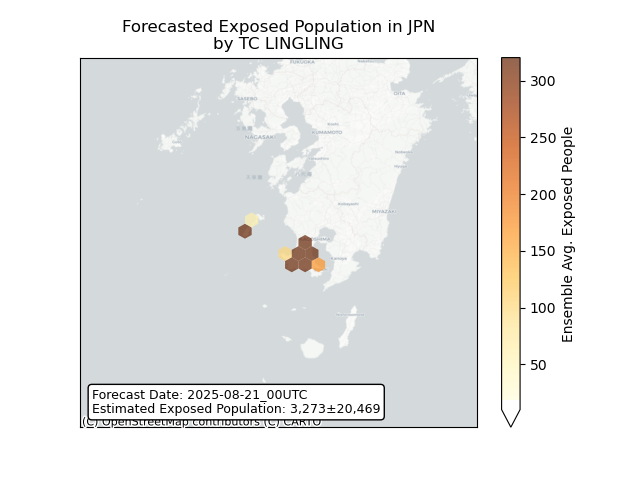
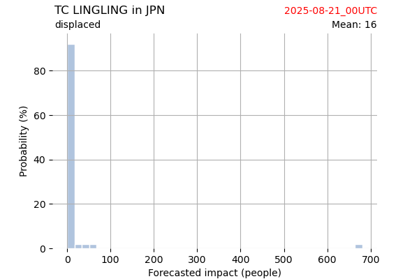
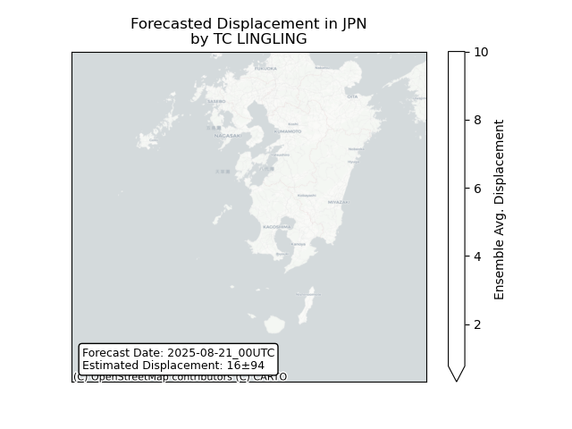
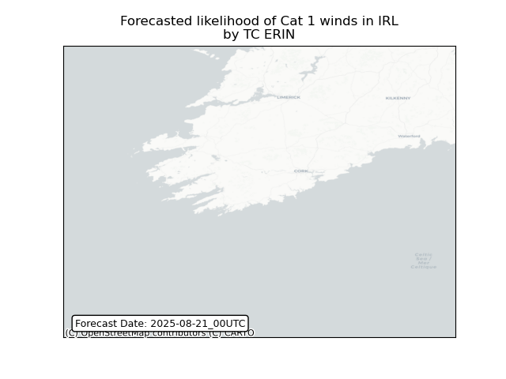
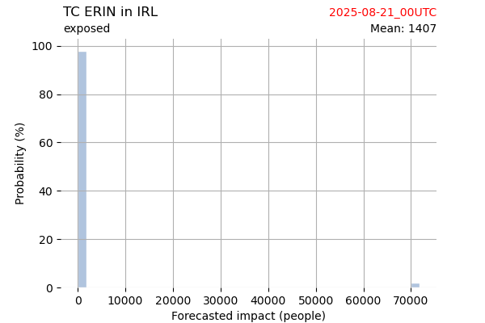
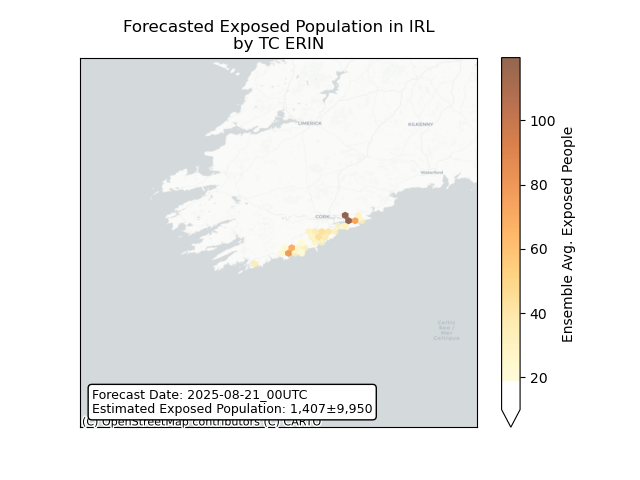
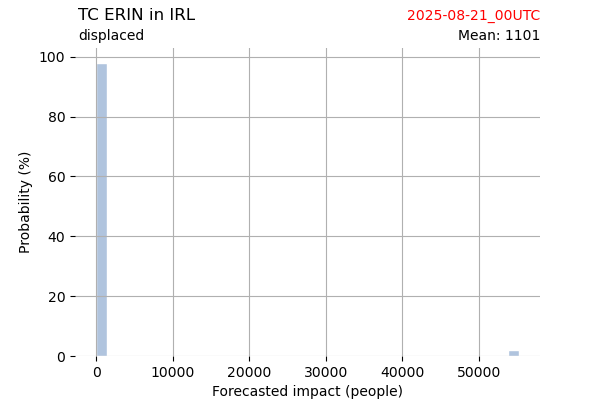
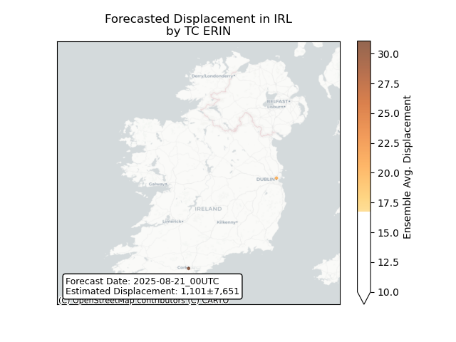

# Displacement forecast

This is a WIP. All this is going to change, for now we're just dumping things here.
## Forecast for 2025-08-21 00:00 UTC

There are 2 active named storms.

## LINGLING Japan: areas affected

## LINGLING Japan: people exposed

## LINGLING Japan: people displaced

## ERIN Ireland: areas affected

## ERIN Ireland: people exposed

## ERIN Ireland: people displaced

