# Displacement forecast

This is a WIP. All this is going to change, for now we're just dumping things here.

## Forecast for 2025-08-23 00:00 UTC

There are 2 active named storms.

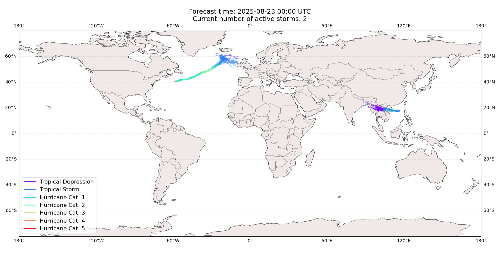

## ERIN All countries: No forecast people exposed

Storm ERIN is not forecast to affect people in All countries.

## ERIN All countries: no forecast people displaced

Storm ERIN is not forecast to displace people in All countries.

## KAJIKI Bangladesh: areas affected

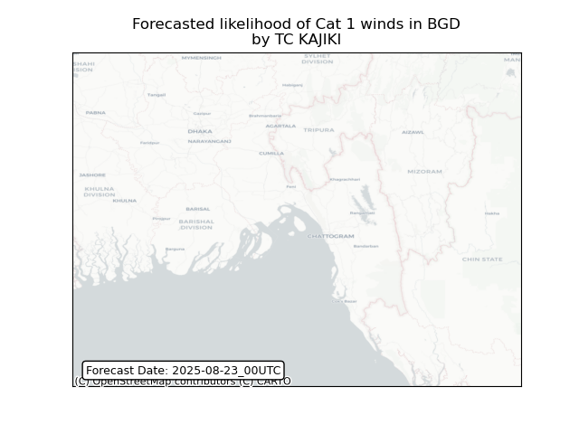

## KAJIKI Bangladesh: people exposed

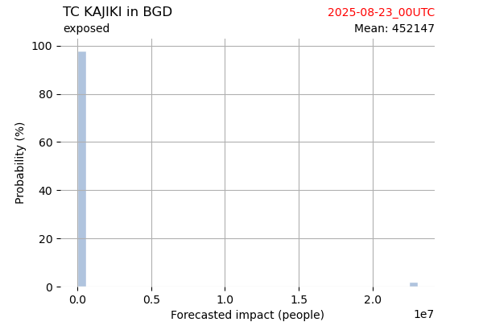

## KAJIKI Bangladesh: people displaced

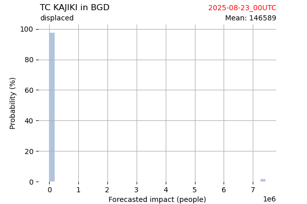

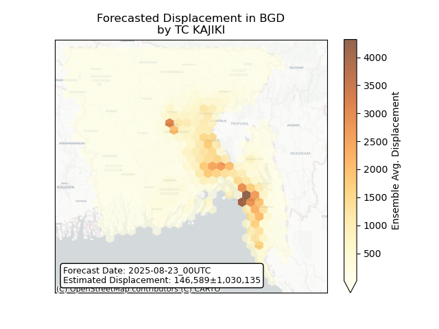

## KAJIKI China: areas affected

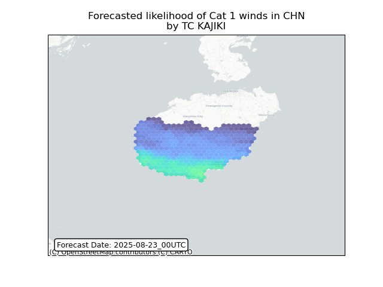

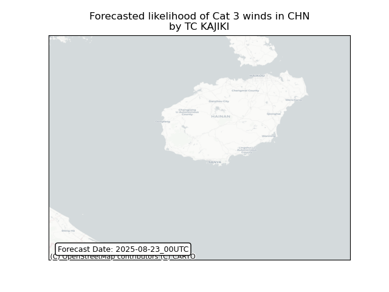

## KAJIKI China: people exposed

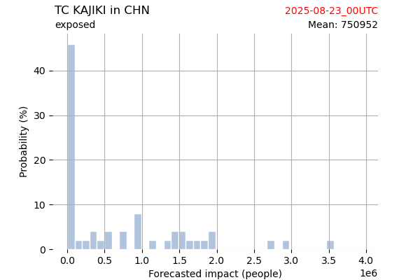

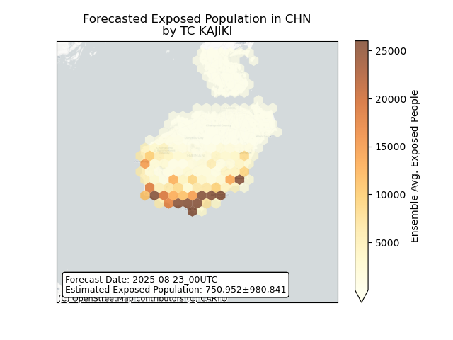

## KAJIKI China: people displaced

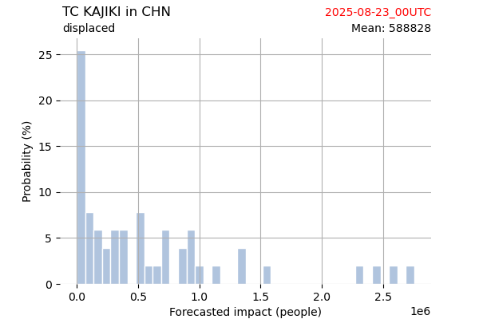

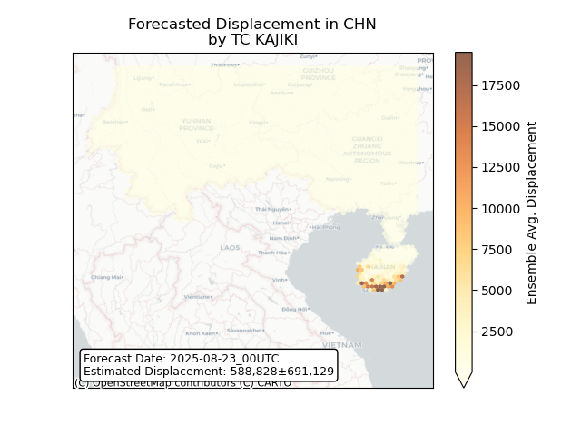

## KAJIKI India: areas affected

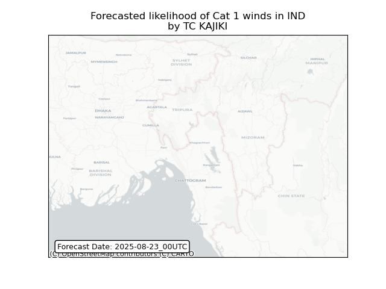

## KAJIKI India: people exposed

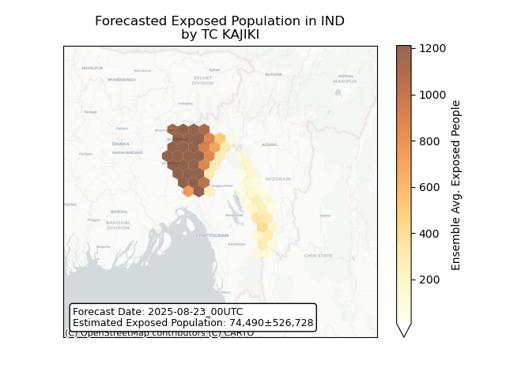

## KAJIKI India: people displaced

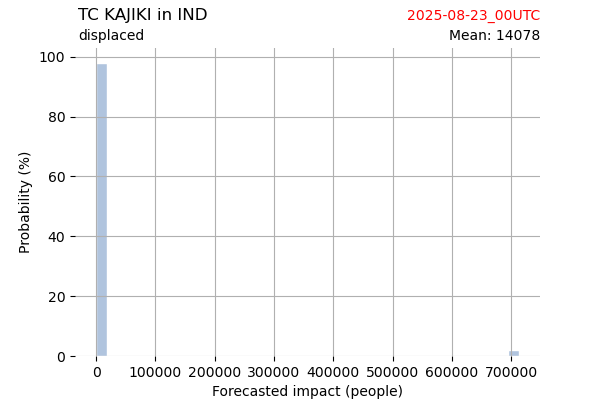

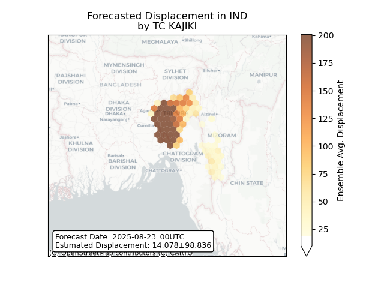

## KAJIKI Lao People's Democratic Republic: areas affected

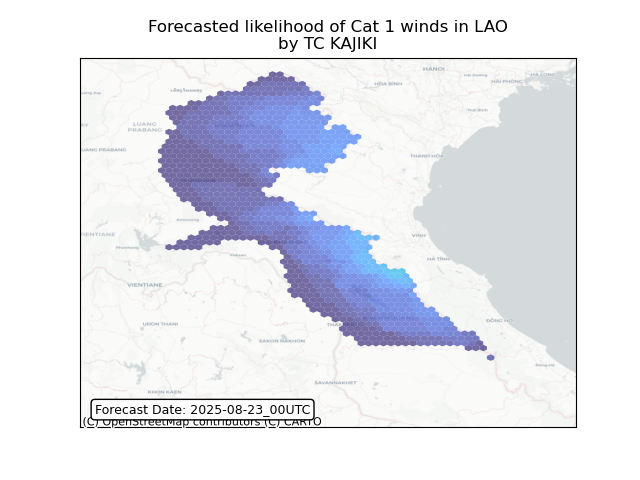

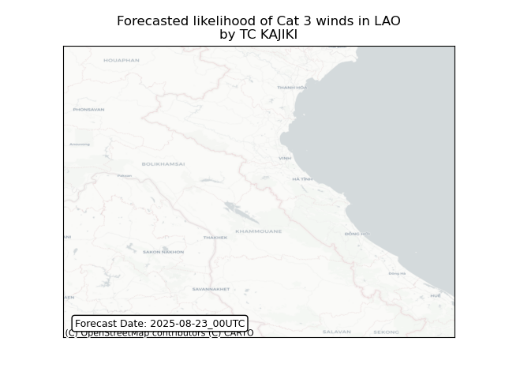

## KAJIKI Lao People's Democratic Republic: people exposed

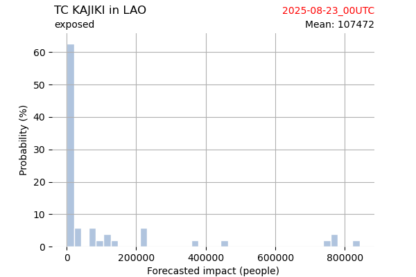

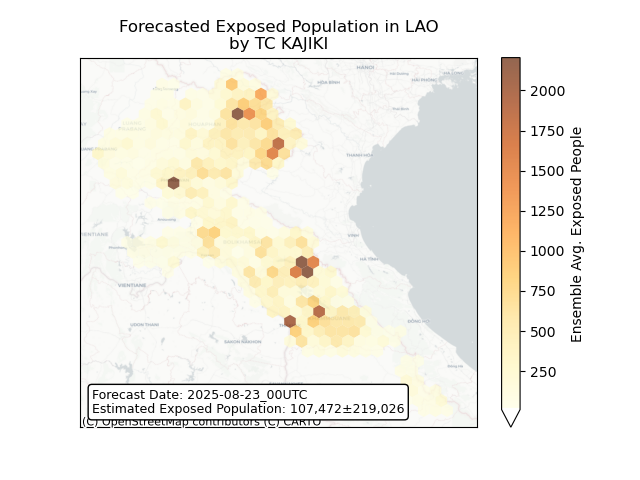

## KAJIKI Lao People's Democratic Republic: people displaced

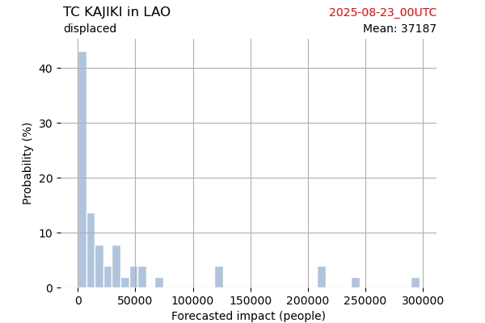

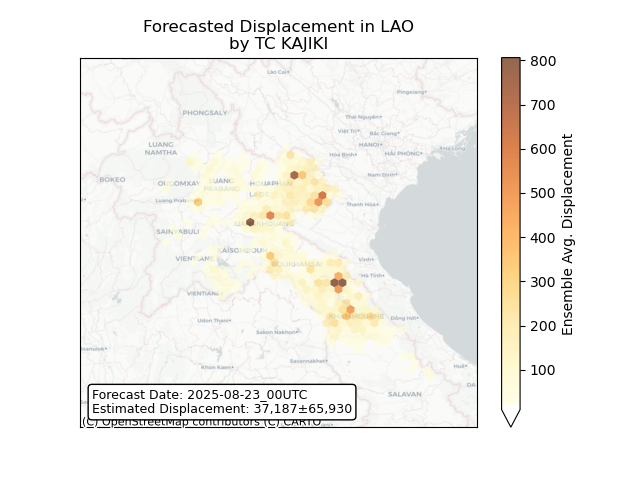

## KAJIKI Myanmar: areas affected

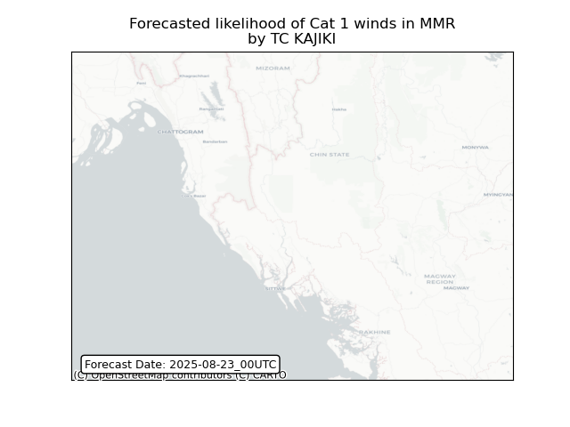

## KAJIKI Myanmar: people exposed

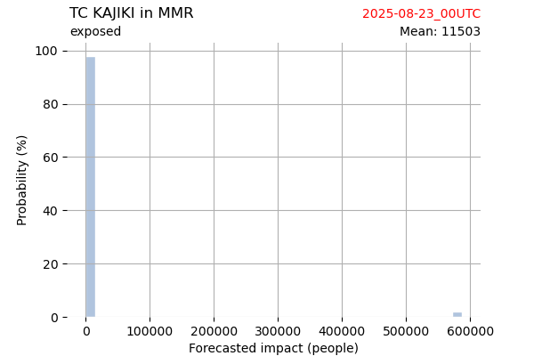

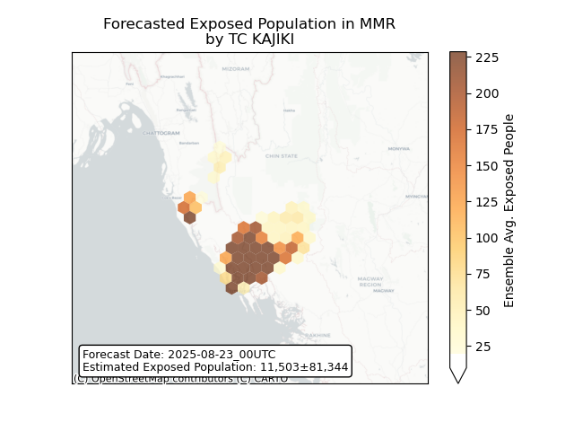

## KAJIKI Myanmar: people displaced

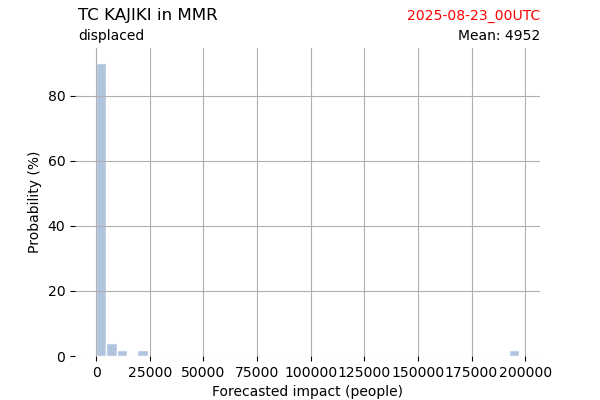

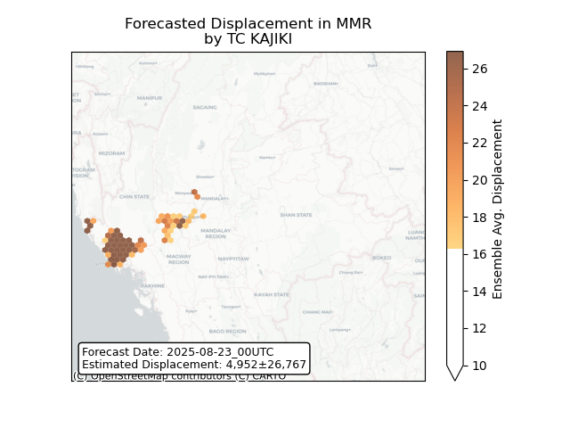

## KAJIKI Thailand: areas affected

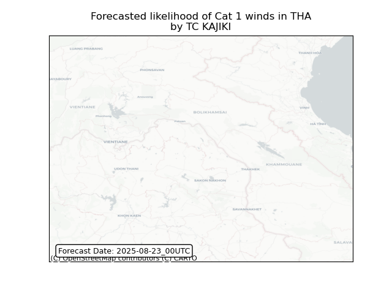

## KAJIKI Thailand: people exposed

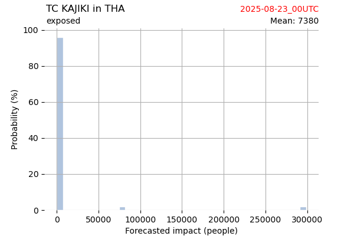

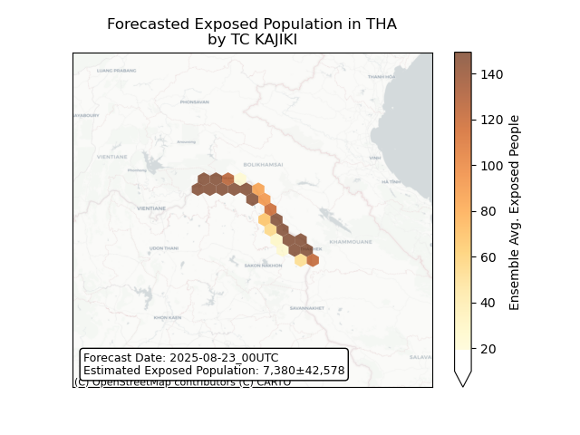

## KAJIKI Thailand: people displaced

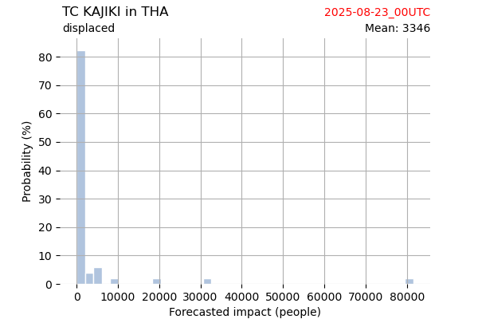

## KAJIKI Viet Nam: areas affected

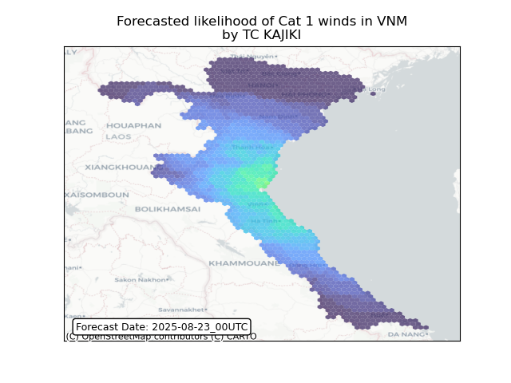

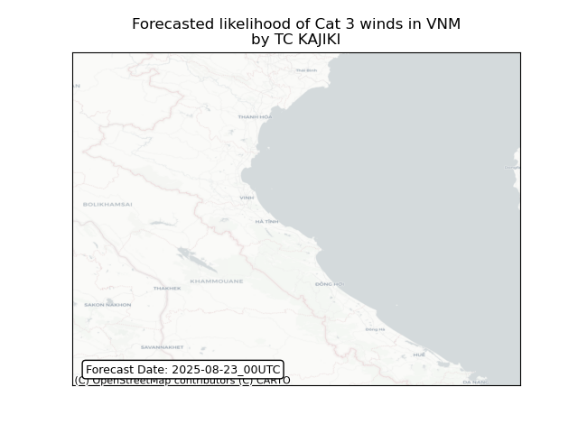

## KAJIKI Viet Nam: people exposed

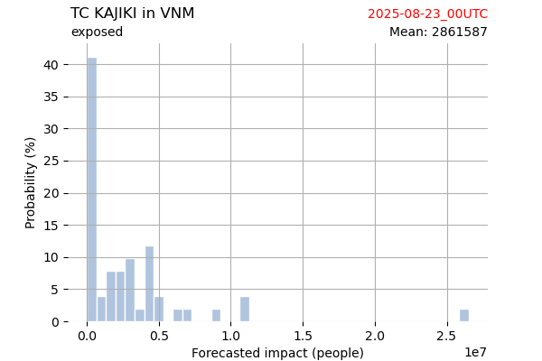

## KAJIKI Viet Nam: people displaced

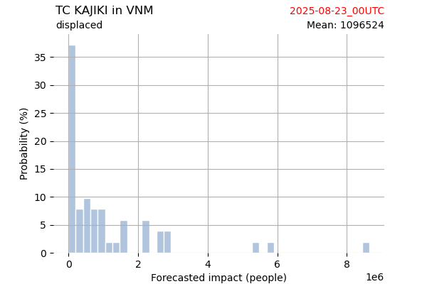

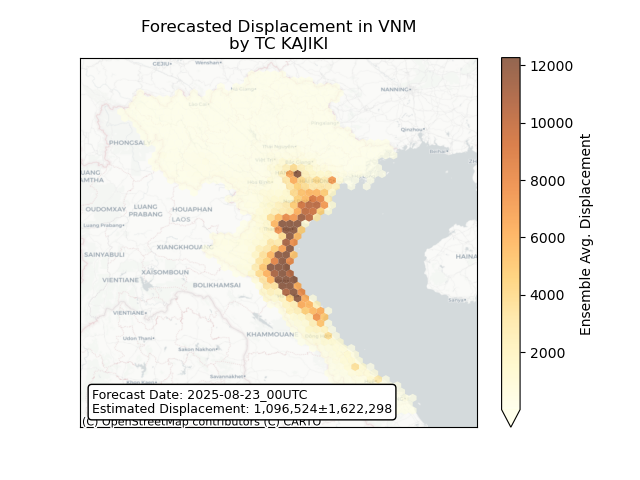

