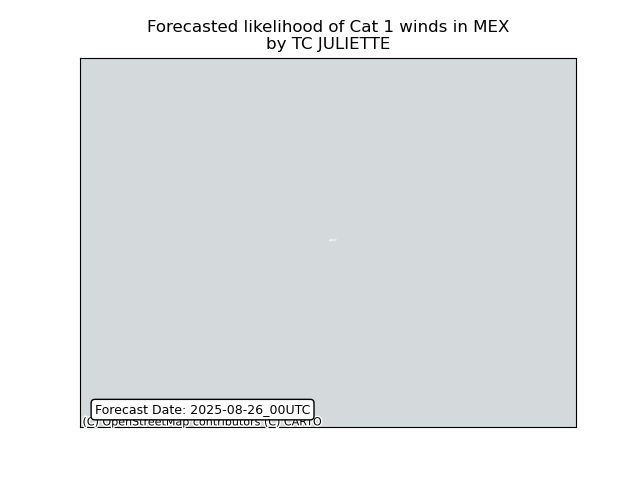

# Displacement forecast

This is a WIP. All this is going to change, for now we're just dumping things here.

## Forecast for 2025-08-26 00:00 UTC

There are 3 active named storms.

## FERNAND All countries: No forecast people exposed

Storm FERNAND is not forecast to affect people in All countries.

## FERNAND All countries: no forecast people displaced

Storm FERNAND is not forecast to displace people in All countries.

## KAJIKI All countries: No forecast people exposed

Storm KAJIKI is not forecast to affect people in All countries.

## KAJIKI All countries: no forecast people displaced

Storm KAJIKI is not forecast to displace people in All countries.

## JULIETTE Mexico: areas affected

