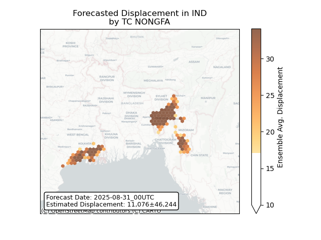

# Displacement forecast

This is a WIP. All this is going to change, for now we're just dumping things here.

## Forecast for 2025-08-31 00:00 UTC

There are 1 active named storms.

## NONGFA Bangladesh: areas affected

## NONGFA Bangladesh: people exposed

## NONGFA Bangladesh: people displaced

## NONGFA India: areas affected

## NONGFA India: people exposed

## NONGFA India: people displaced

