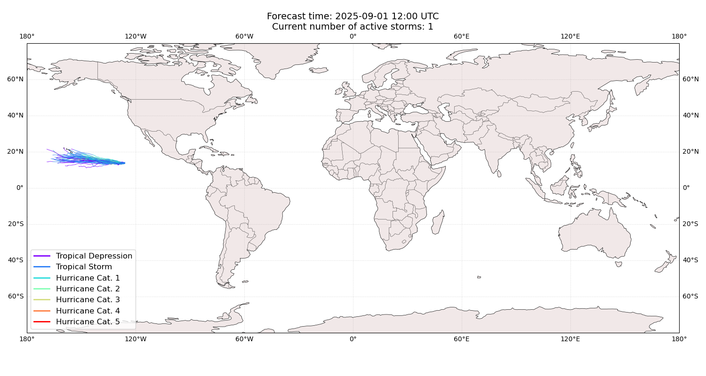
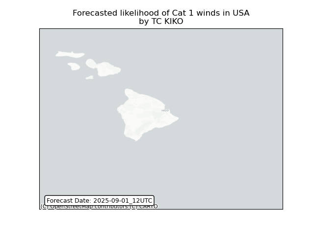
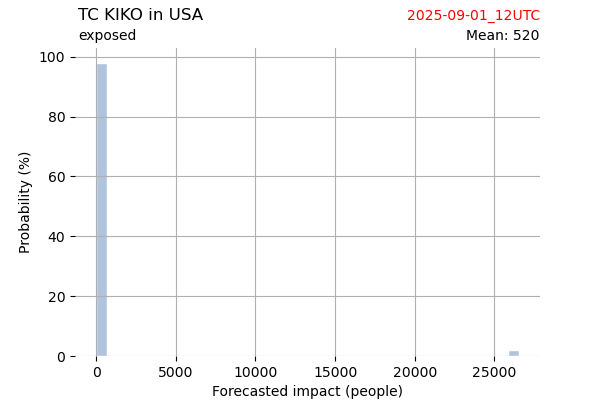
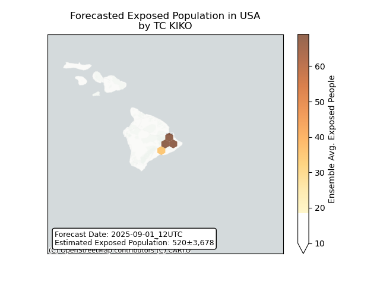
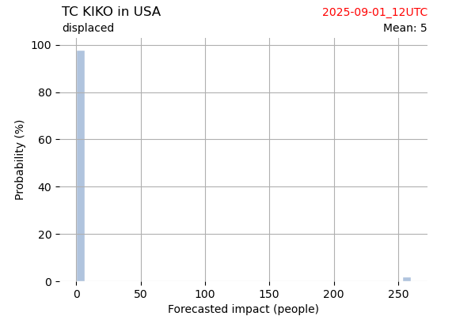
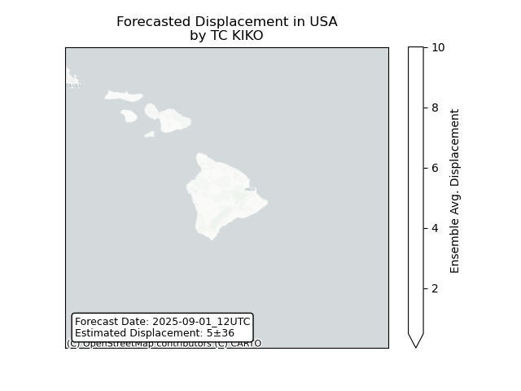

# Displacement forecast

This is a WIP. All this is going to change, for now we're just dumping things here.

## Forecast for 2025-09-01 12:00 UTC

There are 1 active named storms.

## KIKO United States: areas affected

## KIKO United States: people exposed

## KIKO United States: people displaced

