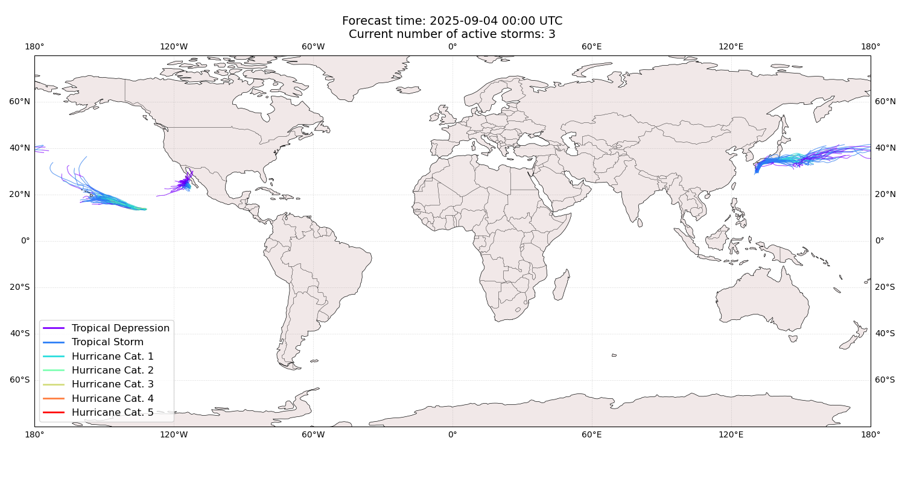
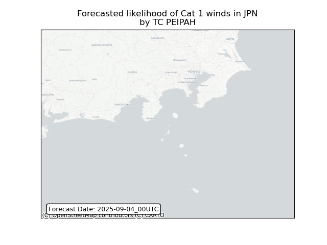
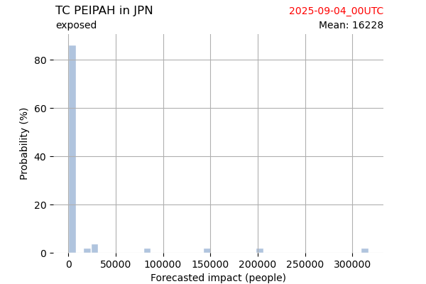
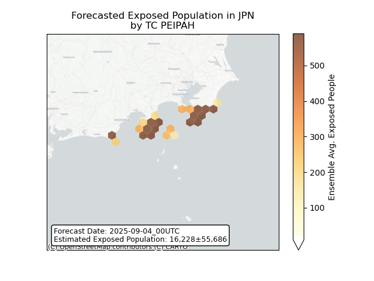
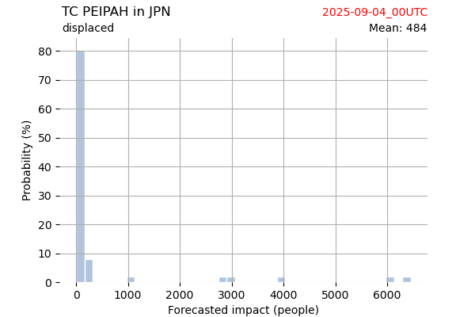
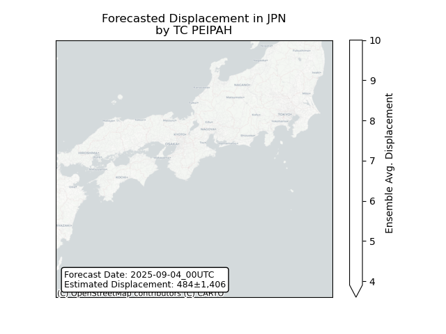

# Displacement forecast

This is a WIP. All this is going to change, for now we're just dumping things here.

## Forecast for 2025-09-04 00:00 UTC

There are 3 active named storms.

## KIKO All countries: No forecast people exposed

Storm KIKO is not forecast to affect people in All countries.

## KIKO All countries: no forecast people displaced

Storm KIKO is not forecast to displace people in All countries.

## LORENA All countries: No forecast people exposed

Storm LORENA is not forecast to affect people in All countries.

## LORENA All countries: no forecast people displaced

Storm LORENA is not forecast to displace people in All countries.

## PEIPAH Japan: areas affected

## PEIPAH Japan: people exposed

## PEIPAH Japan: people displaced

