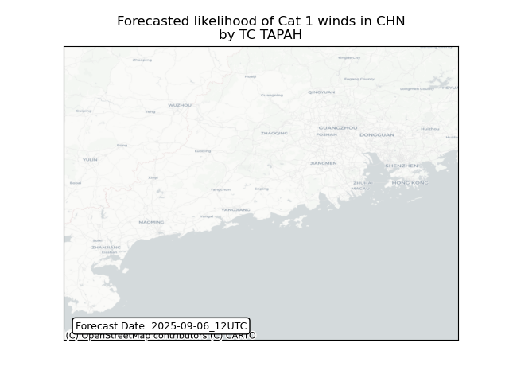

# Displacement forecast

This is a WIP. All this is going to change, for now we're just dumping things here.

## Forecast for 2025-09-06 12:00 UTC

There are 2 active named storms.

## TAPAH China: areas affected

## TAPAH China: people exposed

## KIKO United States Minor Outlying Islands: no forecast people displaced

Storm KIKO is not forecast to displace people in United States Minor Outlying Islands.

