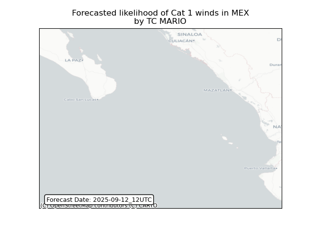

# Displacement forecast

This is a WIP. All this is going to change, for now we're just dumping things here.

## Forecast for 2025-09-12 12:00 UTC

There are 2 active named storms.

## BLOSSOM All countries: No forecast people exposed

Storm BLOSSOM is not forecast to affect people in All countries.

## BLOSSOM All countries: no forecast people displaced

Storm BLOSSOM is not forecast to displace people in All countries.

## MARIO Mexico: areas affected

## MARIO Mexico: people exposed

## MARIO Mexico: people displaced

