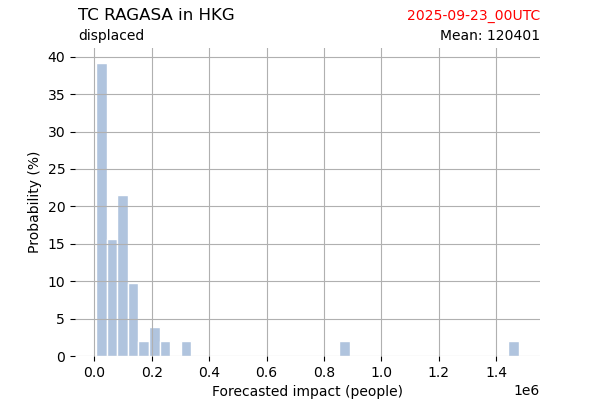

# Displacement forecast

This is a WIP. All this is going to change, for now we're just dumping things here.

## Forecast for 2025-09-23 00:00 UTC

There are 4 active named storms.

## GABRIELLE Portugal: areas affected

## GABRIELLE Portugal: people exposed

## GABRIELLE Portugal: people displaced

## NARDA Mexico: areas affected

## NARDA Mexico: people exposed

## NARDA Mexico: people displaced

## NEOGURI Japan: areas affected

## NEOGURI Japan: people exposed

## NEOGURI Japan: people displaced

## RAGASA China: areas affected

## RAGASA China: people exposed

## RAGASA China: people displaced

## RAGASA Hong Kong: areas affected

## RAGASA Hong Kong: people exposed

## RAGASA Hong Kong: people displaced

## RAGASA Viet Nam: areas affected

## RAGASA Viet Nam: people exposed

## RAGASA Viet Nam: people displaced

