# Displacement forecast

This is a WIP. All this is going to change, for now we're just dumping things here.

## Forecast for 2025-09-23 12:00 UTC

There are 4 active named storms.

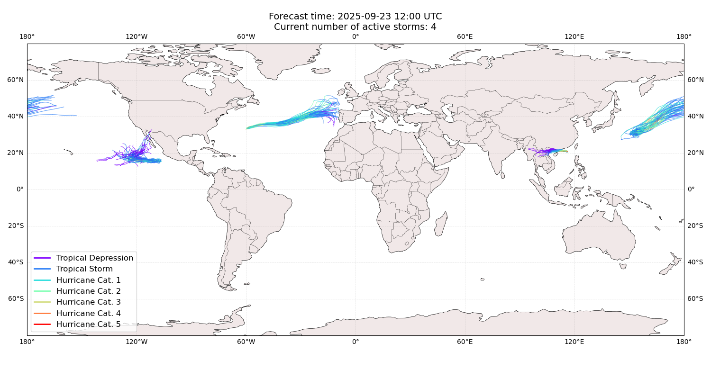

## GABRIELLE Portugal: areas affected

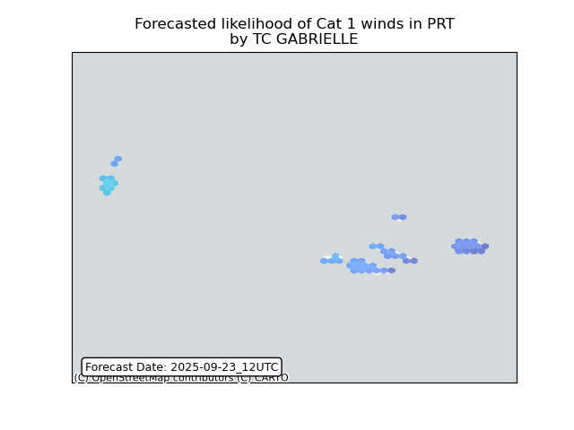

## GABRIELLE Portugal: people exposed

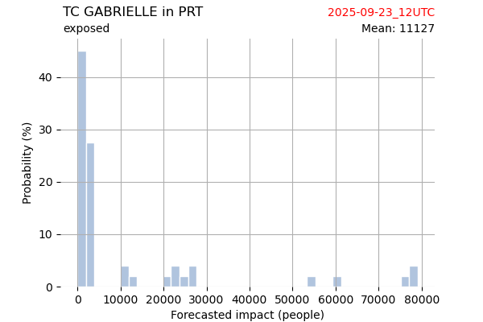

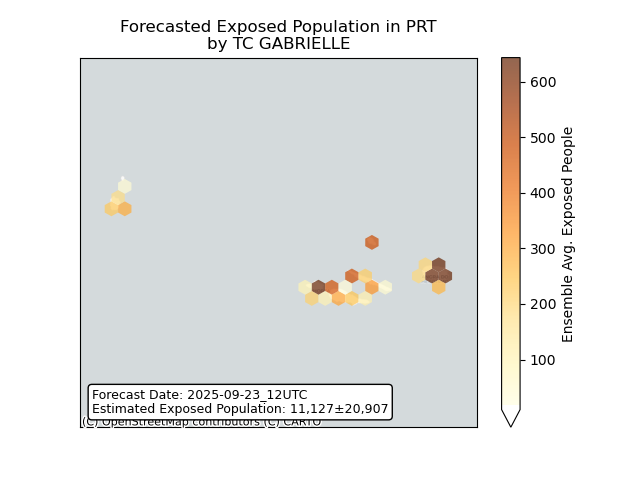

## GABRIELLE Portugal: people displaced

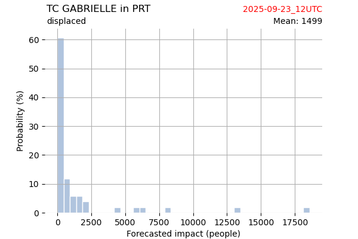

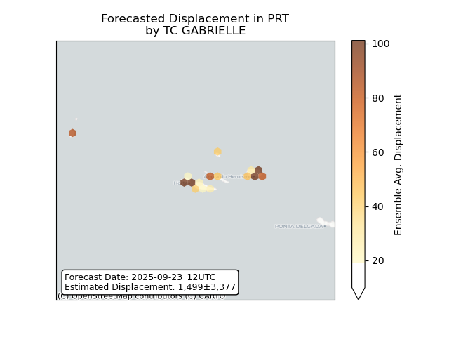

## NARDA All countries: No forecast people exposed

Storm NARDA is not forecast to affect people in All countries.

## NARDA All countries: no forecast people displaced

Storm NARDA is not forecast to displace people in All countries.

## RAGASA China: areas affected

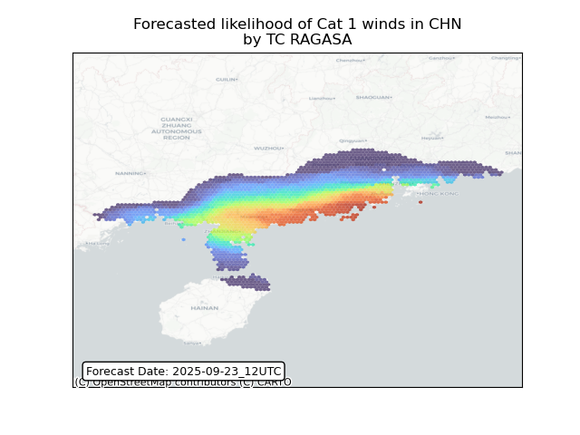

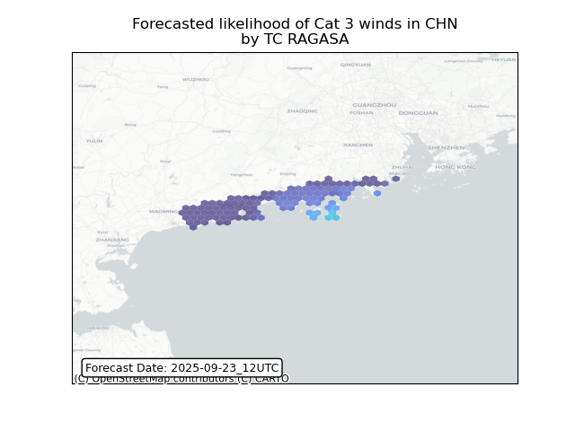

## RAGASA China: people exposed

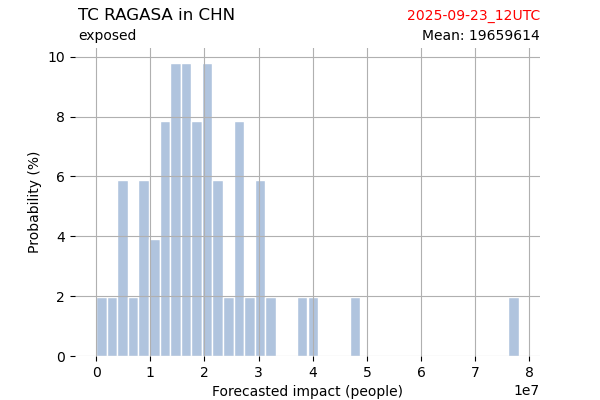

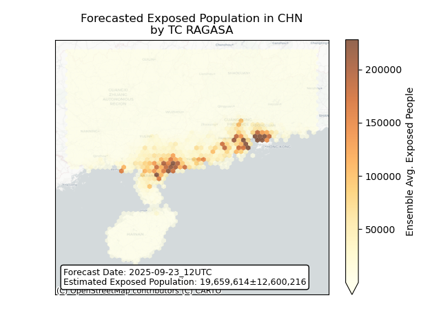

## RAGASA China: people displaced

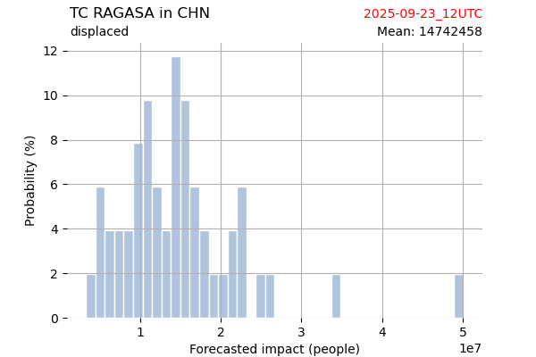

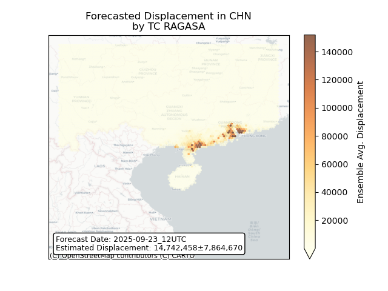

## RAGASA Hong Kong: areas affected

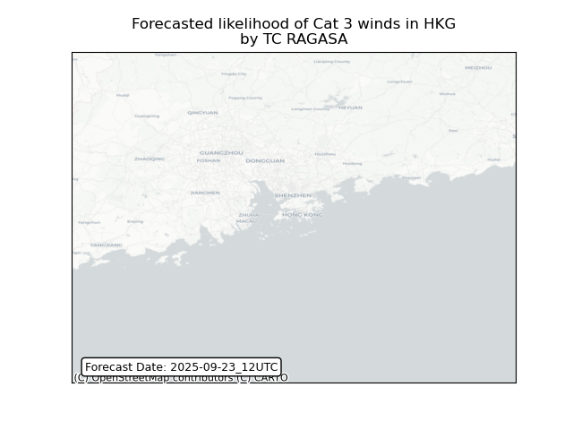

## RAGASA Hong Kong: people exposed

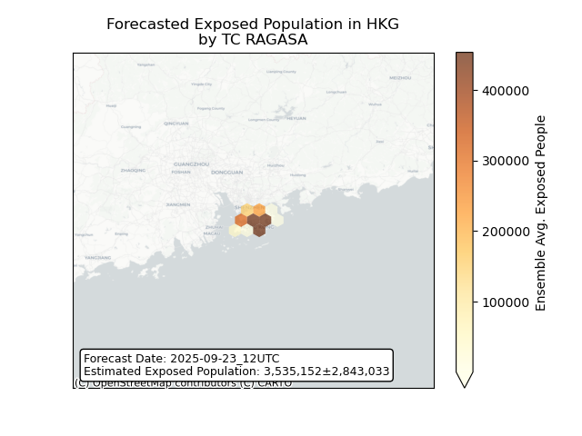

## RAGASA Hong Kong: people displaced

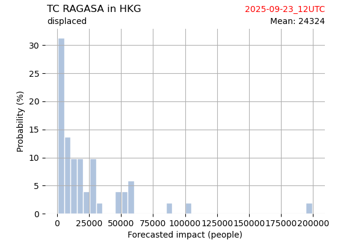

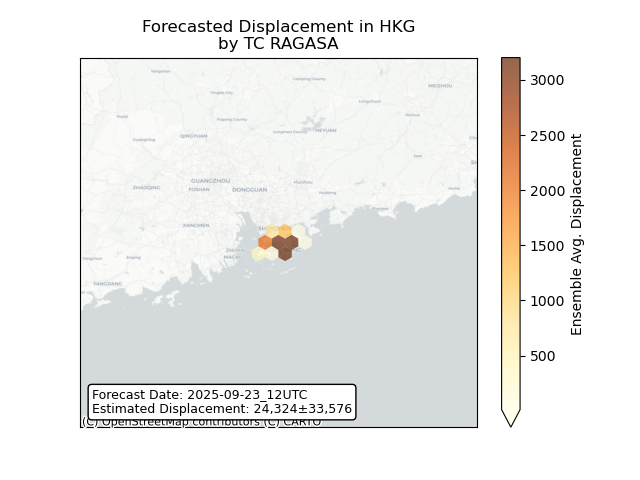

## RAGASA Lao People's Democratic Republic: areas affected

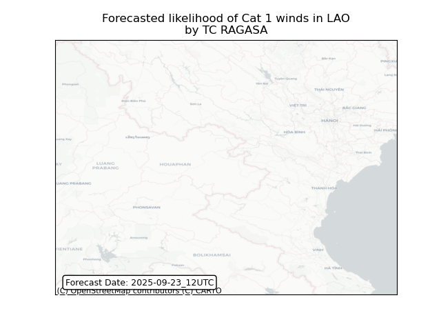

## RAGASA Lao People's Democratic Republic: people exposed

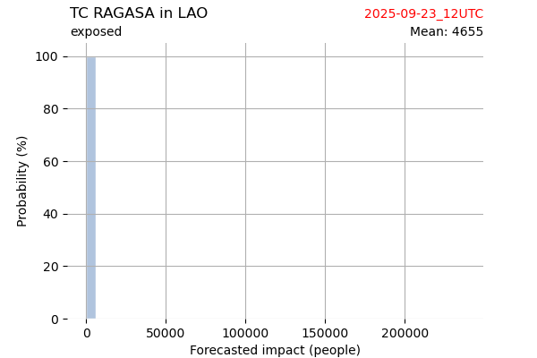

## RAGASA Lao People's Democratic Republic: people displaced

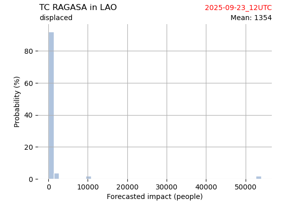

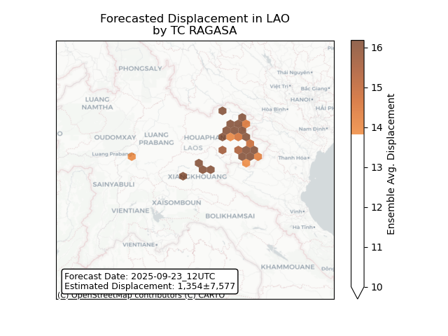

## RAGASA Viet Nam: areas affected

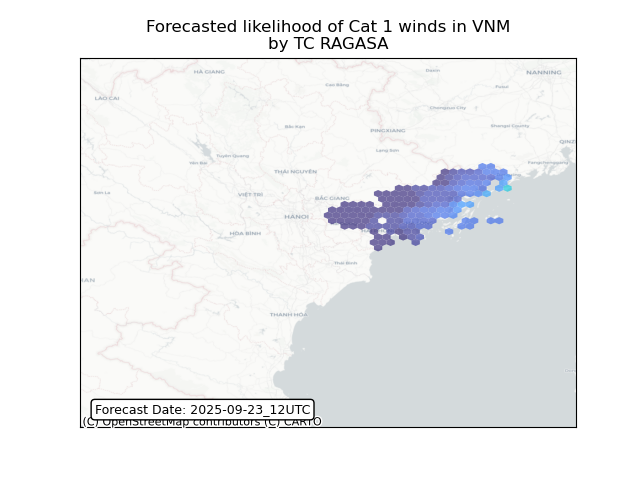

## RAGASA Viet Nam: people exposed

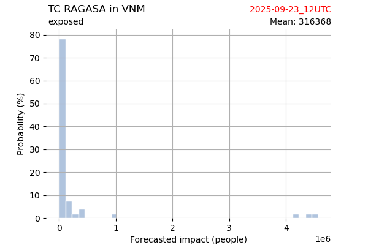

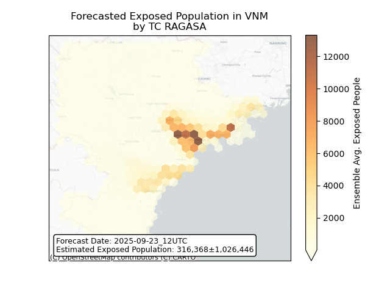

## RAGASA Viet Nam: people displaced

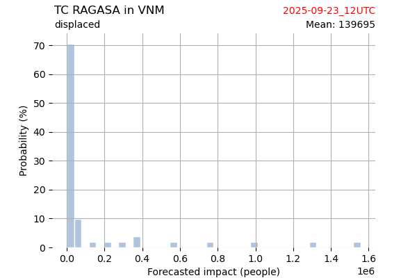

## NEOGURI All countries: No forecast people exposed

Storm NEOGURI is not forecast to affect people in All countries.

## NEOGURI All countries: no forecast people displaced

Storm NEOGURI is not forecast to displace people in All countries.

