# Displacement forecast

This is a WIP. All this is going to change, for now we're just dumping things here.

## Forecast for 2025-09-28 12:00 UTC

There are 4 active named storms.

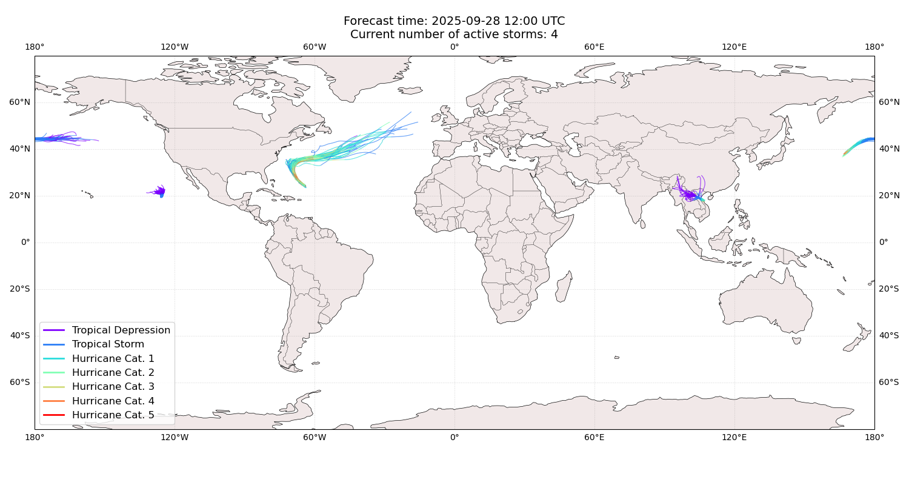

## NARDA All countries: No forecast people exposed

Storm NARDA is not forecast to affect people in All countries.

## NARDA All countries: no forecast people displaced

Storm NARDA is not forecast to displace people in All countries.

## BUALOI Lao People's Democratic Republic: areas affected

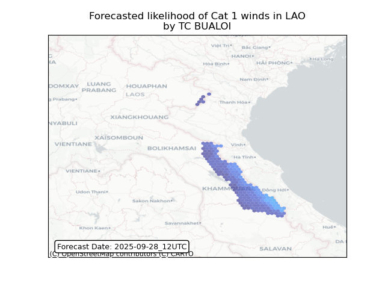

## BUALOI Lao People's Democratic Republic: people exposed

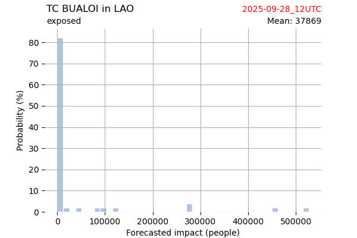

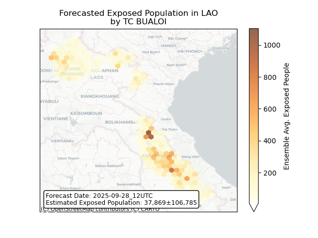

## BUALOI Lao People's Democratic Republic: people displaced

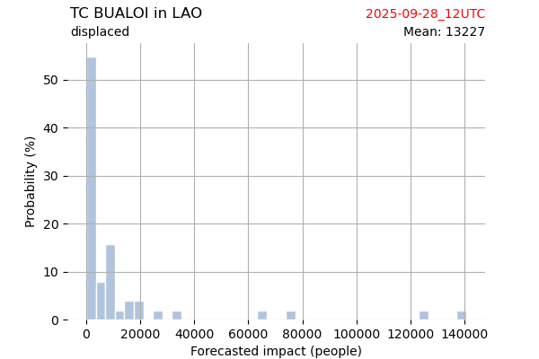

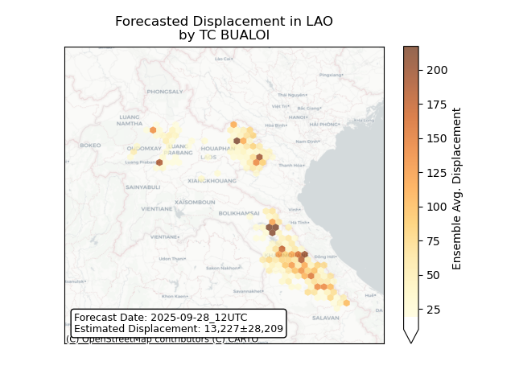

## BUALOI Viet Nam: areas affected

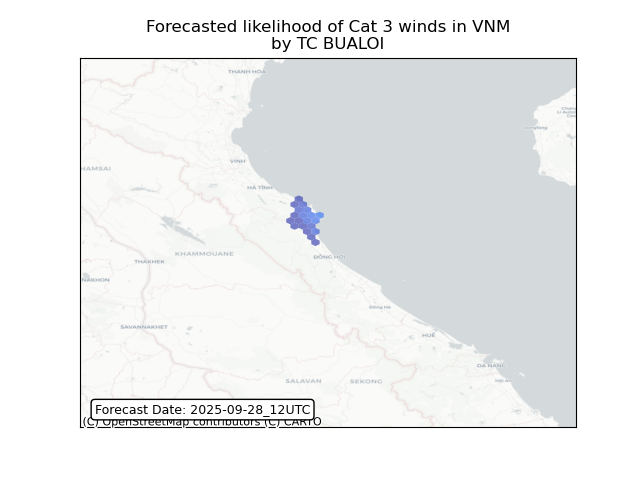

## BUALOI Viet Nam: people exposed

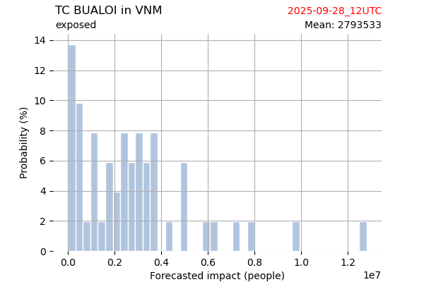

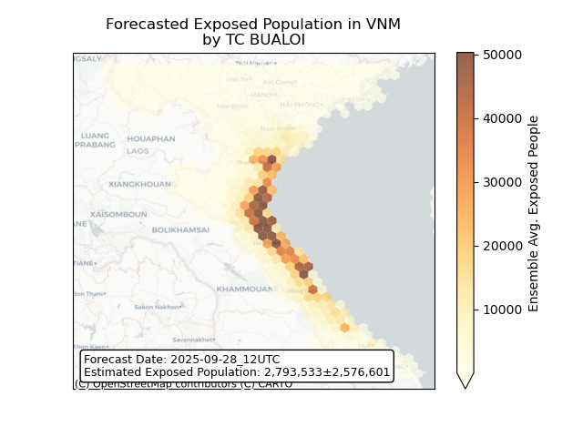

## BUALOI Viet Nam: people displaced

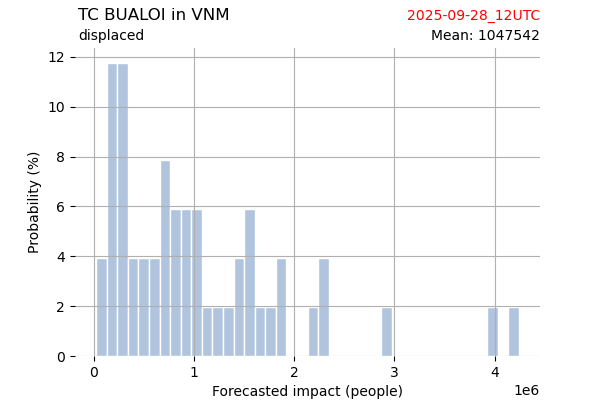

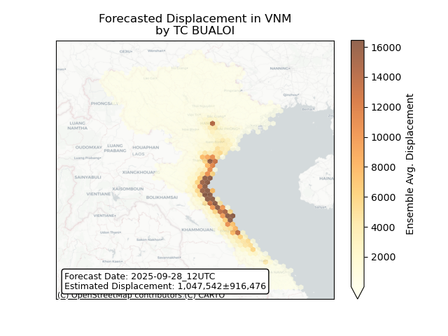

## HUMBERTO Bermuda: areas affected

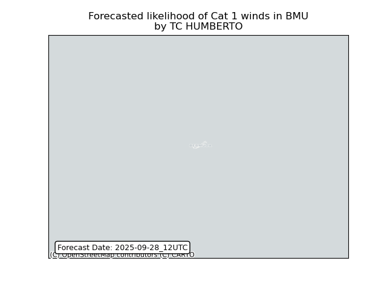

## HUMBERTO Bermuda: people exposed

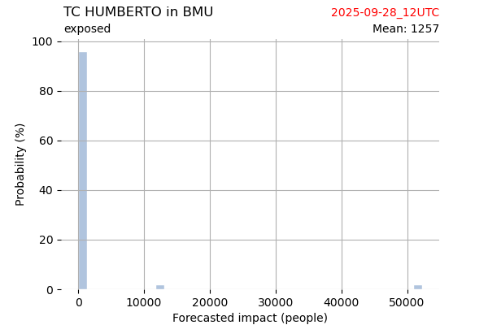

## HUMBERTO Bermuda: people displaced

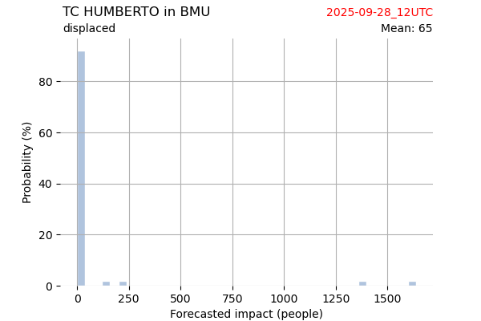

## NEOGURI All countries: No forecast people exposed

Storm NEOGURI is not forecast to affect people in All countries.

## NEOGURI All countries: no forecast people displaced

Storm NEOGURI is not forecast to displace people in All countries.

