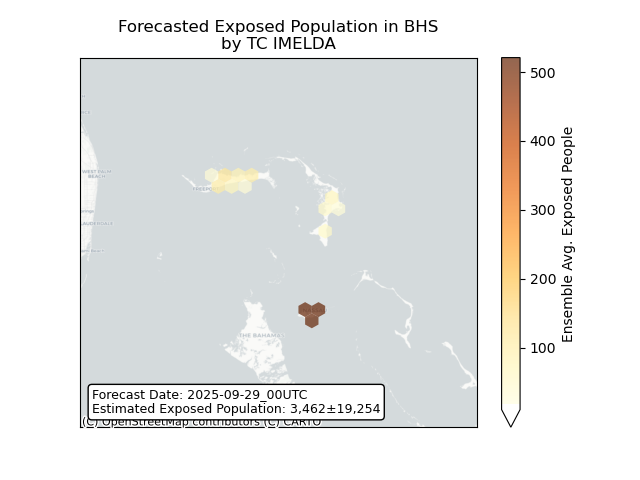
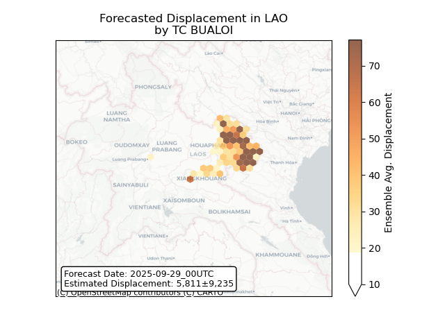

# Displacement forecast

This is a WIP. All this is going to change, for now we're just dumping things here.

## Forecast for 2025-09-29 00:00 UTC

There are 5 active named storms.

## NEOGURI All countries: No forecast people exposed

Storm NEOGURI is not forecast to affect people in All countries.

## NEOGURI All countries: no forecast people displaced

Storm NEOGURI is not forecast to displace people in All countries.

## IMELDA Bahamas: areas affected

## IMELDA Bahamas: people exposed

## IMELDA Bahamas: people displaced

## IMELDA Bermuda: areas affected

## IMELDA Bermuda: people exposed

## IMELDA Bermuda: people displaced

## BUALOI Lao People's Democratic Republic: areas affected

## BUALOI Lao People's Democratic Republic: people exposed

## BUALOI Lao People's Democratic Republic: people displaced

## BUALOI Viet Nam: areas affected

## BUALOI Viet Nam: people exposed

## BUALOI Viet Nam: people displaced

## HUMBERTO All countries: No forecast people exposed

Storm HUMBERTO is not forecast to affect people in All countries.

## HUMBERTO All countries: no forecast people displaced

Storm HUMBERTO is not forecast to displace people in All countries.

## NARDA All countries: No forecast people exposed

Storm NARDA is not forecast to affect people in All countries.

## NARDA All countries: no forecast people displaced

Storm NARDA is not forecast to displace people in All countries.

