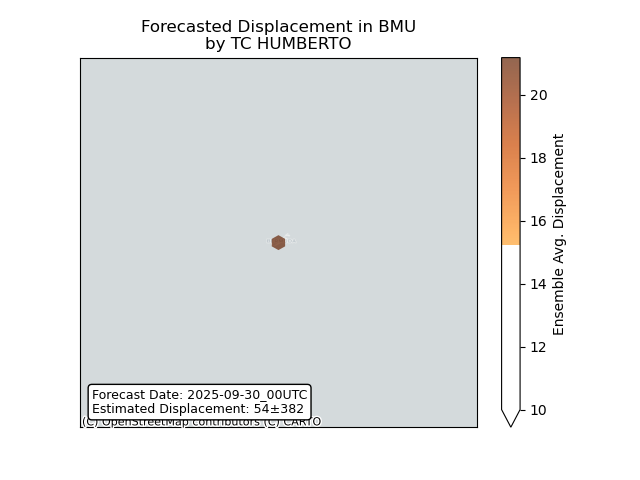

# Displacement forecast

This is a WIP. All this is going to change, for now we're just dumping things here.

## Forecast for 2025-09-30 00:00 UTC

There are 2 active named storms.

## IMELDA Bermuda: areas affected

## IMELDA Bermuda: people exposed

## IMELDA Bermuda: people displaced

## HUMBERTO Bermuda: areas affected

## HUMBERTO Bermuda: people exposed

## HUMBERTO Bermuda: people displaced

