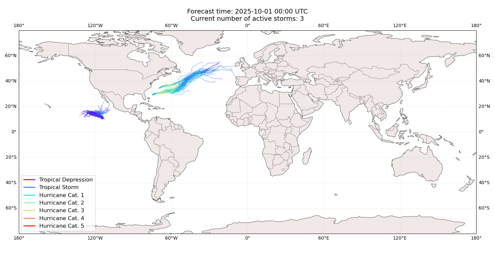
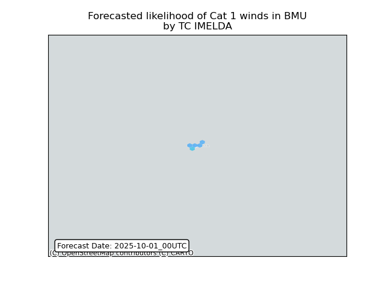
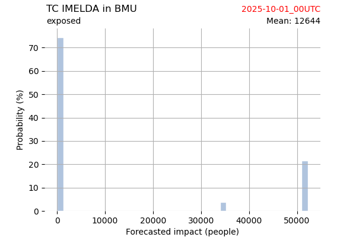
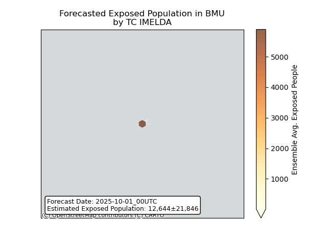
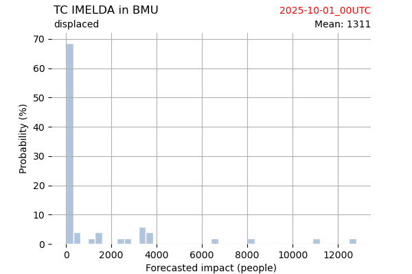
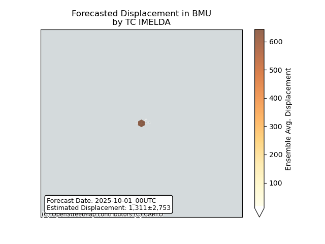

# Displacement forecast

This is a WIP. All this is going to change, for now we're just dumping things here.

## Forecast for 2025-10-01 00:00 UTC

There are 3 active named storms.

## OCTAVE All countries: No forecast people exposed

Storm OCTAVE is not forecast to affect people in All countries.

## OCTAVE All countries: no forecast people displaced

Storm OCTAVE is not forecast to displace people in All countries.

## HUMBERTO All countries: No forecast people exposed

Storm HUMBERTO is not forecast to affect people in All countries.

## HUMBERTO All countries: no forecast people displaced

Storm HUMBERTO is not forecast to displace people in All countries.

## IMELDA Bermuda: areas affected

## IMELDA Bermuda: people exposed

## IMELDA Bermuda: people displaced

