# Displacement forecast

This is a WIP. All this is going to change, for now we're just dumping things here.

## Forecast for 2025-10-02 00:00 UTC

There are 3 active named storms.

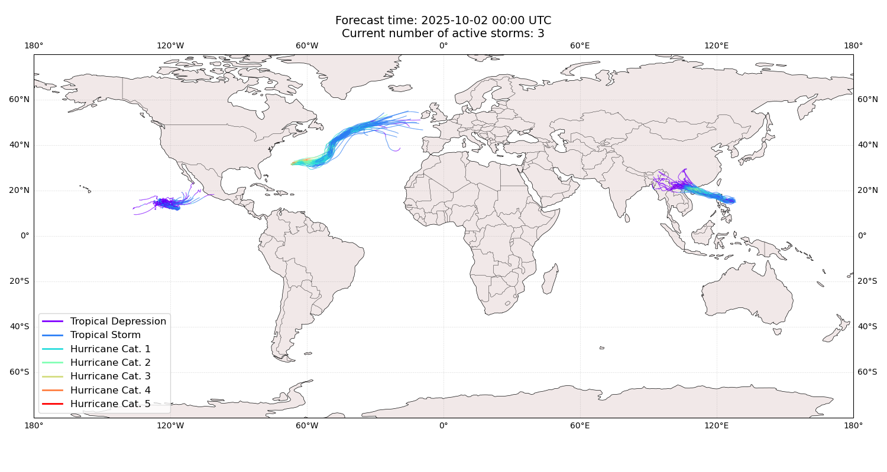

## OCTAVE All countries: No forecast people exposed

Storm OCTAVE is not forecast to affect people in All countries.

## OCTAVE All countries: no forecast people displaced

Storm OCTAVE is not forecast to displace people in All countries.

## MATMO China: areas affected

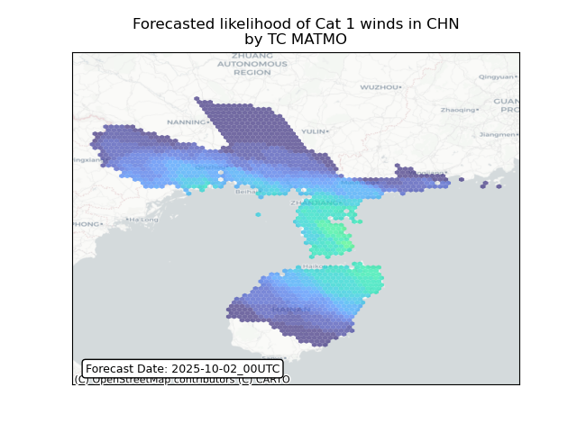

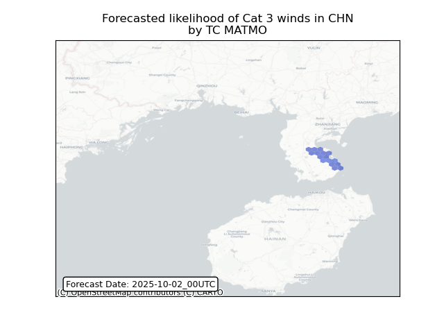

## MATMO China: people exposed

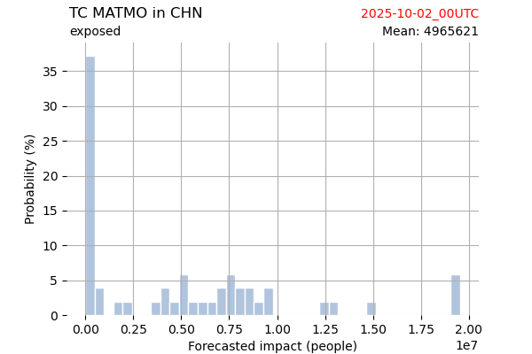

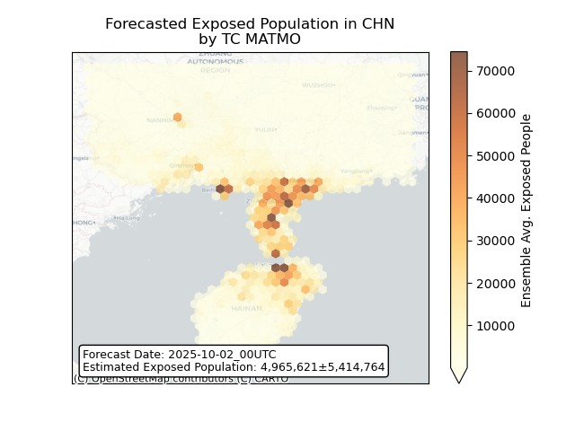

## MATMO China: people displaced

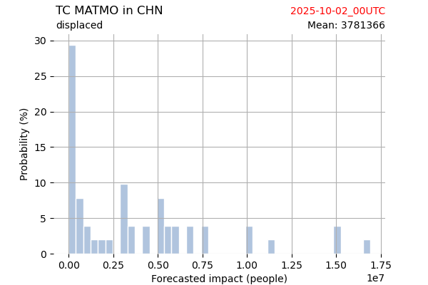

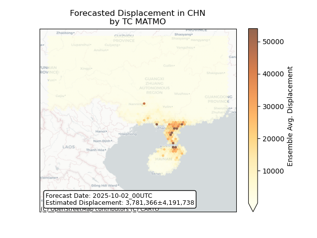

## MATMO Philippines: areas affected

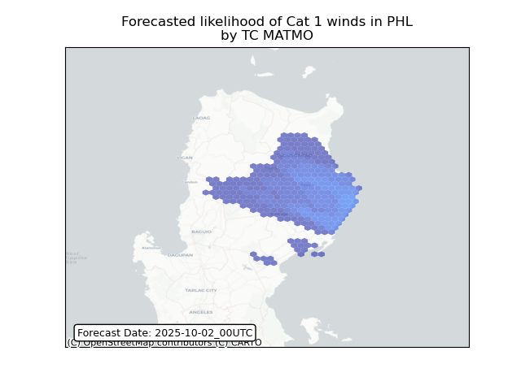

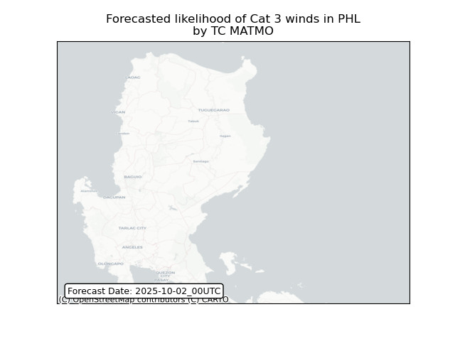

## MATMO Philippines: people exposed

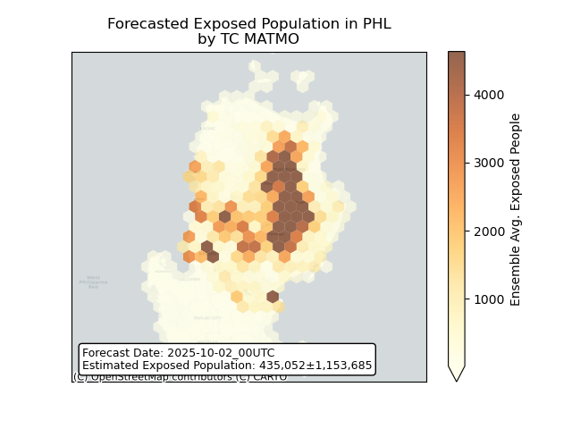

## MATMO Philippines: people displaced

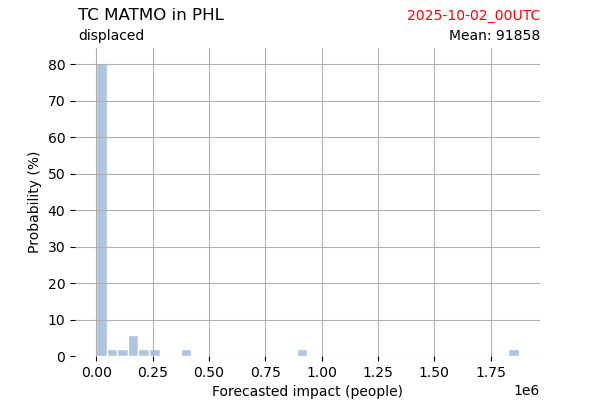

## MATMO Viet Nam: areas affected

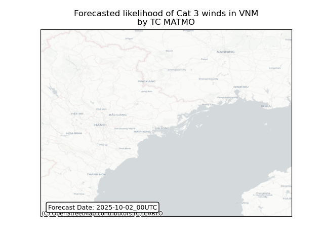

## MATMO Viet Nam: people exposed

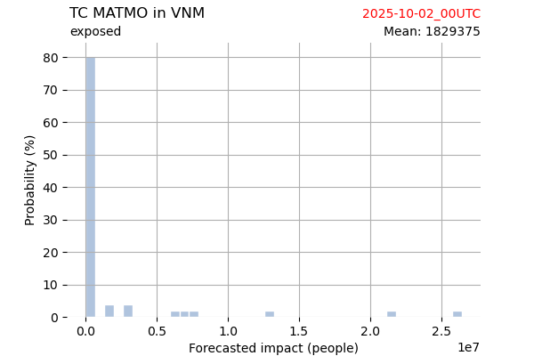

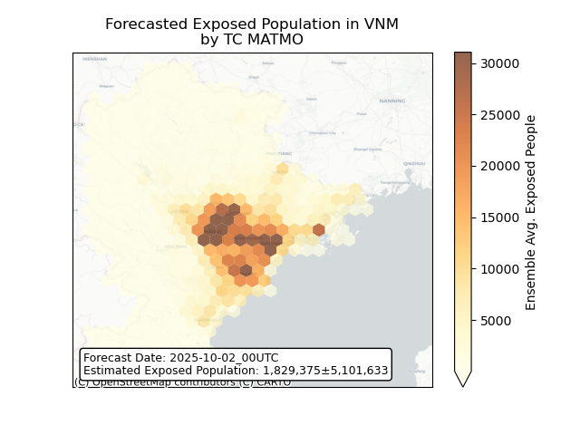

## MATMO Viet Nam: people displaced

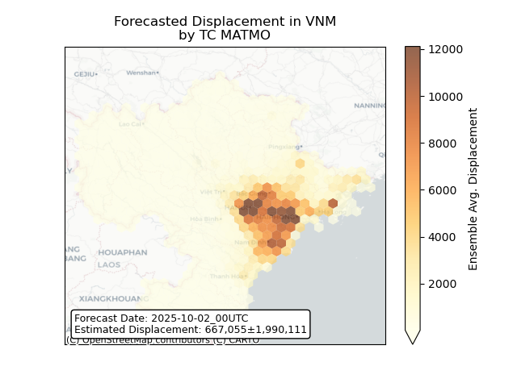

## IMELDA Bermuda: areas affected

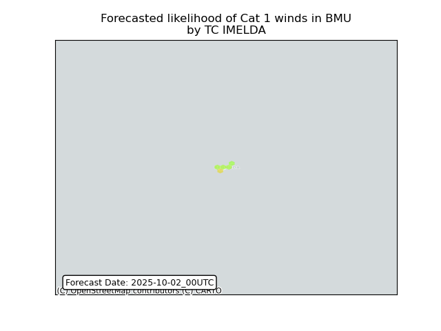

## IMELDA Bermuda: people exposed

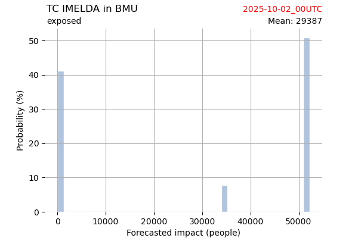

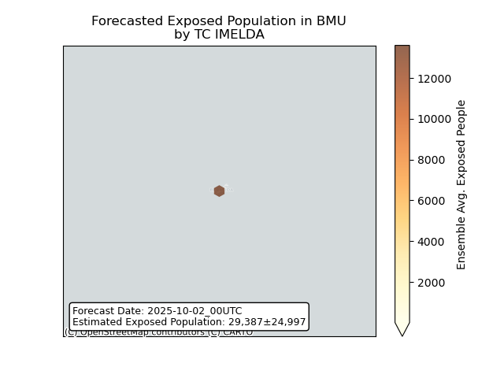

## IMELDA Bermuda: people displaced

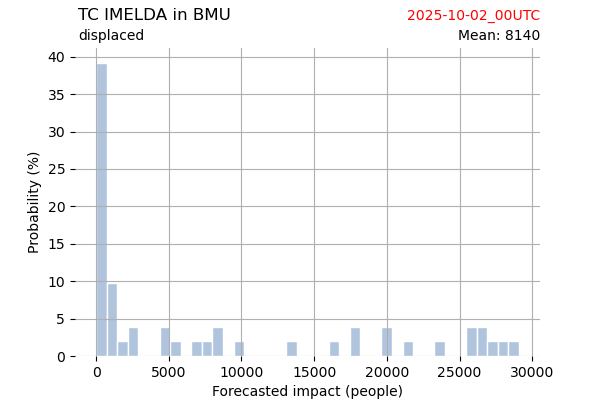

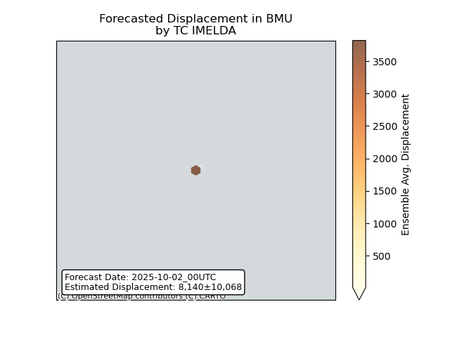

