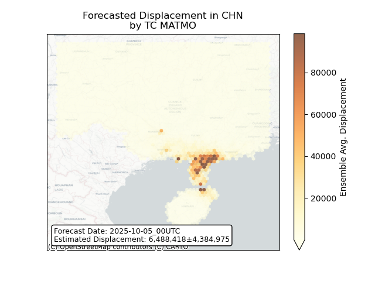
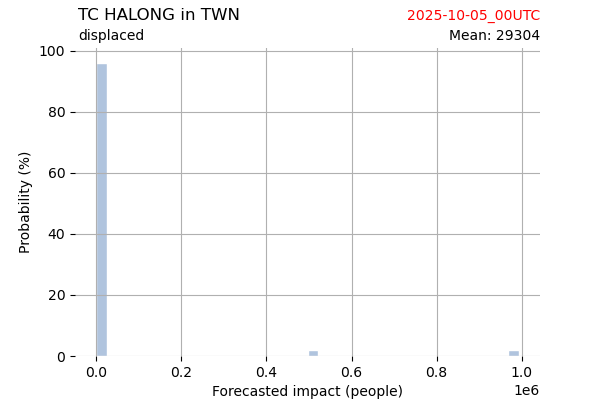

# Displacement forecast

This is a WIP. All this is going to change, for now we're just dumping things here.

## Forecast for 2025-10-05 00:00 UTC

There are 5 active named storms.

## PRISCILLA Mexico: areas affected

## PRISCILLA Mexico: people exposed

## PRISCILLA Mexico: people displaced

## PRISCILLA United States: areas affected

## PRISCILLA United States: people exposed

## PRISCILLA United States: people displaced

## MATMO China: areas affected

## MATMO China: people exposed

## MATMO China: people displaced

## MATMO Viet Nam: areas affected

## MATMO Viet Nam: people exposed

## MATMO Viet Nam: people displaced

## SHAKHTI All countries: No forecast people exposed

Storm SHAKHTI is not forecast to affect people in All countries.

## SHAKHTI All countries: no forecast people displaced

Storm SHAKHTI is not forecast to displace people in All countries.

## OCTAVE All countries: No forecast people exposed

Storm OCTAVE is not forecast to affect people in All countries.

## OCTAVE All countries: no forecast people displaced

Storm OCTAVE is not forecast to displace people in All countries.

## HALONG China: areas affected

## HALONG China: people exposed

## HALONG China: people displaced

## HALONG Japan: areas affected

## HALONG Japan: people exposed

## HALONG Japan: people displaced

## HALONG Philippines: areas affected

## HALONG Philippines: people exposed

## HALONG Philippines: people displaced

## HALONG Taiwan, Province of China: areas affected

## HALONG Taiwan, Province of China: people exposed

## HALONG Taiwan, Province of China: people displaced

