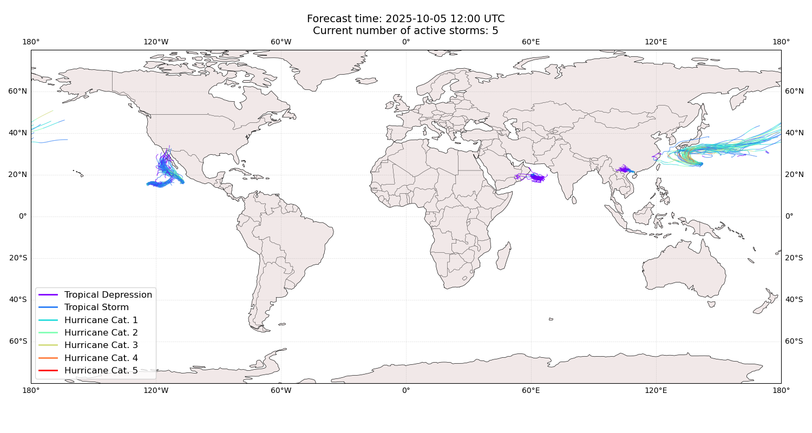
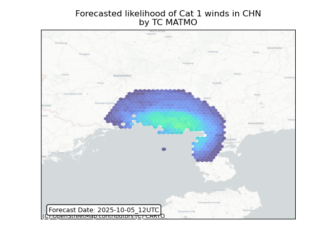
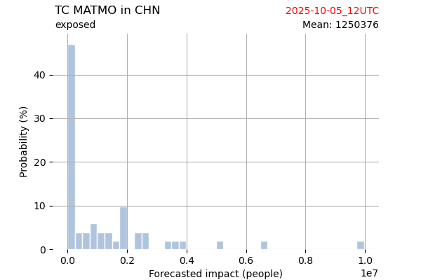
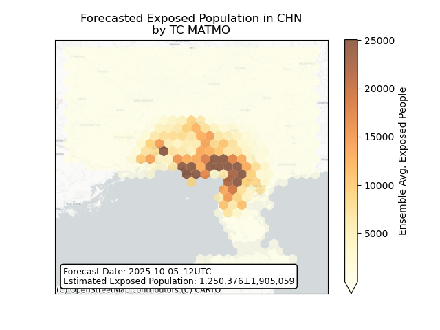
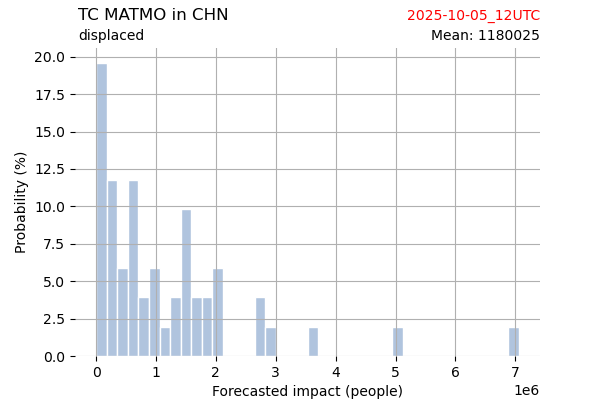
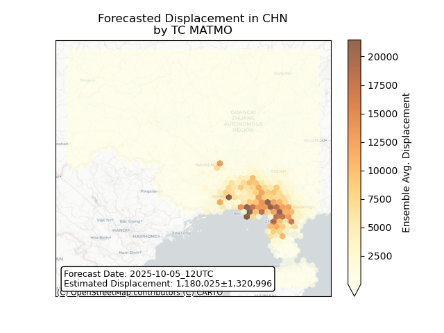

# Displacement forecast

This is a WIP. All this is going to change, for now we're just dumping things here.

## Forecast for 2025-10-05 12:00 UTC

There are 5 active named storms.

## OCTAVE All countries: No forecast people exposed

Storm OCTAVE is not forecast to affect people in All countries.

## OCTAVE All countries: no forecast people displaced

Storm OCTAVE is not forecast to displace people in All countries.

## PRISCILLA All countries: No forecast people exposed

Storm PRISCILLA is not forecast to affect people in All countries.

## PRISCILLA All countries: no forecast people displaced

Storm PRISCILLA is not forecast to displace people in All countries.

## HALONG All countries: No forecast people exposed

Storm HALONG is not forecast to affect people in All countries.

## HALONG All countries: no forecast people displaced

Storm HALONG is not forecast to displace people in All countries.

## MATMO China: areas affected

## MATMO China: people exposed

## MATMO China: people displaced

## SHAKHTI All countries: No forecast people exposed

Storm SHAKHTI is not forecast to affect people in All countries.

## SHAKHTI All countries: no forecast people displaced

Storm SHAKHTI is not forecast to displace people in All countries.

