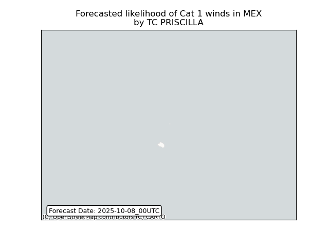

# Displacement forecast

This is a WIP. All this is going to change, for now we're just dumping things here.

## Forecast for 2025-10-08 00:00 UTC

There are 4 active named storms.

## PRISCILLA Mexico: areas affected

## JERRY Spain: areas affected

## JERRY Spain: people exposed

## JERRY Spain: people displaced

## JERRY Portugal: areas affected

## JERRY Portugal: people exposed

## JERRY Portugal: people displaced

## HALONG Japan: areas affected

## HALONG Japan: people exposed

## HALONG Japan: people displaced

## HALONG United States: areas affected

## HALONG United States: people exposed

## HALONG United States: people displaced

## OCTAVE All countries: No forecast people exposed

Storm OCTAVE is not forecast to affect people in All countries.

## OCTAVE All countries: no forecast people displaced

Storm OCTAVE is not forecast to displace people in All countries.

