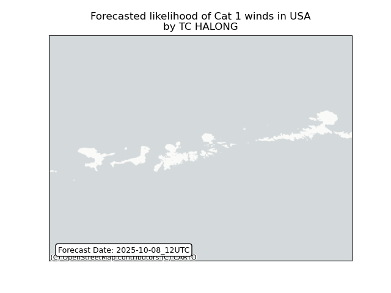
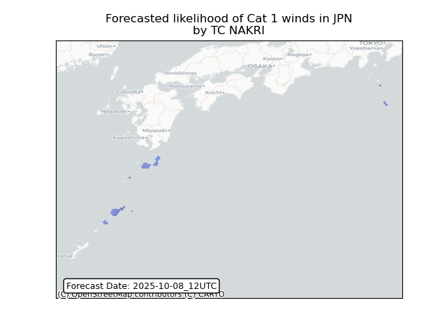
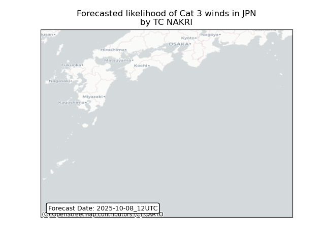
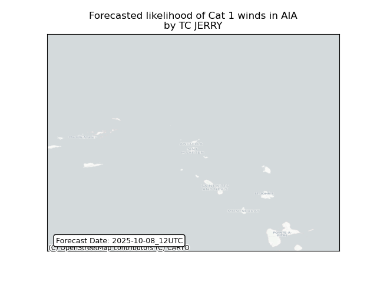
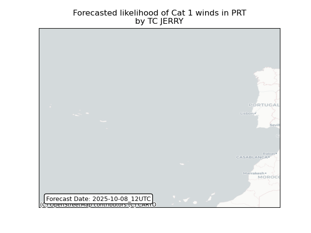
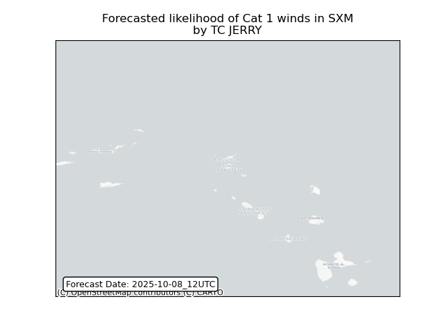

# Displacement forecast

This is a WIP. All this is going to change, for now we're just dumping things here.

## Forecast for 2025-10-08 12:00 UTC

There are 5 active named storms.

## OCTAVE All countries: No forecast people exposed

Storm OCTAVE is not forecast to affect people in All countries.

## OCTAVE All countries: no forecast people displaced

Storm OCTAVE is not forecast to displace people in All countries.

## HALONG Japan: areas affected

## HALONG Japan: people exposed

## HALONG United States: no forecast people displaced

Storm HALONG is not forecast to displace people in United States.

## HALONG United States: areas affected

## NAKRI Japan: areas affected

## JERRY Anguilla: areas affected

## JERRY Anguilla: people exposed

## JERRY Anguilla: people displaced

## JERRY Canada: areas affected

## JERRY Canada: people exposed

## JERRY Portugal: no forecast people displaced

Storm JERRY is not forecast to displace people in Portugal.

## JERRY Portugal: areas affected

## JERRY Sint Maarten (Dutch part): areas affected

## PRISCILLA All countries: No forecast people exposed

Storm PRISCILLA is not forecast to affect people in All countries.

## PRISCILLA All countries: no forecast people displaced

Storm PRISCILLA is not forecast to displace people in All countries.

