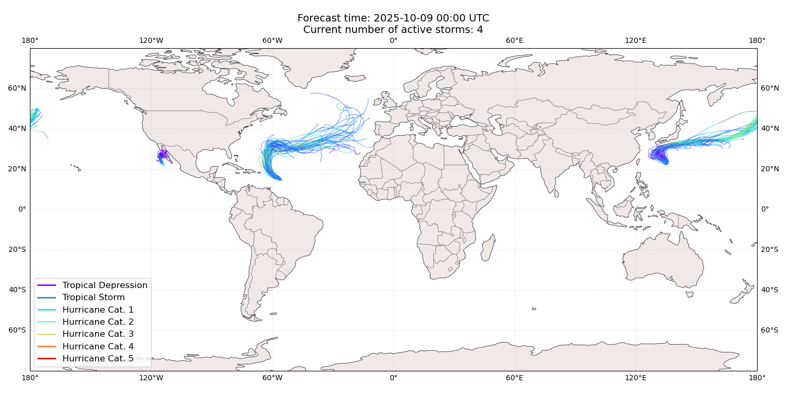
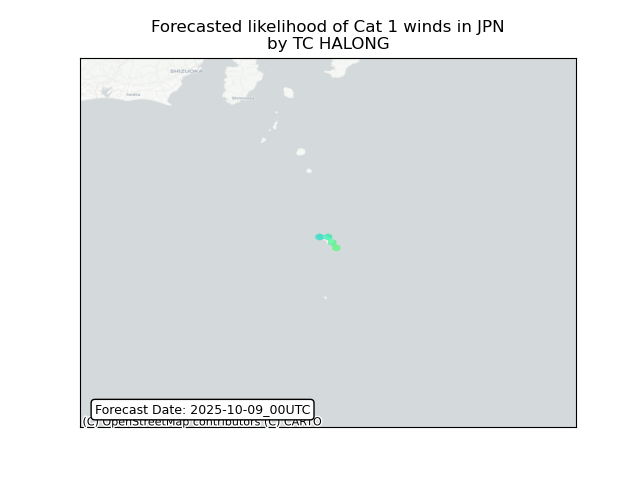
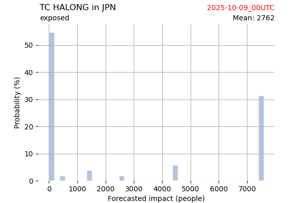
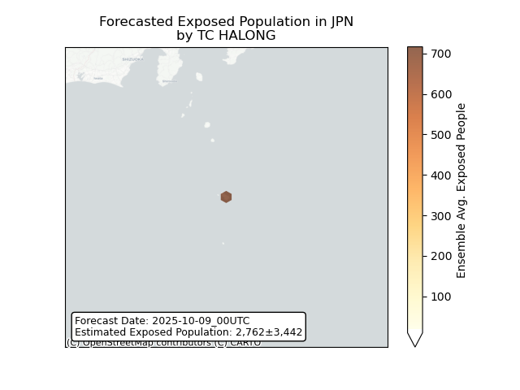

# Displacement forecast

This is a WIP. All this is going to change, for now we're just dumping things here.

## Forecast for 2025-10-09 00:00 UTC

There are 5 active named storms.

## NAKRI All countries: No forecast people exposed

Storm NAKRI is not forecast to affect people in All countries.

## NAKRI All countries: no forecast people displaced

Storm NAKRI is not forecast to displace people in All countries.

## OCTAVE All countries: No forecast people exposed

Storm OCTAVE is not forecast to affect people in All countries.

## OCTAVE All countries: no forecast people displaced

Storm OCTAVE is not forecast to displace people in All countries.

## JERRY All countries: No forecast people exposed

Storm JERRY is not forecast to affect people in All countries.

## JERRY All countries: no forecast people displaced

Storm JERRY is not forecast to displace people in All countries.

## HALONG Japan: areas affected

## HALONG Japan: people exposed

## PRISCILLA All countries: no forecast people displaced

Storm PRISCILLA is not forecast to displace people in All countries.

## PRISCILLA All countries: No forecast people exposed

Storm PRISCILLA is not forecast to affect people in All countries.

## PRISCILLA All countries: no forecast people displaced

Storm PRISCILLA is not forecast to displace people in All countries.

