# Displacement forecast

This is a WIP. All this is going to change, for now we're just dumping things here.

## Forecast for 2025-10-10 00:00 UTC

There are 6 active named storms.

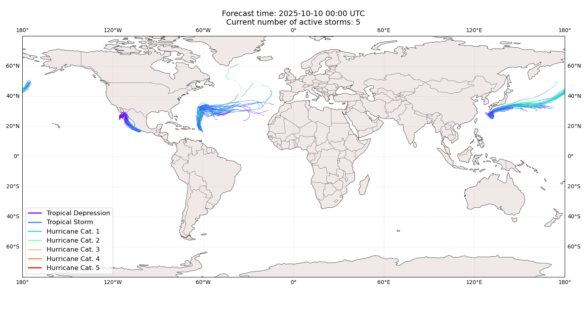

## RAYMOND All countries: No forecast people exposed

Storm RAYMOND is not forecast to affect people in All countries.

## RAYMOND All countries: no forecast people displaced

Storm RAYMOND is not forecast to displace people in All countries.

## OCTAVE All countries: No forecast people exposed

Storm OCTAVE is not forecast to affect people in All countries.

## OCTAVE All countries: no forecast people displaced

Storm OCTAVE is not forecast to displace people in All countries.

## HALONG All countries: No forecast people exposed

Storm HALONG is not forecast to affect people in All countries.

## HALONG All countries: no forecast people displaced

Storm HALONG is not forecast to displace people in All countries.

## JERRY Antigua and Barbuda: areas affected

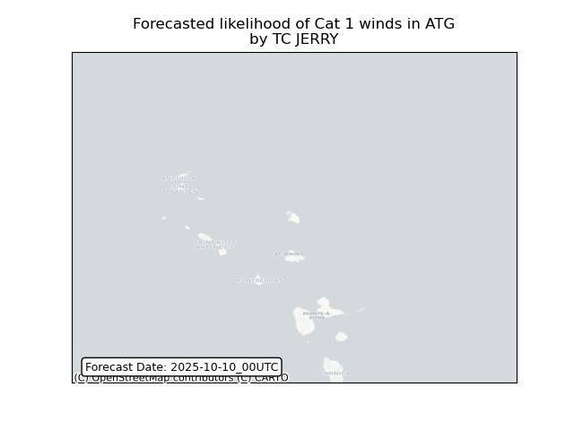

## JERRY Antigua and Barbuda: people exposed

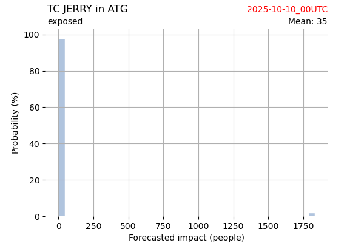

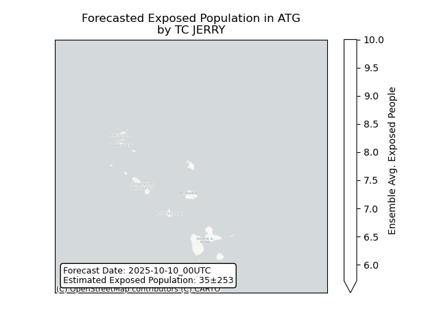

## JERRY Antigua and Barbuda: people displaced

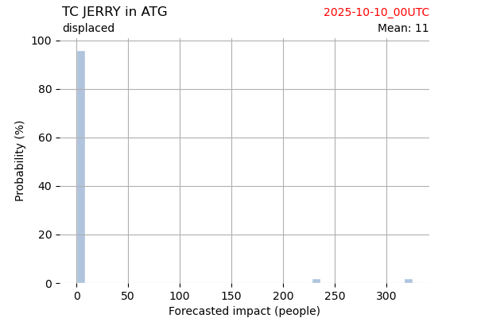

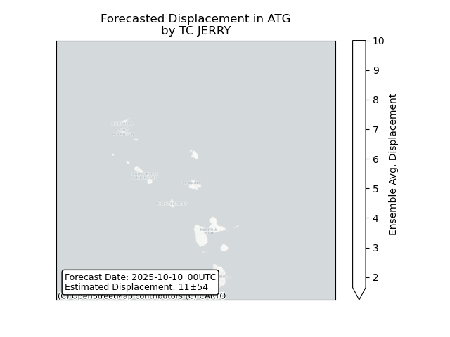

## PRISCILLA All countries: No forecast people exposed

Storm PRISCILLA is not forecast to affect people in All countries.

## PRISCILLA All countries: no forecast people displaced

Storm PRISCILLA is not forecast to displace people in All countries.

## NAKRI Japan: areas affected

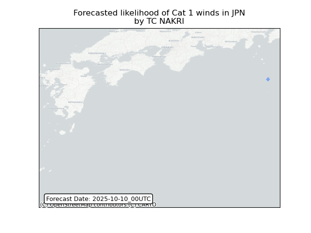

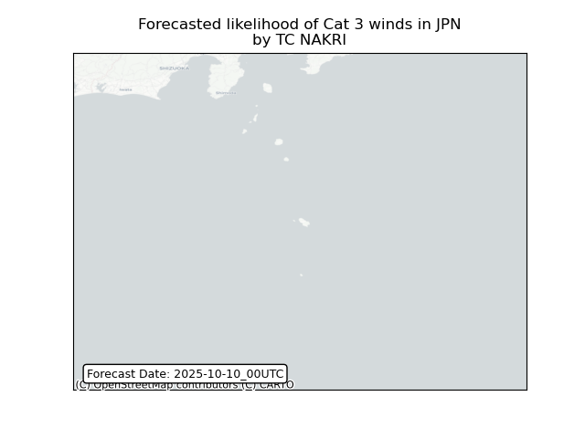

## NAKRI Japan: people exposed

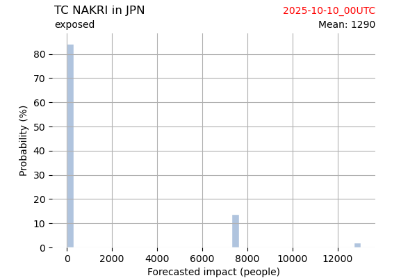

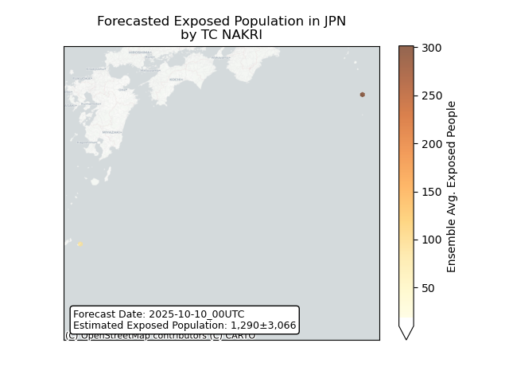

## NAKRI Japan: people displaced

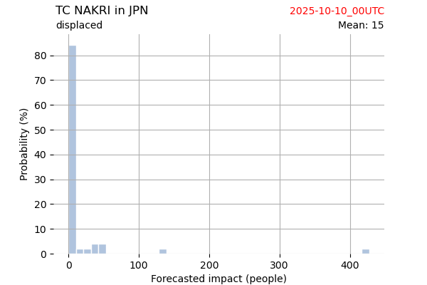

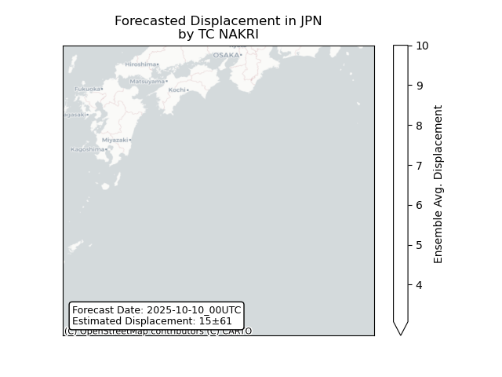

