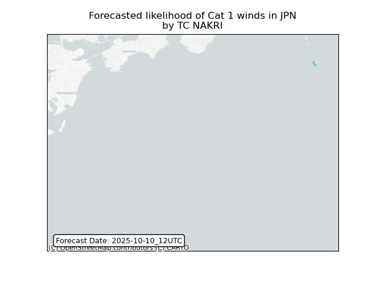

# Displacement forecast

This is a WIP. All this is going to change, for now we're just dumping things here.

## Forecast for 2025-10-10 12:00 UTC

There are 6 active named storms.

## PRISCILLA All countries: No forecast people exposed

Storm PRISCILLA is not forecast to affect people in All countries.

## PRISCILLA All countries: no forecast people displaced

Storm PRISCILLA is not forecast to displace people in All countries.

## RAYMOND Mexico: areas affected

## RAYMOND Mexico: people exposed

## RAYMOND Mexico: people displaced

## NAKRI Japan: areas affected

## NAKRI Japan: people exposed

## NAKRI Japan: people displaced

## KAREN All countries: No forecast people exposed

Storm KAREN is not forecast to affect people in All countries.

## KAREN All countries: no forecast people displaced

Storm KAREN is not forecast to displace people in All countries.

## JERRY All countries: No forecast people exposed

Storm JERRY is not forecast to affect people in All countries.

## JERRY All countries: no forecast people displaced

Storm JERRY is not forecast to displace people in All countries.

## HALONG United States: areas affected

## HALONG United States: people exposed

## HALONG United States: people displaced

