# Displacement forecast

This is a WIP. All this is going to change, for now we're just dumping things here.

## Forecast for 2025-10-19 12:00 UTC

There are 2 active named storms.

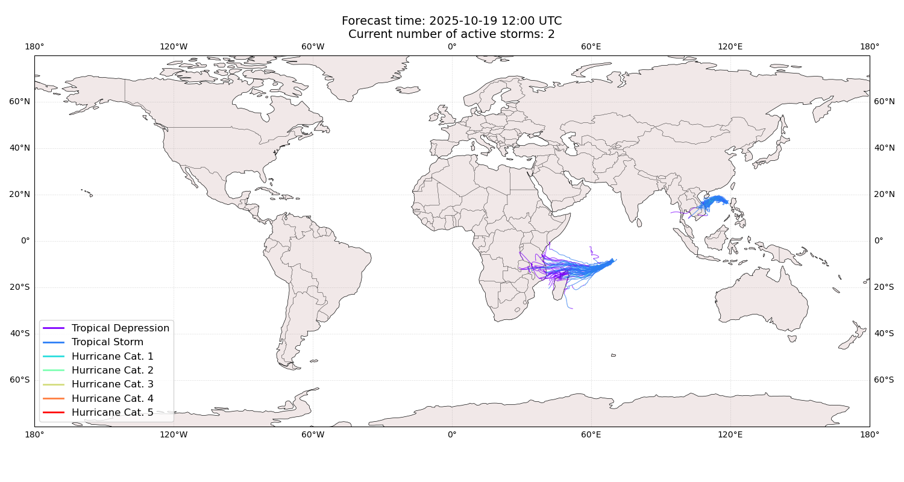

## CHENGE Mozambique: areas affected

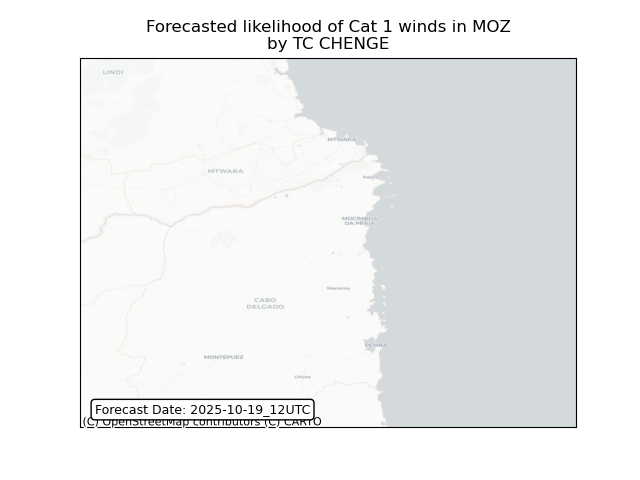

## CHENGE Mozambique: people exposed

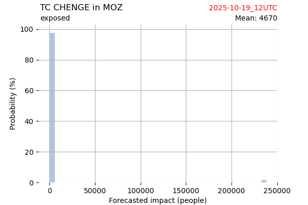

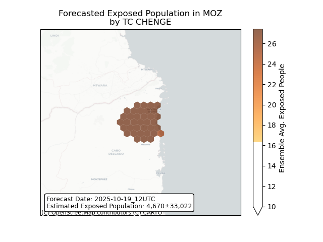

## CHENGE Mozambique: people displaced

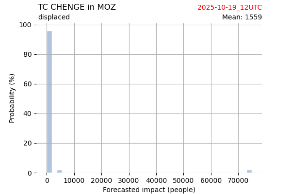

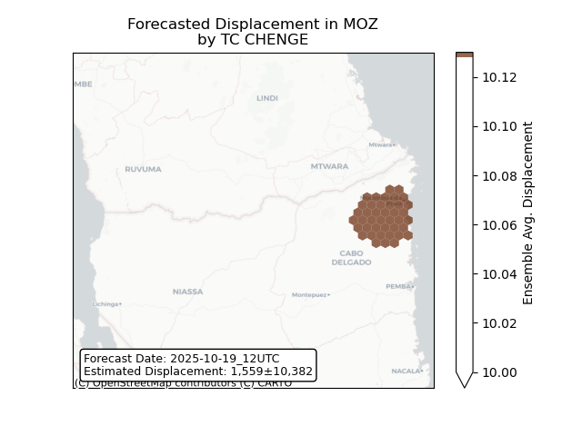

## FENGSHEN Viet Nam: areas affected

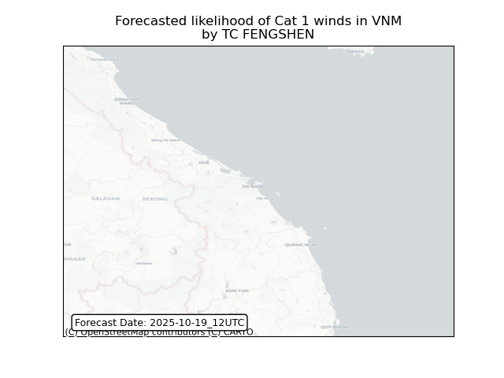

## FENGSHEN Viet Nam: people exposed

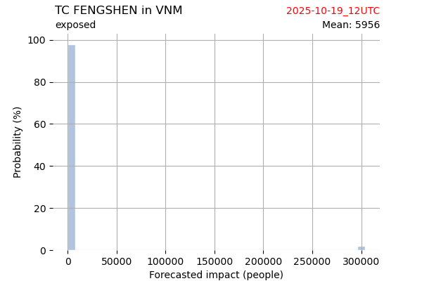

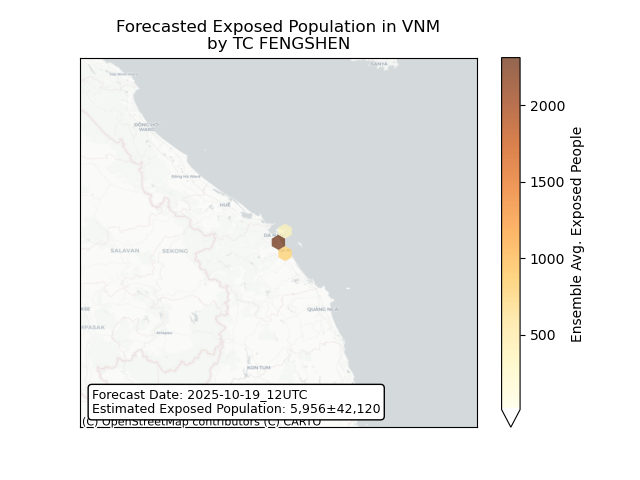

## FENGSHEN Viet Nam: people displaced

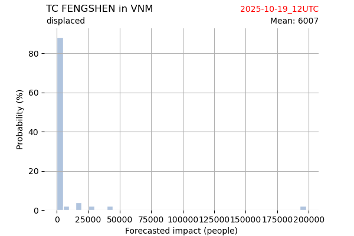

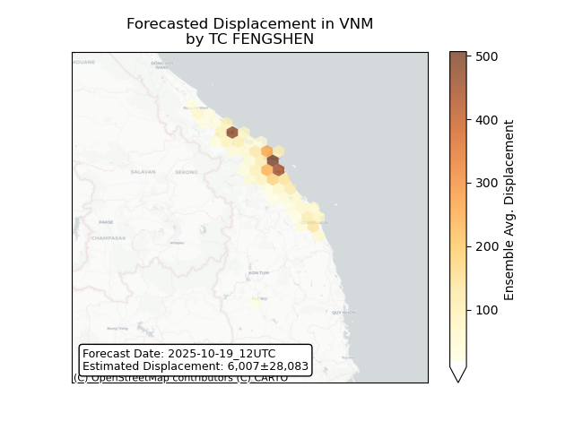

