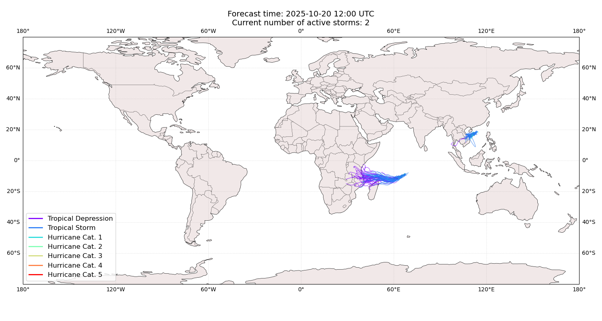
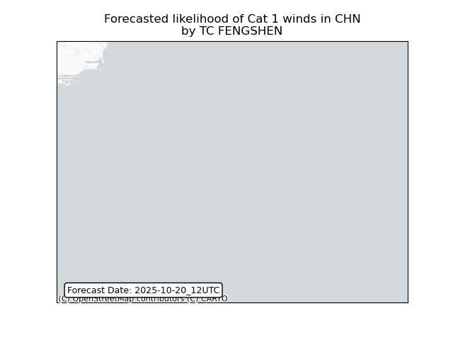
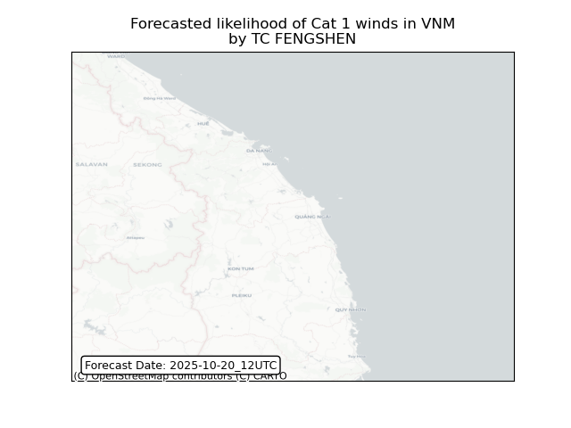
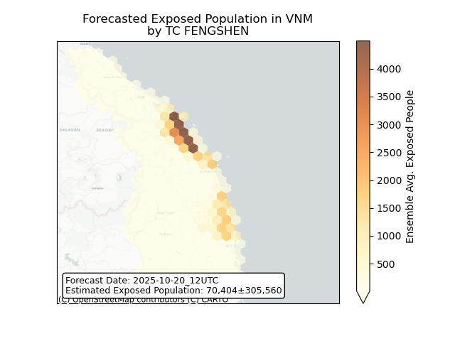
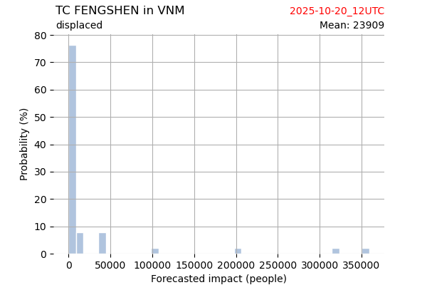
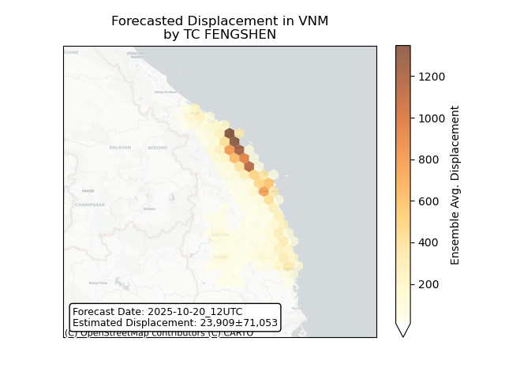

# Displacement forecast

This is a WIP. All this is going to change, for now we're just dumping things here.

## Forecast for 2025-10-20 12:00 UTC

There are 2 active named storms.

## FENGSHEN China: areas affected

## FENGSHEN Viet Nam: areas affected

## FENGSHEN Viet Nam: people exposed

## FENGSHEN Viet Nam: people displaced

## CHENGE All countries: No forecast people exposed

Storm CHENGE is not forecast to affect people in All countries.

## CHENGE All countries: no forecast people displaced

Storm CHENGE is not forecast to displace people in All countries.

