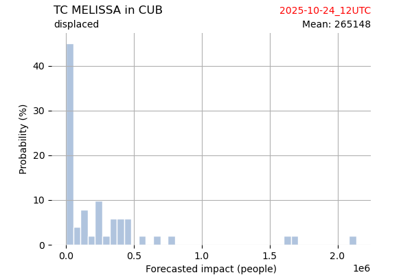

# Displacement forecast

This is a WIP. All this is going to change, for now we're just dumping things here.

## Forecast for 2025-10-24 12:00 UTC

There are 2 active named storms.

## MELISSA Bahamas: areas affected

## MELISSA Bahamas: people exposed

## MELISSA Bahamas: people displaced

## MELISSA Bermuda: areas affected

## MELISSA Bermuda: people exposed

## MELISSA Bermuda: people displaced

## MELISSA Canada: areas affected

## MELISSA Canada: people exposed

## MELISSA Canada: people displaced

## MELISSA Cuba: areas affected

## MELISSA Cuba: people exposed

## MELISSA Cuba: people displaced

## MELISSA Cayman Islands: areas affected

## MELISSA Cayman Islands: people exposed

## MELISSA Cayman Islands: people displaced

## MELISSA Dominican Republic: areas affected

## MELISSA Dominican Republic: people exposed

## MELISSA Dominican Republic: people displaced

## MELISSA Honduras: areas affected

## MELISSA Honduras: people exposed

## MELISSA Honduras: people displaced

## MELISSA Haiti: areas affected

## MELISSA Haiti: people exposed

## MELISSA Haiti: people displaced

## MELISSA Jamaica: areas affected

## MELISSA Jamaica: people exposed

## MELISSA Jamaica: people displaced

## MELISSA Nicaragua: areas affected

## MELISSA Nicaragua: people exposed

## MELISSA Nicaragua: people displaced

## MELISSA Saint Pierre and Miquelon: areas affected

## MELISSA Saint Pierre and Miquelon: people exposed

## MELISSA Saint Pierre and Miquelon: people displaced

## MELISSA Turks and Caicos Islands: areas affected

## MELISSA Turks and Caicos Islands: people exposed

## MELISSA Turks and Caicos Islands: people displaced

## MELISSA United States: areas affected

## MELISSA United States: people exposed

## MELISSA United States: people displaced

## CHENGE All countries: No forecast people exposed

Storm CHENGE is not forecast to affect people in All countries.

## CHENGE All countries: no forecast people displaced

Storm CHENGE is not forecast to displace people in All countries.

