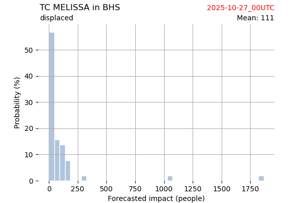
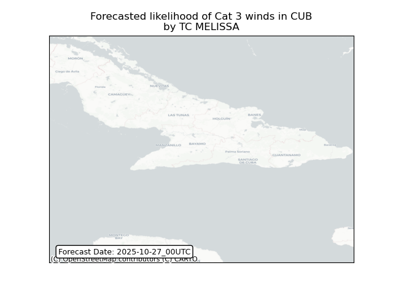

# Displacement forecast

This is a WIP. All this is going to change, for now we're just dumping things here.

## Forecast for 2025-10-27 00:00 UTC

There are 3 active named storms.

## MELISSA Bahamas: areas affected

## MELISSA Bahamas: people exposed

## MELISSA Bahamas: people displaced

## MELISSA Cuba: areas affected

## MELISSA Cuba: people exposed

## MELISSA Cuba: people displaced

## MELISSA Ireland: areas affected

## MELISSA Jamaica: areas affected

## MELISSA Jamaica: people exposed

## MELISSA Turks and Caicos Islands: no forecast people displaced

Storm MELISSA is not forecast to displace people in Turks and Caicos Islands.

## MELISSA Turks and Caicos Islands: areas affected

## MELISSA Turks and Caicos Islands: people exposed

## MELISSA Turks and Caicos Islands: people displaced

## SONIA All countries: No forecast people exposed

Storm SONIA is not forecast to affect people in All countries.

## SONIA All countries: no forecast people displaced

Storm SONIA is not forecast to displace people in All countries.

