# Displacement forecast

This is a WIP. All this is going to change, for now we're just dumping things here.

## Forecast for 2025-10-30 12:00 UTC

There are 1 active named storms.

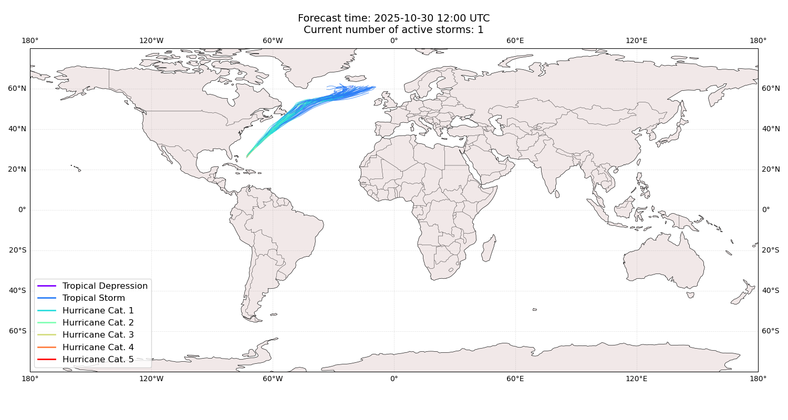

## MELISSA Bermuda: areas affected

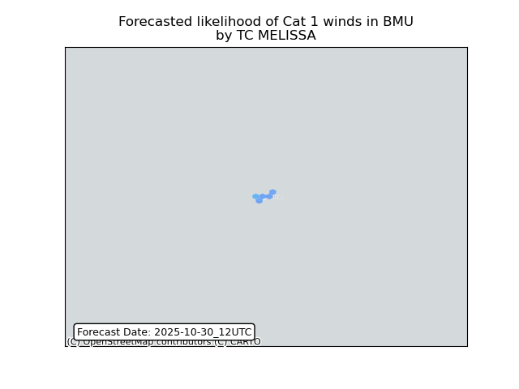

## MELISSA Bermuda: people exposed

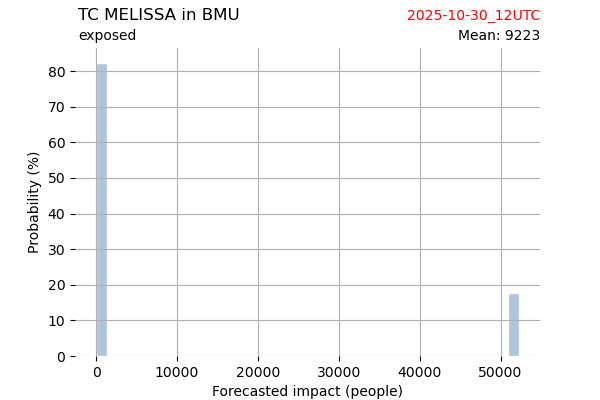

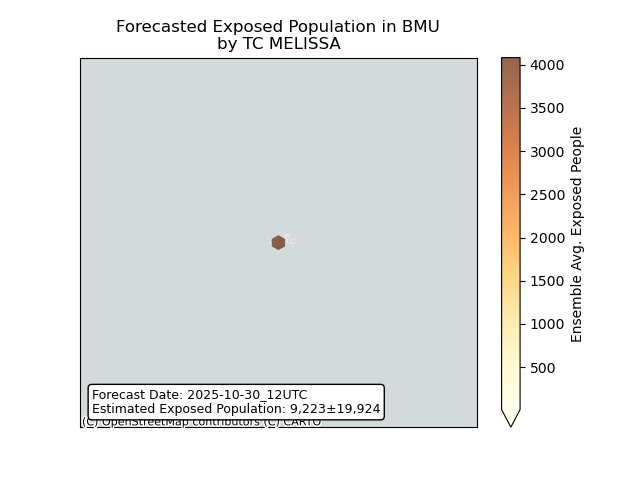

## MELISSA Bermuda: people displaced

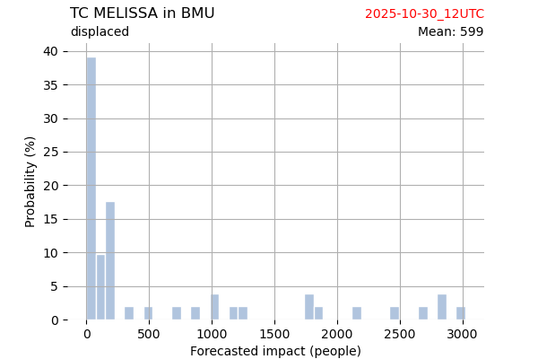

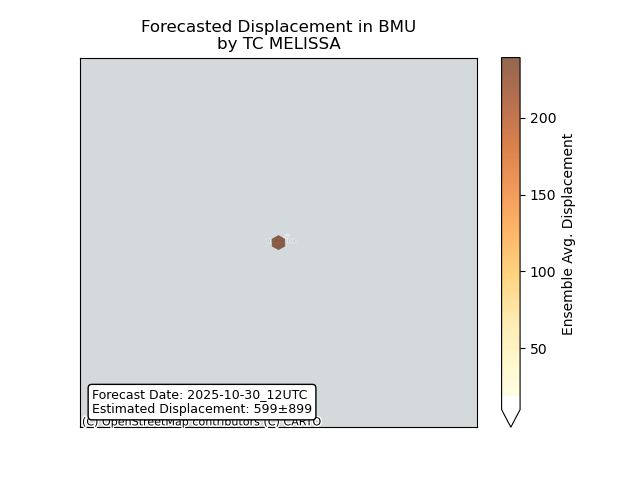

## MELISSA Canada: areas affected

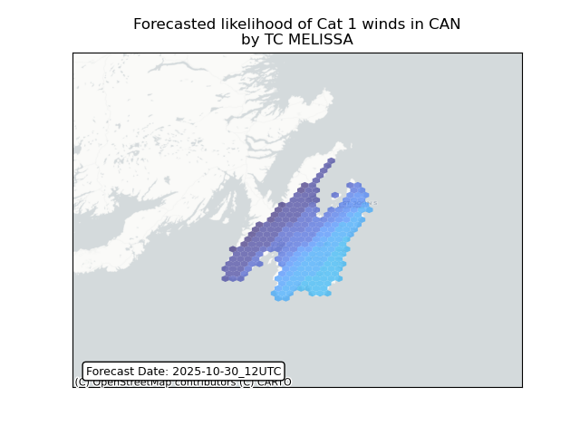

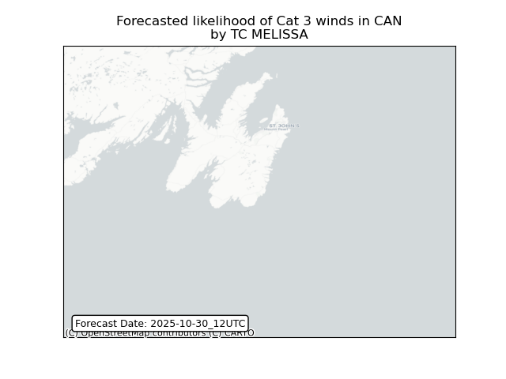

## MELISSA Canada: people exposed

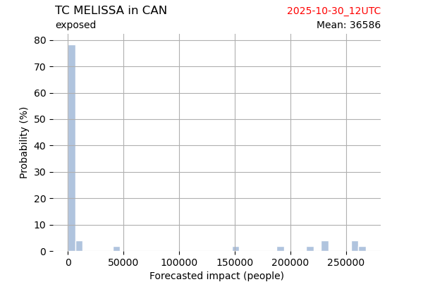

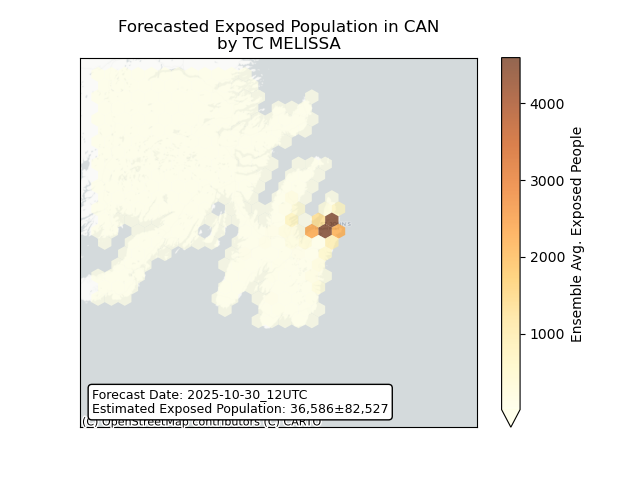

## MELISSA Canada: people displaced

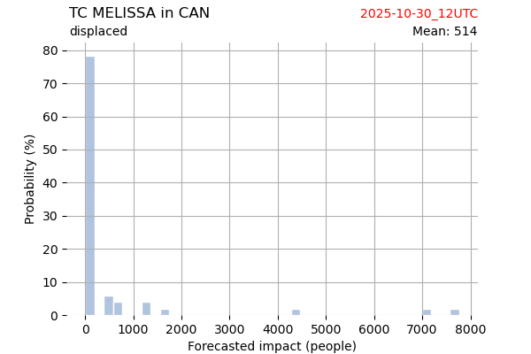

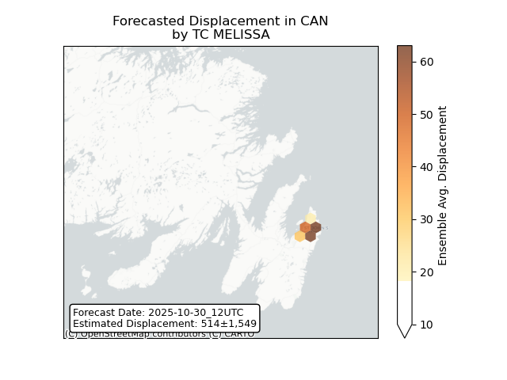

