# Displacement forecast

This is a WIP. All this is going to change, for now we're just dumping things here.

## Forecast for 2025-11-01 12:00 UTC

There are 1 active named storms.

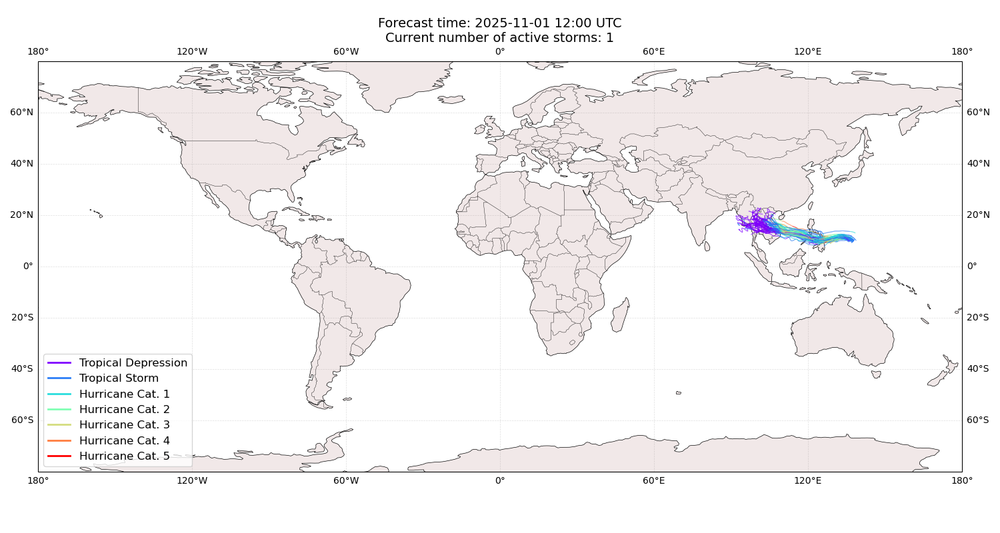

## KALMAEGI China: areas affected

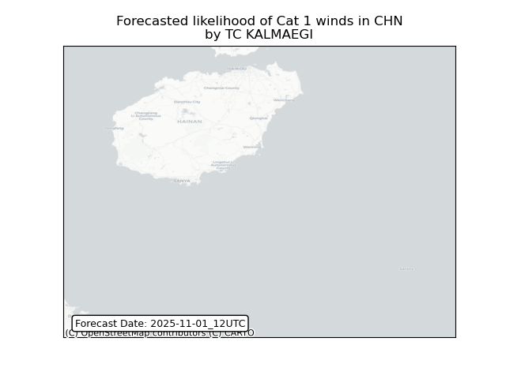

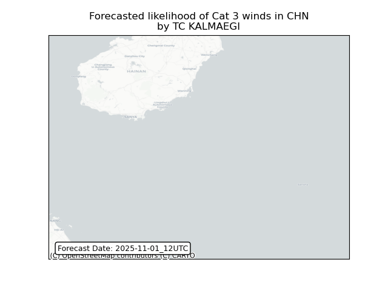

## KALMAEGI China: people exposed

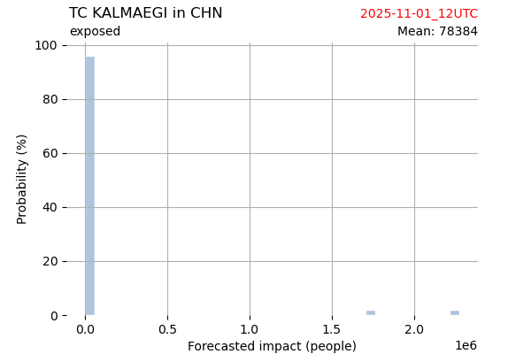

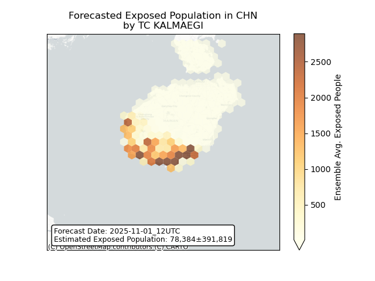

## KALMAEGI China: people displaced

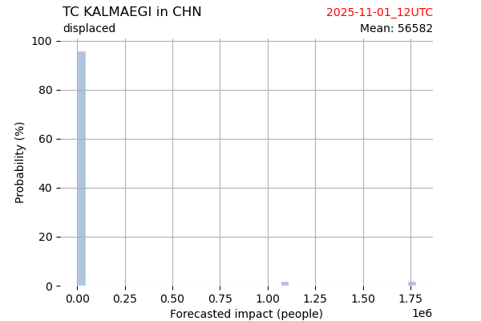

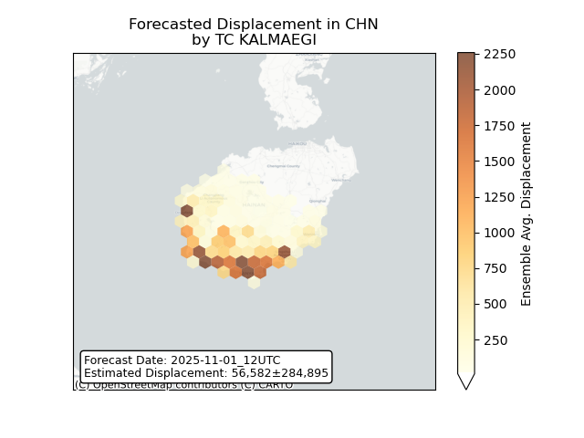

## KALMAEGI Cambodia: areas affected

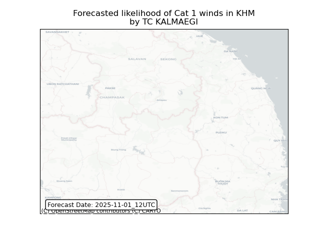

## KALMAEGI Cambodia: people exposed

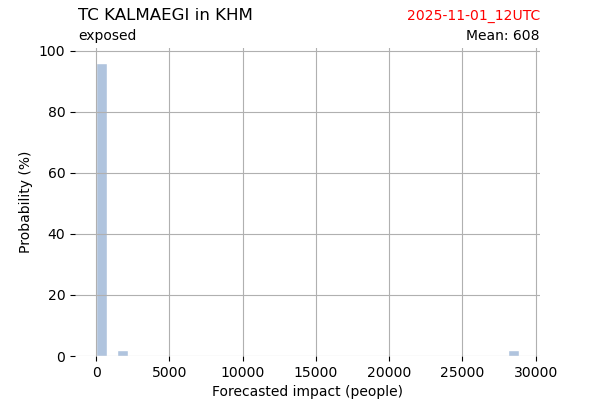

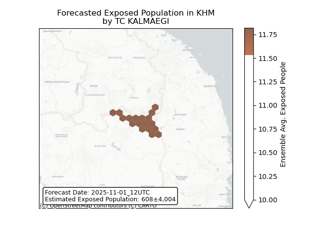

## KALMAEGI Cambodia: people displaced

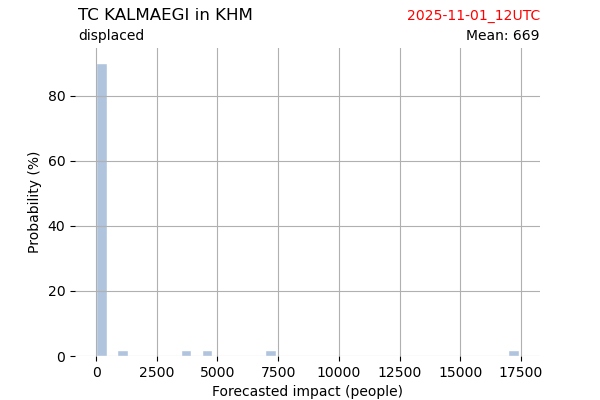

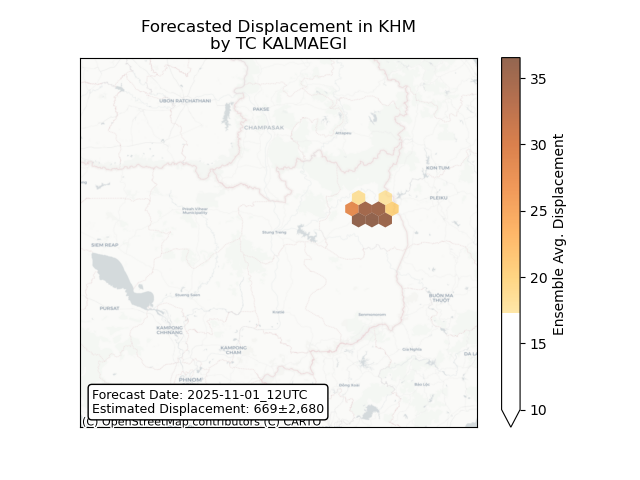

## KALMAEGI Lao People's Democratic Republic: areas affected

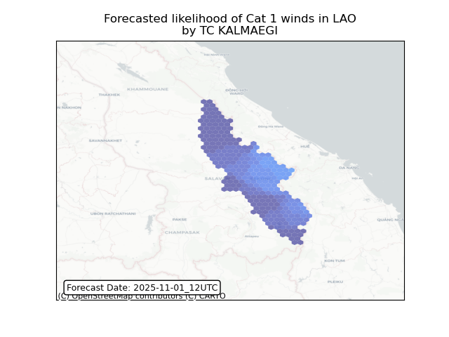

## KALMAEGI Lao People's Democratic Republic: people exposed

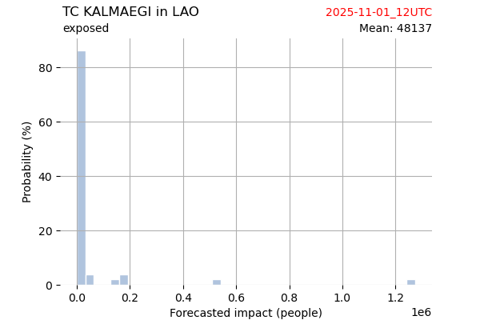

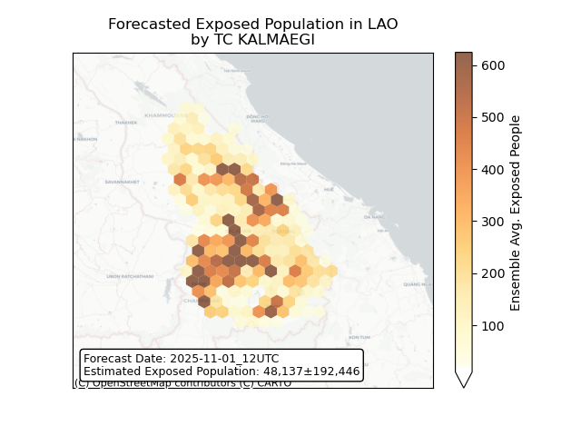

## KALMAEGI Lao People's Democratic Republic: people displaced

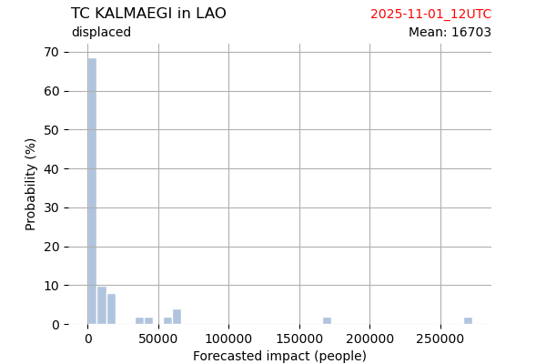

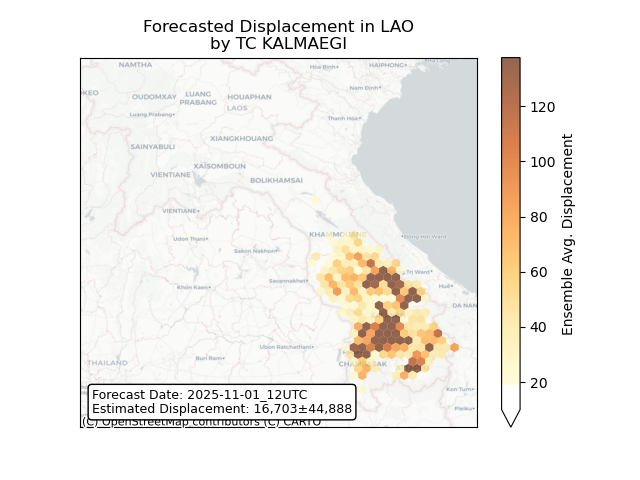

## KALMAEGI Philippines: areas affected

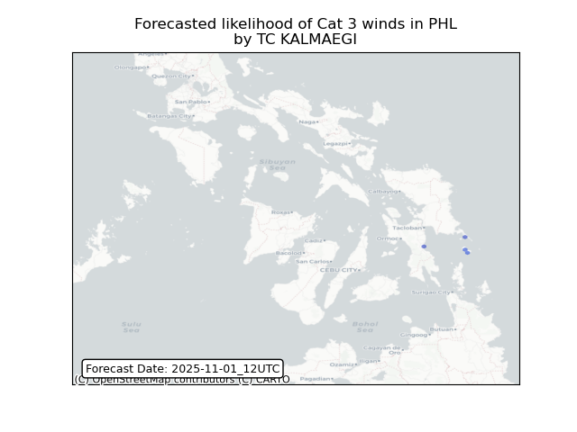

## KALMAEGI Philippines: people exposed

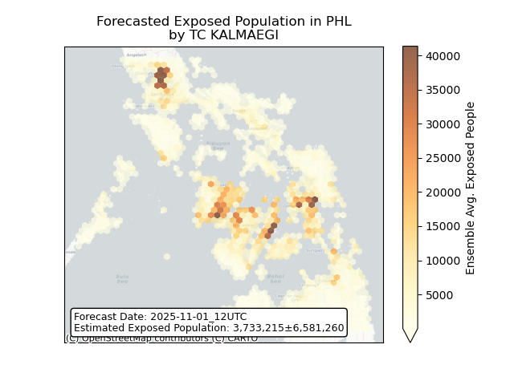

## KALMAEGI Philippines: people displaced

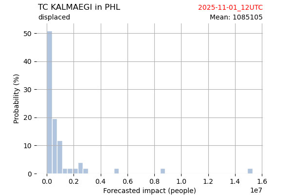

## KALMAEGI Viet Nam: areas affected

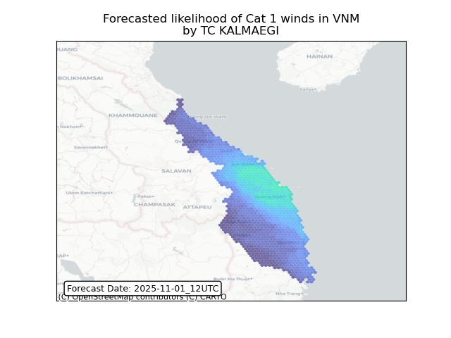

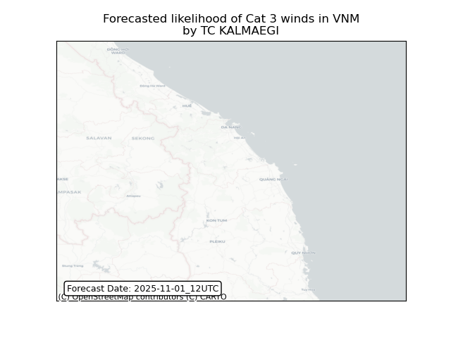

## KALMAEGI Viet Nam: people exposed

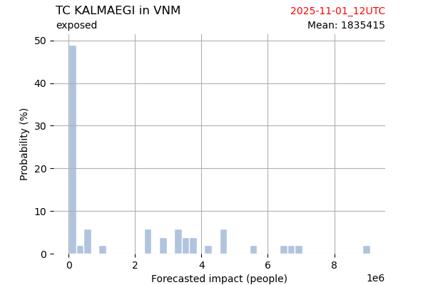

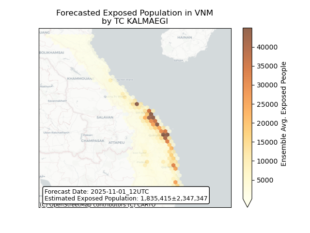

## KALMAEGI Viet Nam: people displaced

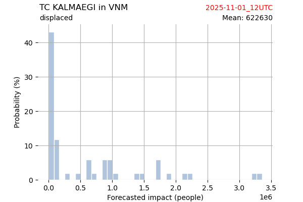

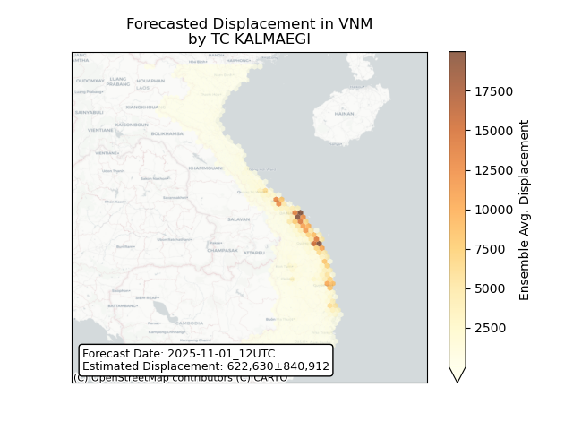

