# Displacement forecast

This is a WIP. All this is going to change, for now we're just dumping things here.

## Forecast for 2025-11-07 12:00 UTC

There are 1 active named storms.

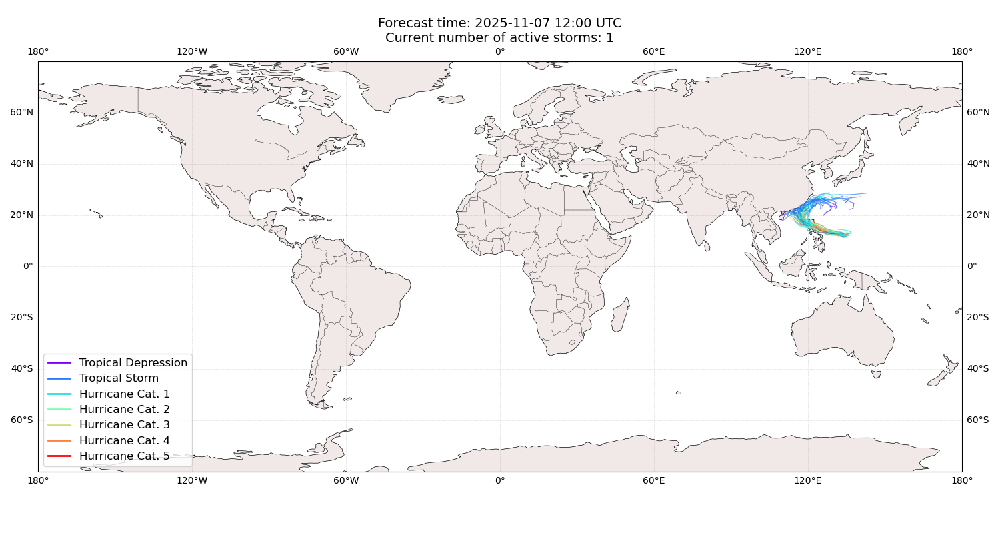

## FUNG-WONG China: areas affected

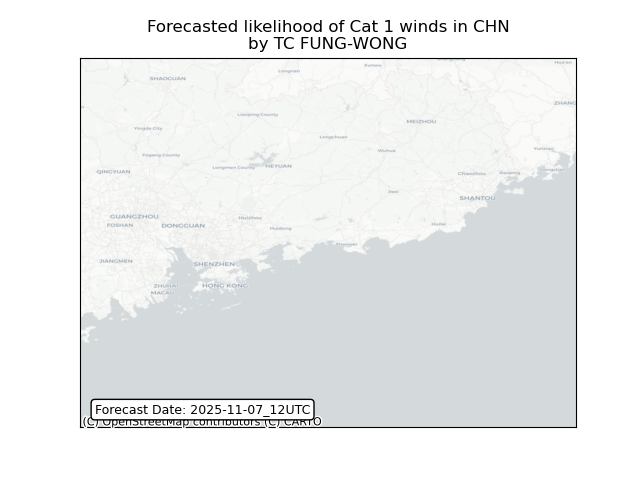

## FUNG-WONG China: people exposed

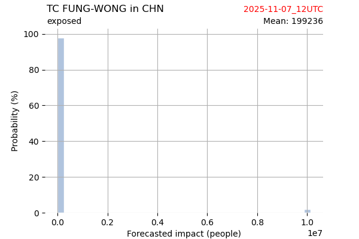

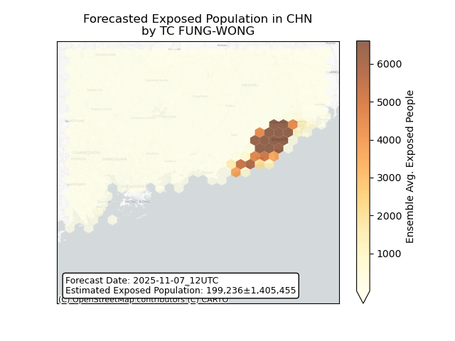

## FUNG-WONG China: people displaced

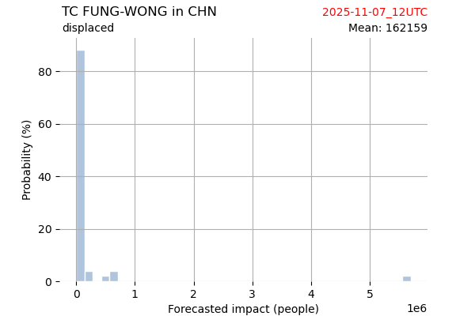

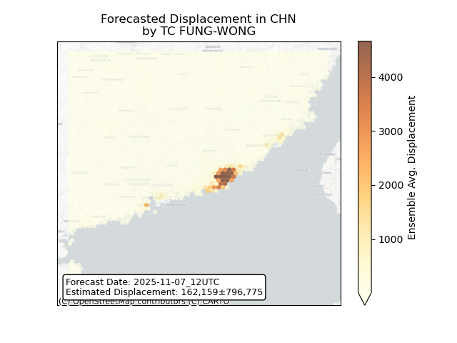

## FUNG-WONG Japan: areas affected

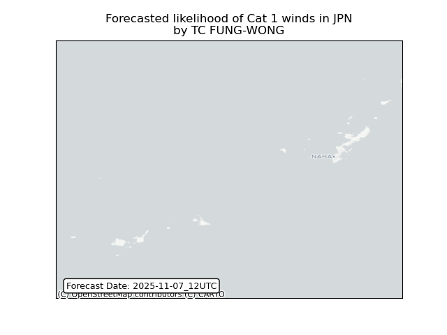

## FUNG-WONG Japan: people exposed

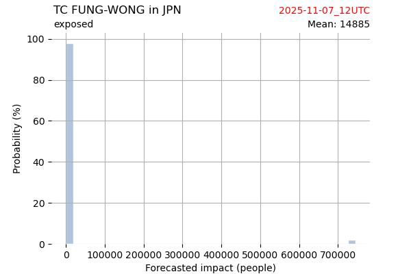

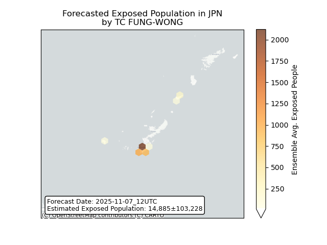

## FUNG-WONG Japan: people displaced

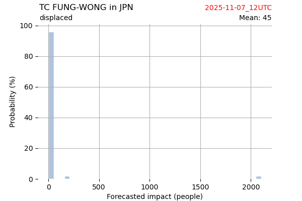

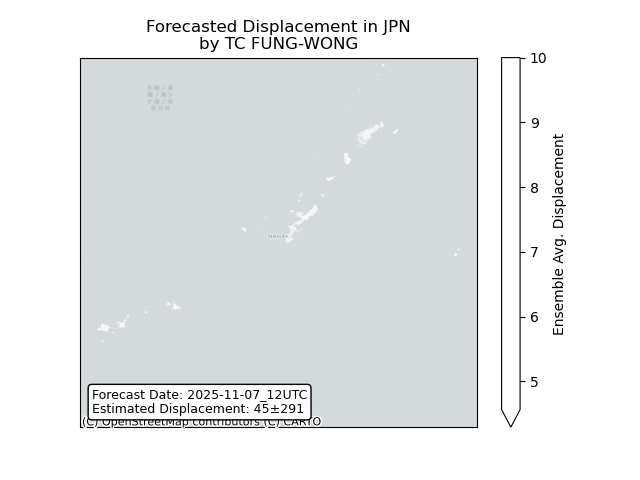

## FUNG-WONG Macao: areas affected

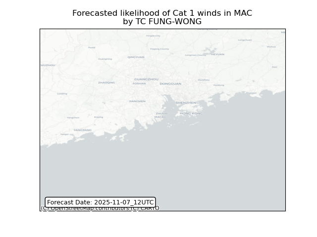

