# Displacement forecast

This is a WIP. All this is going to change, for now we're just dumping things here.

## Forecast for 2025-11-20 12:00 UTC

There are 1 active named storms.

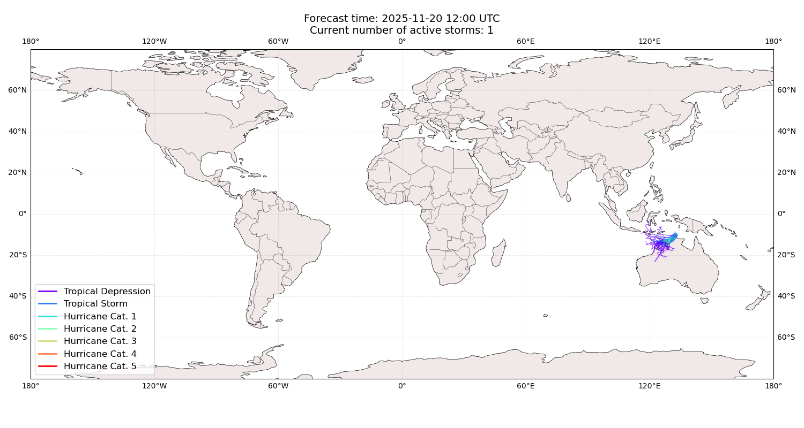

## FINA Australia: areas affected

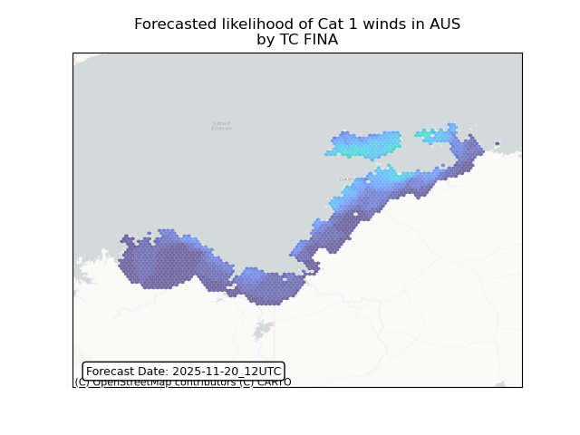

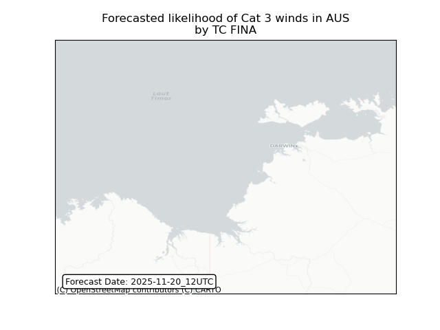

## FINA Australia: people exposed

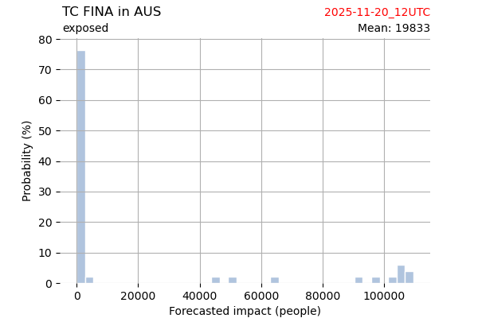

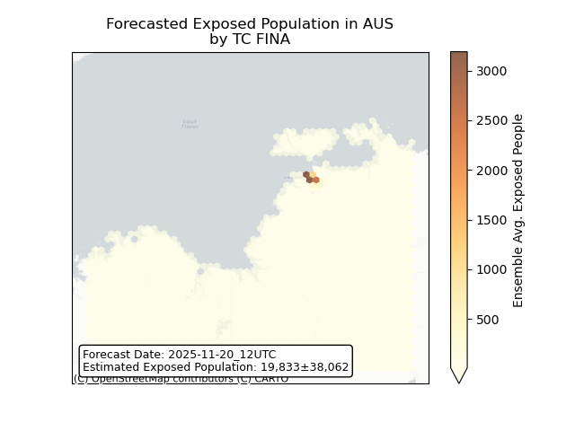

## FINA Australia: people displaced

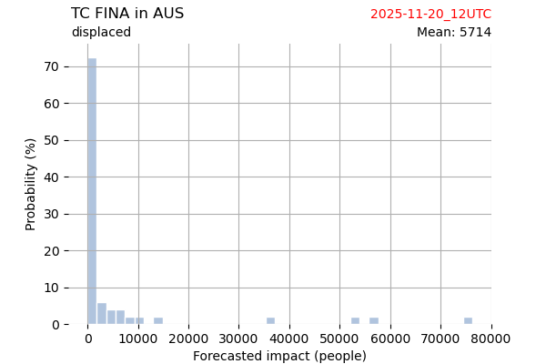

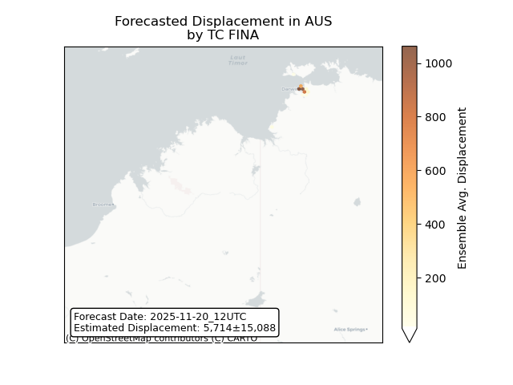

## FINA Indonesia: areas affected

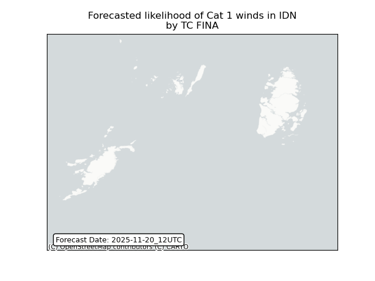

## FINA Indonesia: people exposed

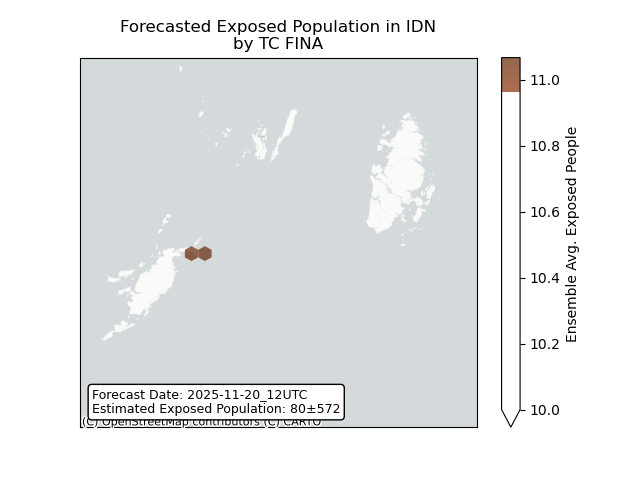

## FINA Indonesia: people displaced

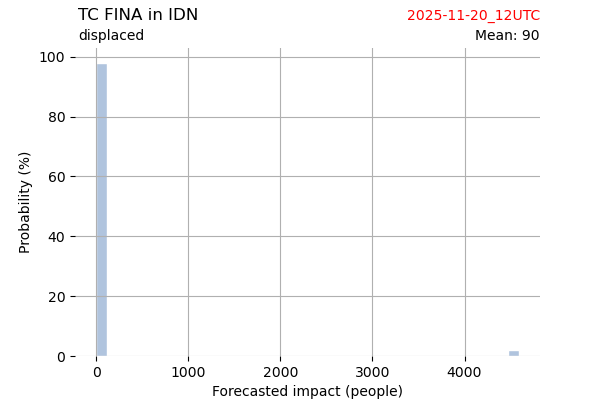

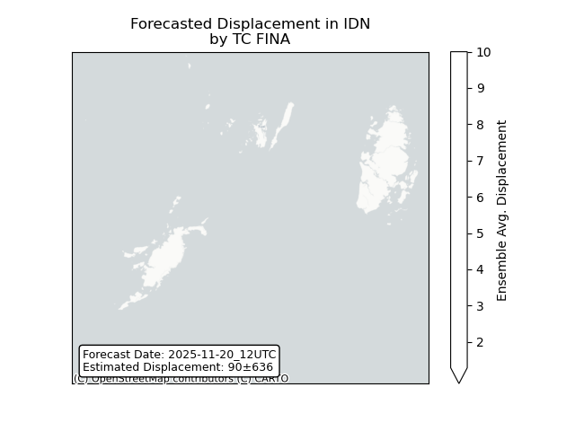

