# Displacement forecast

This is a WIP. All this is going to change, for now we're just dumping things here.

## Forecast for 2025-11-27 12:00 UTC

There are 3 active named storms.

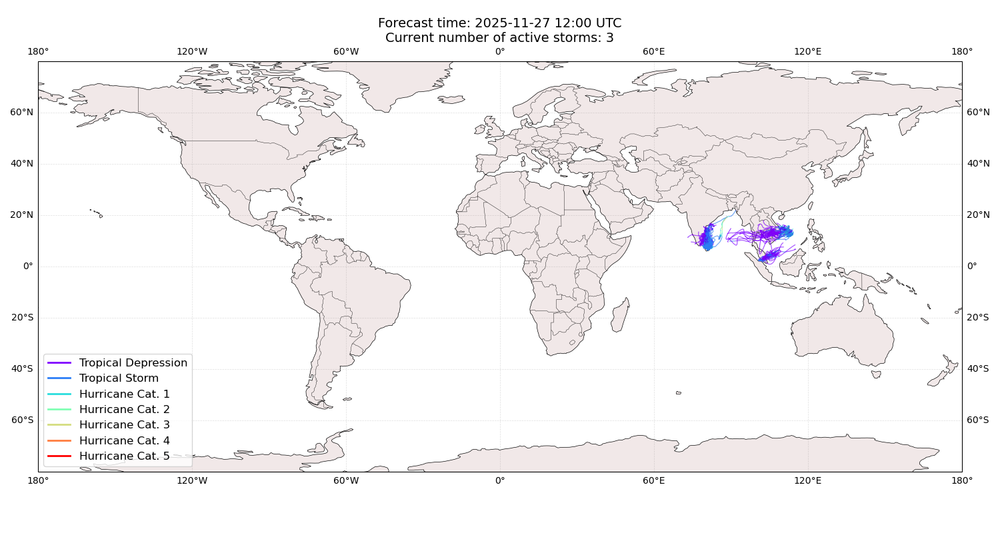

## DITWAH Sri Lanka: areas affected

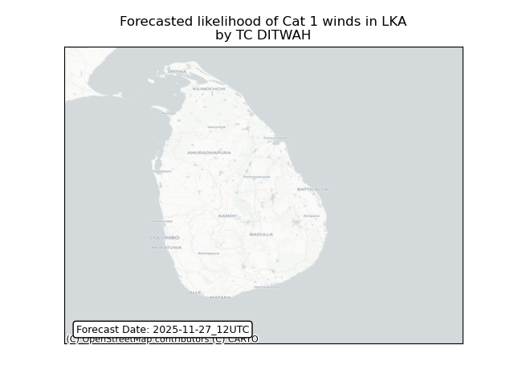

## DITWAH Sri Lanka: people exposed

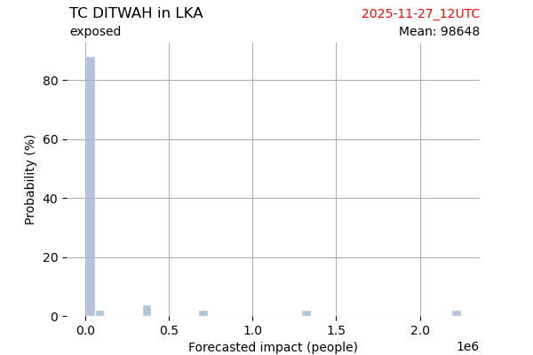

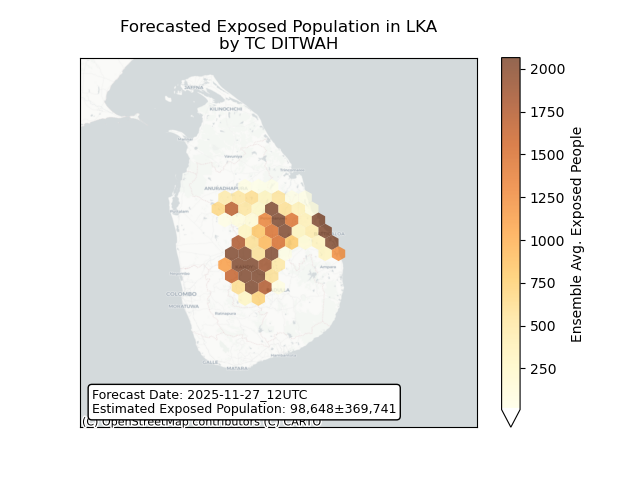

## DITWAH Sri Lanka: people displaced

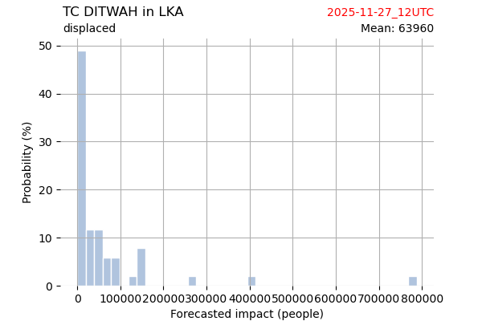

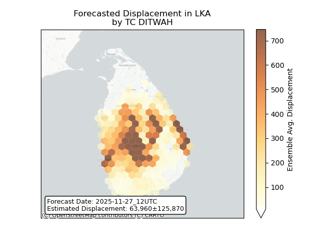

## SENYAR All countries: No forecast people exposed

Storm SENYAR is not forecast to affect people in All countries.

## SENYAR All countries: no forecast people displaced

Storm SENYAR is not forecast to displace people in All countries.

## KOTO Viet Nam: areas affected

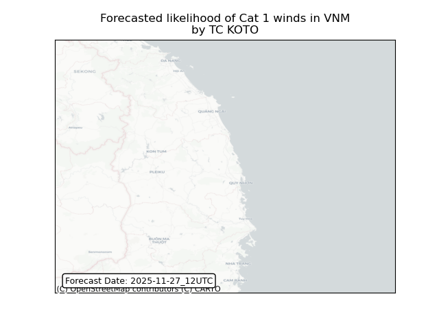

## KOTO Viet Nam: people exposed

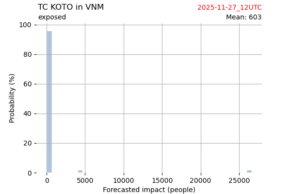

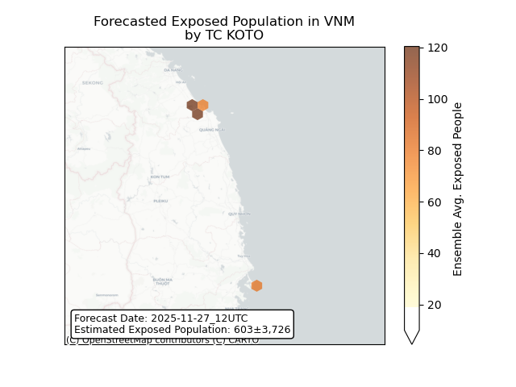

## KOTO Viet Nam: people displaced

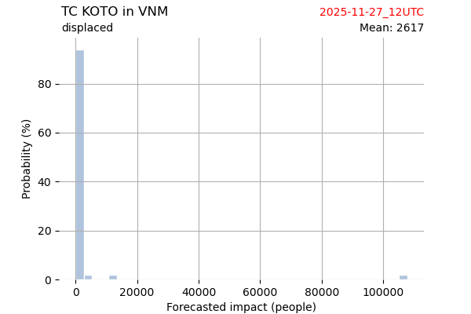

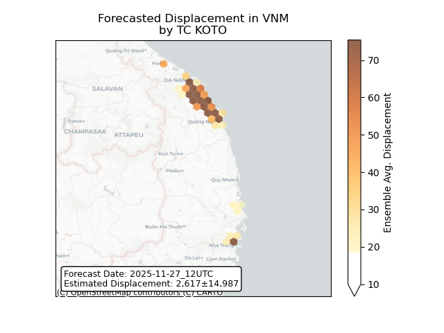

